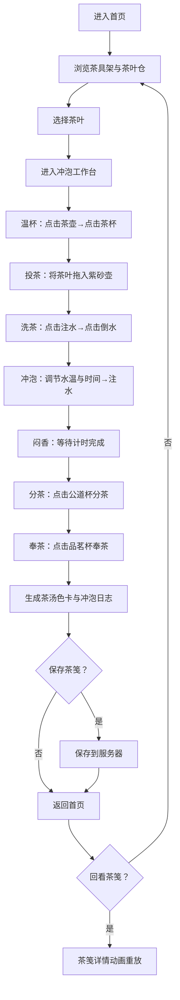

## 1. 产品概述

虚拟茶艺表演与茶道文化展示全栈Web应用，让用户在浏览器中模拟完整的功夫茶艺流程（温杯、投茶、洗茶、冲泡、闷香、分茶、奉茶），并生成带有视觉化茶汤色卡和冲泡日志的电子茶笺。
- 目标用户：茶文化爱好者、茶艺学习者、东方美学追求者
- 核心价值：沉浸式茶道体验，交互式学习功夫茶艺流程，个性化茶笺记录与分享

## 2. 核心功能

### 2.1 用户角色
| 角色 | 注册方式 | 核心权限 |
|------|----------|----------|
| 访客 | 无需注册 | 浏览茶具茶叶、体验冲泡流程、保存与回看茶笺 |

### 2.2 功能模块
1. **首页**：茶具架陈列（6件功夫茶具）、茶叶仓选择（8种茶类）、已保存茶笺列表
2. **冲泡工作台**：茶具操作区、冲泡步骤引导、注水/冲泡动画、茶汤色卡生成、冲泡日志记录
3. **茶笺回看**：茶种信息、茶汤色卡、冲泡日志时间轴动画重放

### 2.3 页面详情
| 页面名称 | 模块名称 | 功能描述 |
|----------|----------|----------|
| 首页 | 茶具架 | 左侧展示6件功夫茶具（紫砂壶、公道杯、品茗杯、闻香杯、茶滤、茶盘），仿古架格陈列，每格有阴影内发光效果 |
| 首页 | 茶叶仓 | 右侧展示8种茶类圆形卡片（龙井、铁观音、普洱、大红袍、正山小种、白毫银针、茉莉花茶、凤凰单丛），悬停放大1.1倍并显示茶香描述，点击选择出现金色边框闪烁 |
| 首页 | 茶笺列表 | 右侧下方展示已保存茶笺卡片（茶种名称+色卡缩略图），点击回看详情 |
| 冲泡工作台 | 茶具操作区 | 左栏：紫砂壶居中偏左，公道杯右下方，品茗杯与闻香杯并排下方；点击紫砂壶触发注水动画 |
| 冲泡工作台 | 冲泡日志与色卡 | 右栏：宣纸米白底色，手工纸纹质感；茶汤渐变色块、RGB值、色号名称；带时间轴冲泡日志 |
| 冲泡工作台 | 步骤指示器 | 底部7个圆形步骤指示器（温杯→投茶→洗茶→冲泡→闷香→分茶→奉茶），当前步骤金色脉冲，已完成白色打钩 |
| 茶笺回看 | 详情弹窗 | 显示茶种、茶汤色卡、冲泡参数，日志步骤按原时间轴动画重放（0.3秒/步） |

## 3. 核心流程

用户进入首页 → 浏览茶具架与茶叶仓 → 选择一种茶叶（金色边框闪烁确认） → 进入冲泡工作台 → 按顺序执行7步冲泡流程（温杯→投茶→洗茶→冲泡→闷香→分茶→奉茶）→ 每步有交互验证（顺序错误则红色闪烁提示）→ 冲泡完成自动生成茶汤色卡与冲泡日志 → 保存茶笺到服务器 → 返回首页查看已保存茶笺列表 → 点击茶笺回看详情（动画重放）

## 4. 用户界面设计

### 4.1 设计风格
- **风格定位**：日式侘寂风，质朴、留白、自然纹理
- **主色调**：竹青 #d4e2c6、宣纸米 #fdf8e7、墨黑 #2c2c2c、金棕 #c9a96e
- **背景纹理**：CSS repeating-linear-gradient模拟竹片拼接（#d4e2c6 和 #b8d4a8 交替）
- **按钮风格**：圆润、金棕描边、悬停0.2秒缓动放大(scale 1.05)、点击0.15秒按压(scale 0.95)
- **字体**：衬线体为主（思源宋体/Noto Serif SC），辅以无衬线（思源黑体）
- **布局风格**：左右两栏对称布局，冲泡页左操作右记录
- **图标风格**：CSS clip-path与渐变绘制的茶具剪影，极简线条

### 4.2 页面设计概览
| 页面名称 | 模块名称 | UI元素 |
|----------|----------|--------|
| 首页 | 茶具架 | 竹木纹理背景、仿古架格6格、每格阴影内发光、茶具CSS剪影图、悬停放大1.05 |
| 首页 | 茶叶仓 | 8种茶类圆形卡片、对应色系、悬停1.1倍放大+茶香描述浮层、选中金色边框闪烁0.5秒 |
| 首页 | 茶笺列表 | 卡片式列表、茶种名称+色卡缩略图、点击进入回看 |
| 冲泡工作台 | 茶具操作区 | 仿宣纸米白底(#fdf8e7)、多层box-shadow纸纹质感、紫砂壶居中偏左、注水SVG弧线动画(stroke-dashoffset)、壶内水面上升0.5秒至80%、壶身浅褐→深褐渐变 |
| 冲泡工作台 | 日志与色卡 | 渐变色块(浅金黄→深琥珀/淡绿→黄绿)、RGB值+色号名、时间轴日志+色点标记 |
| 冲泡工作台 | 步骤指示器 | 7个圆形、当前金色# c9a96e脉冲1.5秒、完成白色打钩、错误红色闪烁0.3秒+提示文字 |
| 茶笺回看 | 详情弹窗 | 居中弹窗、茶种信息+色卡+日志、日志步骤0.3秒/步动画重放 |

### 4.3 响应式适配
- 桌面优先设计（≥768px）：左右两栏布局
- 移动端适配（<768px）：上下布局，茶具区缩小80%并允许滑动，步骤指示器变为横向滚动条
- 触控优化：可交互元素最小点击区域44px，拖拽操作支持touch事件

### 4.4 动画性能要求
- 所有动画帧率不低于55fps（使用CSS transform/opacity触发GPU加速）
- 冲泡日志列表加载不超过500ms
- 注水动画：SVG stroke-dashoffset，持续1秒
- 水面上升：0.5秒速率
- 步骤脉冲：1.5秒周期
- 错误闪烁：0.3秒
