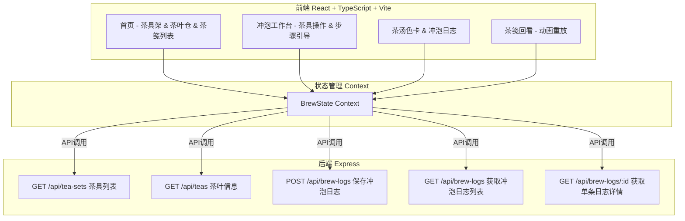
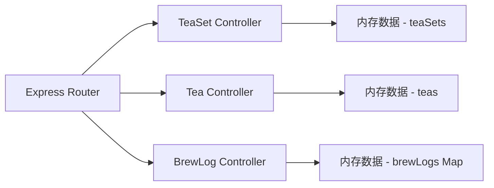
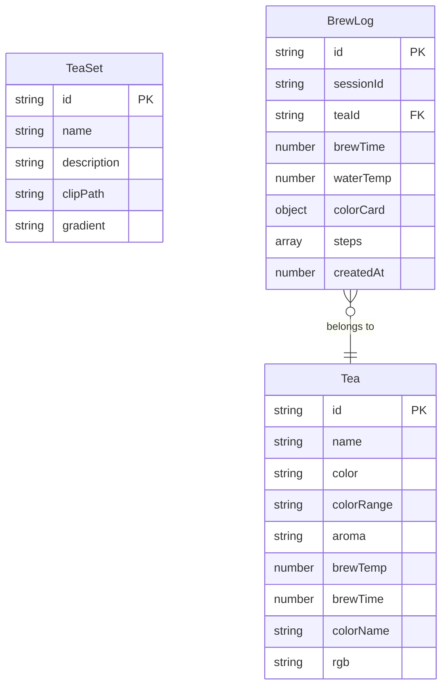

## 1. 架构设计



## 2. 技术说明
- **前端**：React 18 + TypeScript + Vite
- **初始化工具**：vite-init (react-express-ts模板)
- **后端**：Express 4 (ESM格式，server/index.mjs)
- **状态管理**：React Context (BrewState)
- **路由**：react-router-dom v6
- **样式**：CSS Modules + CSS变量（侘寂风设计系统）
- **动画**：CSS transforms/opacity (GPU加速) + SVG stroke-dashoffset
- **数据存储**：服务端内存存储（Map结构），session通过uuid标识

## 3. 路由定义
| 路由 | 用途 |
|------|------|
| / | 首页：茶具架、茶叶仓、已保存茶笺列表 |
| /brew | 冲泡工作台：茶具操作、步骤引导、色卡与日志 |
| /brew/review/:id | 茶笺回看详情（动画重放） |

## 4. API定义

### 4.1 茶具列表
```
GET /api/tea-sets
Response: Array<{
  id: string;
  name: string;
  description: string;
  clipPath: string;
  gradient: string;
}>
```

### 4.2 茶叶信息
```
GET /api/teas
Response: Array<{
  id: string;
  name: string;
  color: string;
  colorRange: [string, string];
  aroma: string;
  brewTemp: number;
  brewTime: number;
  colorName: string;
  rgb: [number, number, number];
}>
```

### 4.3 保存冲泡日志
```
POST /api/brew-logs
Body: {
  sessionId: string;
  teaId: string;
  teaName: string;
  brewTime: number;
  waterTemp: number;
  colorCard: {
    gradient: [string, string];
    rgb: [number, number, number];
    colorName: string;
  };
  steps: Array<{
    name: string;
    timestamp: number;
    duration: number;
  }>;
}
Response: { id: string; success: boolean }
```

### 4.4 获取冲泡日志列表
```
GET /api/brew-logs
Response: Array<{
  id: string;
  teaName: string;
  colorCard: { gradient: [string, string]; rgb: [number, number, number]; colorName: string };
  createdAt: number;
}>
```

### 4.5 获取单条冲泡日志详情
```
GET /api/brew-logs/:id
Response: {
  id: string;
  teaName: string;
  teaId: string;
  brewTime: number;
  waterTemp: number;
  colorCard: { gradient: [string, string]; rgb: [number, number, number]; colorName: string };
  steps: Array<{ name: string; timestamp: number; duration: number }>;
  createdAt: number;
}
```

## 5. 服务器架构图



## 6. 数据模型

### 6.1 数据模型定义



### 6.2 数据定义

茶具初始数据（6件）：
- 紫砂壶、公道杯、品茗杯、闻香杯、茶滤、茶盘

茶叶初始数据（8种）：
- 龙井（绿色系）、铁观音（金黄系）、普洱（深琥珀系）、大红袍（橙红系）
- 正山小种（红棕系）、白毫银针（淡银绿系）、茉莉花茶（浅黄绿系）、凤凰单丛（橙黄系）

冲泡日志：服务端内存Map存储，key为uuid
