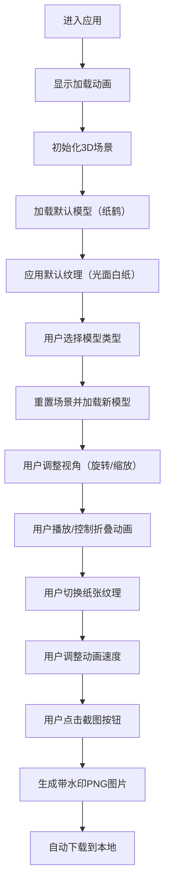

## 1. 产品概述

Origami Lab 是一款基于Web的3D折纸艺术模拟应用，为艺术爱好者和设计师提供在浏览器中体验折纸创作、观察纸张纹理和折叠动画的沉浸式工作台。

- **主要目标**：在没有实体纸张的情况下，让用户通过交互式3D可视化学习和体验折纸艺术
- **目标用户**：艺术爱好者、设计师、教育工作者、折纸初学者
- **核心价值**：将传统折纸艺术数字化，提供可交互、可观察、可保存的折纸创作体验

## 2. 核心功能

### 2.1 功能模块

1. **3D折纸工作台**：核心3D场景，支持模型展示、折叠动画、视角控制
2. **模型选择系统**：6种预设折纸模型（纸鹤、纸船、纸飞机、纸花、纸盒、纸青蛙）
3. **折叠动画系统**：平滑折叠动画、步骤控制、速度调节、折痕辅助线
4. **纹理材质系统**：6种程序化纸张纹理（光面白纸、牛皮纸、和纸、金箔纸、再生纸、彩色手工纸）
5. **视角控制系统**：鼠标拖拽旋转（360度）、滚轮缩放（0.5-2.0倍）
6. **截图保存系统**：1920x1080 PNG截图，自动添加"Origami Lab"水印

### 2.2 页面详情

| 页面名称 | 模块名称 | 功能描述 |
|-----------|-------------|---------------------|
| 主工作台 | 3D场景 | 展示折纸模型，支持旋转、缩放、折叠动画播放 |
| 主工作台 | 左侧模型选择面板 | 垂直排列6个圆形缩略图，点击切换模型 |
| 主工作台 | 右侧纹理选择按钮 | 2行3列共6个方形按钮，切换纸张纹理 |
| 主工作台 | 底部控制栏 | 折叠速度滑动条、步骤前进/后退按钮、旋转复位按钮、截图按钮 |
| 主工作台 | 步骤指示器 | 底部显示当前步骤编号和文字说明 |
| 主工作台 | 加载动画 | 页面加载时展示折纸风格的加载动画 |

## 3. 核心流程

## 4. 用户界面设计

### 4.1 设计风格

**日式简约木质美学**
- **主色调**：浅木色 `#d4b088`（背景）、深木色 `#8b5e3c`（边框）、橙色 `#e67e22`（选中高亮）、浅灰色 `#f5f5f5`（辅助线）
- **按钮风格**：圆形/方形，带悬停阴影，点击缩放反馈（0.95倍，0.15秒）
- **字体**：主标题使用优雅的衬线字体，正文使用清晰的无衬线字体
- **布局风格**：中央3D工作台，左侧垂直模型面板，右侧纹理按钮区，底部控制栏
- **视觉细节**：半透明阴影投射、木纹质感背景、微妙的颗粒噪点叠加

### 4.2 页面设计概述

| 页面名称 | 模块名称 | UI元素 |
|-----------|-------------|-------------|
| 主工作台 | 3D场景 | 浅木色背景、半透明地面阴影、柔和三点照明 |
| 主工作台 | 左侧模型选择 | 6个直径60px圆形缩略图、边框`#8b5e3c`、悬停放大1.1倍 |
| 主工作台 | 右侧纹理按钮 | 6个50x50px方形按钮、2行3列布局、选中边框`#e67e22` |
| 主工作台 | 底部控制栏 | 滑动条（0.3-0.8倍速）、箭头按钮、圆形复位按钮、截图按钮 |
| 主工作台 | 步骤指示器 | 半透明深色背景、白色文字、步骤编号和说明 |
| 主工作台 | 加载动画 | 折纸风格几何图形旋转动画、淡入淡出效果 |

### 4.3 响应式设计

- **桌面端**（≥768px）：左侧垂直模型面板、右侧纹理按钮、底部控制栏
- **移动端**（<768px）：左侧面板折叠为底部抽屉式菜单，可滑动呼出
- **触控优化**：增大触摸目标（≥44px）、支持双指缩放和拖拽旋转

### 4.4 3D场景指引

- **环境**：浅木色平面作为工作台，柔和的环境光模拟室内自然光
- **灯光设置**：主光源（Key Light）45度角、补光（Fill Light）弱化阴影、背光（Back Light）勾勒轮廓
- **相机设置**：PerspectiveCamera，fov 50度，初始距离3.5，目标点在场景中心
- **构图**：模型居中放置，预留充足的旋转空间，地面投射柔和阴影
- **交互动画**：模型变形使用线性插值，纹理切换使用0.3秒淡入淡出，折叠步骤高亮使用半透明蓝色覆盖层
- **后期处理**：柔和抗锯齿、微妙的环境光遮蔽、轻微色调映射
- **性能预算**：单模型面数≤500三角形，折叠动画≥30fps，纹理切换响应≤200ms
