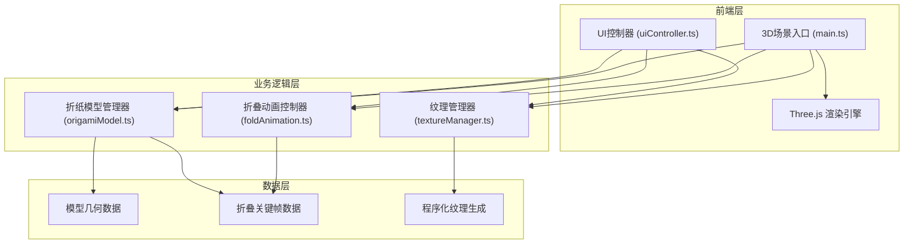

## 1. 架构设计



## 2. 技术描述

- **前端框架**：TypeScript + Vite
- **3D引擎**：Three.js @0.160.0
- **动画库**：GSAP
- **UI工具**：Tweakpane（调试用）
- **构建工具**：Vite
- **类型支持**：@types/three

**项目文件结构**：
```
├── package.json
├── vite.config.js
├── tsconfig.json
├── index.html
└── src/
    ├── main.ts              # 应用入口，场景初始化
    ├── origamiModel.ts      # 折纸模型几何体与关键帧
    ├── foldAnimation.ts     # 折叠动画插值系统
    ├── textureManager.ts    # 程序化纹理生成管理
    └── uiController.ts      # DOM交互与事件绑定
```

## 3. 核心模块设计

### 3.1 折纸模型管理器 (origamiModel.ts)

```typescript
// 模型类型定义
type ModelType = 'crane' | 'boat' | 'plane' | 'flower' | 'box' | 'frog';

interface FoldStep {
  stepNumber: number;
  description: string;
  vertices: number[];        // 目标顶点位置数组
  highlightFaces: number[];  // 当前步骤高亮的面索引
}

interface OrigamiModelData {
  name: string;
  type: ModelType;
  faceCount: number;         // 12-24个三角形
  baseVertices: number[];    // 初始纸张顶点
  foldSteps: FoldStep[];     // 折叠关键帧序列
  creaseLines: number[][];   // 折痕辅助线坐标
}

class OrigamiModel {
  public mesh: THREE.Mesh;
  public geometry: THREE.BufferGeometry;
  public currentStep: number = 0;
  public modelData: OrigamiModelData;
  
  constructor(type: ModelType, texture: THREE.Texture);
  public loadModel(type: ModelType): void;
  public reset(): void;
  public getTotalSteps(): number;
  public getStepDescription(step: number): string;
  public getHighlightFaces(step: number): number[];
}
```

### 3.2 折叠动画控制器 (foldAnimation.ts)

```typescript
class FoldAnimation {
  public isPlaying: boolean = false;
  public speed: number = 0.5;   // 0.3-0.8
  public currentFrame: number = 0;
  public onStepChange: (step: number) => void;
  public onFrameUpdate: (vertices: number[]) => void;
  
  constructor(model: OrigamiModel);
  public play(): void;
  public pause(): void;
  public nextStep(): void;
  public prevStep(): void;
  public goToStep(step: number): void;
  public setSpeed(speed: number): void;
  public update(deltaTime: number): void;
  private lerpVertices(from: number[], to: number[], t: number): number[];
}
```

### 3.3 纹理管理器 (textureManager.ts)

```typescript
type TextureType = 'white' | 'kraft' | 'washi' | 'gold' | 'recycled' | 'colorful';

interface TextureData {
  name: string;
  type: TextureType;
  texture: THREE.Texture;
}

class TextureManager {
  private textureCache: Map<TextureType, THREE.Texture> = new Map();
  
  constructor();
  public getTexture(type: TextureType): THREE.Texture;
  public generateTexture(type: TextureType): THREE.Texture;
  public applyTexture(mesh: THREE.Mesh, type: TextureType, duration?: number): Promise<void>;
  private generateWhitePaper(): THREE.Texture;
  private generateKraftPaper(): THREE.Texture;
  private generateWashiPaper(): THREE.Texture;
  private generateGoldFoil(): THREE.Texture;
  private generateRecycledPaper(): THREE.Texture;
  private generateColorfulPaper(): THREE.Texture;
}
```

### 3.4 UI控制器 (uiController.ts)

```typescript
class UIController {
  private modelSelector: HTMLElement;
  private textureButtons: HTMLElement;
  private controlBar: HTMLElement;
  private stepIndicator: HTMLElement;
  
  constructor(
    onModelSelect: (type: ModelType) => void,
    onTextureSelect: (type: TextureType) => void,
    onSpeedChange: (speed: number) => void,
    onNextStep: () => void,
    onPrevStep: () => void,
    onResetRotation: () => void,
    onScreenshot: () => void
  );
  public updateStepIndicator(step: number, description: string): void;
  public setActiveModel(type: ModelType): void;
  public setActiveTexture(type: TextureType): void;
  public setSpeed(speed: number): void;
  public showLoading(): void;
  public hideLoading(): void;
}
```

## 4. 核心技术实现要点

### 4.1 折纸几何体生成
- 每个模型由12-24个三角形面片组成
- 使用BufferGeometry存储顶点数据
- 关键帧顶点数据预计算，运行时仅做插值
- 折叠步骤的高亮面使用独立的半透明覆盖层

### 4.2 动画插值系统
- 关键帧间隔0.5秒
- 顶点位置使用线性插值（LERP）
- 折叠速度0.3-0.8倍可调
- 每帧更新几何体的position attribute

### 4.3 程序化纹理生成
- 使用Canvas 2D API生成纹理
- 牛皮纸：Perlin噪声 + 纤维纹路
- 金箔纸：颗粒噪点 + 高光反射
- 和纸：柔软纹理 + 纤维分布
- 纹理切换使用材质opacity渐变过渡

### 4.4 截图功能
- 临时将渲染器尺寸设为1920x1080
- 渲染后使用toDataURL生成PNG
- 使用Canvas在右下角添加"Origami Lab"水印
- 创建a标签触发自动下载

## 5. 性能优化策略

1. **几何体优化**：使用BufferGeometry，面数控制在500三角形以内
2. **动画优化**：仅更新顶点position，避免重建几何体
3. **纹理优化**：纹理缓存复用，Canvas生成后立即释放
4. **渲染优化**：启用抗锯齿但关闭不必要的后期处理
5. **内存管理**：模型切换时正确dispose旧的几何体和材质
