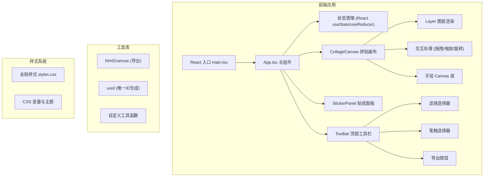

## 1. 架构设计



## 2. 技术描述

- **前端框架**：React 18 + TypeScript 5
- **构建工具**：Vite 5
- **渲染方式**：DOM 渲染（图层元素）+ Canvas 2D（手绘笔迹）
- **第三方库**：
  - uuid：生成图层唯一标识符
  - html2canvas：画布内容导出为PNG图片
- **状态管理**：React useState + useCallback 管理图层状态和交互状态
- **性能优化**：
  - 使用 React.memo 避免不必要的重渲染
  - 使用 requestAnimationFrame 保证拖拽/缩放 60fps
  - 图层数量限制在30个以内

## 3. 项目结构

```
e:\solo\VersionFast\tasks\auto116\
├── package.json
├── vite.config.js
├── tsconfig.json
├── index.html
└── src\
    ├── main.tsx
    ├── App.tsx
    ├── styles.css
    ├── components\
    │   ├── CollageCanvas.tsx
    │   └── StickerPanel.tsx
    └── types\
        └── index.ts (类型定义)
```

## 4. 数据模型

### 4.1 类型定义

```typescript
// 图层类型
type LayerType = 'sticker' | 'photo' | 'text' | 'drawing';

// 滤镜类型
type FilterType = 'none' | 'vintage' | 'faded' | 'grain';

// 笔触类型
type BrushType = 'ballpoint' | 'marker' | 'brush';

// 贴纸分类
type StickerCategory = 'stamp' | 'plant' | 'polka' | 'geometric' | 'label';

// 贴纸定义
interface Sticker {
  id: string;
  name: string;
  category: StickerCategory;
  emoji: string;
  defaultColor: string;
}

// 图层基础属性
interface BaseLayer {
  id: string;
  type: LayerType;
  x: number;
  y: number;
  width: number;
  height: number;
  rotation: number;
  zIndex: number;
  filter: FilterType;
}

// 贴纸图层
interface StickerLayer extends BaseLayer {
  type: 'sticker';
  stickerId: string;
  emoji: string;
  color: string;
}

// 文字图层
interface TextLayer extends BaseLayer {
  type: 'text';
  content: string;
  fontSize: number;
  fontFamily: string;
  color: string;
}

// 照片图层
interface PhotoLayer extends BaseLayer {
  type: 'photo';
  imageUrl: string;
  brightness: number;
  contrast: number;
}

// 手绘图层
interface DrawingLayer extends BaseLayer {
  type: 'drawing';
  paths: DrawingPath[];
}

// 手绘路径
interface DrawingPath {
  points: { x: number; y: number }[];
  brushType: BrushType;
  color: string;
  isStraightLine: boolean;
}

// 应用状态
interface AppState {
  layers: BaseLayer[];
  selectedLayerId: string | null;
  activeTool: 'select' | 'brush';
  activeBrush: BrushType;
  activeColor: string;
  isExporting: boolean;
}
```

## 5. 核心交互实现

### 5.1 拖拽移动
- 鼠标按下时记录初始位置和图层偏移
- mousemove 时更新图层 x/y 坐标
- 使用 requestAnimationFrame 确保流畅动画

### 5.2 缩放（Shift + 拖拽）
- 检测 Shift 键按下状态
- 计算缩放比例，限制在 30%-200% 范围
- 保持中心点不变进行缩放

### 5.3 旋转（Ctrl + 拖拽）
- 检测 Ctrl 键按下状态
- 计算鼠标位置与图层中心点的夹角
- 实时显示旋转角度（整数度）

### 5.4 层级调整
- 右键菜单触发层级操作
- 更新图层 zIndex 属性
- 重新排序图层数组

### 5.5 手绘功能
- 独立 Canvas 层渲染手绘笔迹
- mousedown 开始绘制，mousemove 记录点，mouseup 结束
- Shift 键按下时绘制直线

### 5.6 导出功能
- 使用 html2canvas 捕获画布 DOM
- scale: 2 保证高清输出
- backgroundColor: null 实现透明背景
- 生成文件名：handbook_YYYYMMDD_HHmmss.png

## 6. 性能优化策略

1. **图层数量限制**：最多30个图层，避免过度重绘
2. **CSS 硬件加速**：使用 transform: translate3d 进行图层变换
3. **减少重排**：批量更新图层位置，避免频繁触发 reflow
4. **事件节流**：mousemove 事件使用 requestAnimationFrame 节流
5. **React 优化**：使用 React.memo 包装子组件，使用 useCallback 缓存事件处理函数
6. **Canvas 优化**：手绘路径使用 Path2D 缓存，减少重复绘制

## 7. 浏览器兼容性

- 支持现代浏览器（Chrome 90+, Firefox 88+, Safari 14+, Edge 90+）
- 使用 CSS 变量和 Grid 布局
- 无需 IE 支持
