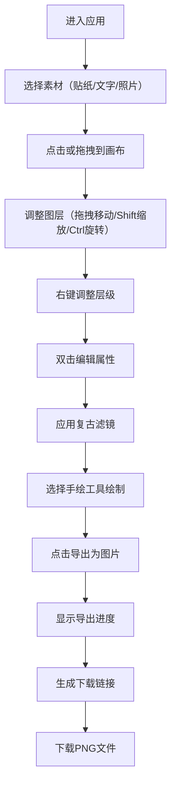

## 1. 产品概述

在线虚拟手账本与拼贴艺术创作工具，让用户像拼贴艺术家一样在浏览器中自由创作数字手账页面。通过拖拽、旋转、缩放各种素材贴纸、照片、文字和手绘笔迹，结合复古滤镜和装饰元素，生成可导出的精美手账作品。

- 核心目标：提供直观、富有创意的拼贴创作体验，满足手账爱好者的数字创作需求
- 目标用户：手账爱好者、设计师、创意工作者、学生群体
- 市场价值：填补浏览器端轻量级拼贴艺术创作工具的空白，无需专业软件即可完成高品质手账创作

## 2. 核心功能

### 2.1 用户角色
| 角色 | 注册方式 | 核心权限 |
|------|----------|----------|
| 普通用户 | 无需注册，直接使用 | 使用所有创作功能，导出作品 |

### 2.2 功能模块
1. **拼贴画布**：核心创作区域，支持图层管理、拖拽、缩放、旋转交互
2. **贴纸素材面板**：20种预设贴纸，5大分类（复古邮票、手绘植物、波点图案、几何图形、文字标签）
3. **手绘工具**：3种笔触（圆珠笔、记号笔、毛笔），12色复古调色板，支持直线绘制
4. **滤镜效果**：3种复古滤镜（老照片、褪色、胶片颗粒），可针对单个图层应用
5. **导出功能**：2倍分辨率PNG导出，透明背景，自动命名

### 2.3 页面详情
| 页面名称 | 模块名称 | 功能描述 |
|----------|----------|----------|
| 主创作页 | 顶部工具栏 | 画笔工具切换、滤镜选择、图层操作、导出按钮 |
| 主创作页 | 左侧贴纸面板 | 分类贴纸展示，点击添加到画布 |
| 主创作页 | 中心画布区域 | 800x600px笔记本页面，圆点网格背景，图层渲染 |
| 主创作页 | 右键菜单 | 图层层级调整（上移/下移/置顶/置底） |
| 主创作页 | 双击编辑面板 | 贴纸换色、照片调整、文字编辑 |
| 主创作页 | 导出进度遮罩 | 半透明遮罩+旋转加载图标 |

## 3. 核心流程

用户从选择素材开始，通过拖拽、缩放、旋转等交互调整布局，可应用滤镜增强视觉效果，使用手绘工具添加个性化元素，最终导出为高质量PNG图片。

## 4. 用户界面设计

### 4.1 设计风格
- **主色调**：浅米色 #faf3e0（背景）、暖棕色 #8b7355（工具栏）、奶油白 #fff8e7（面板）、浅金色 #d4a574（交互高亮）
- **配色体系**：复古色系，包含棕色 #8b4513、深红 #a52a2a、藏蓝 #2f4f4f、墨绿 #556b2f、金色 #b8860b
- **按钮风格**：圆角矩形，圆角8px，悬停背景变为浅金色并轻微放大，transition 0.2s ease
- **字体选择**：采用优雅的衬线字体作为标题，无衬线字体作为正文，营造复古手账氛围
- **布局风格**：三栏布局（左侧贴纸面板 + 中心画布 + 右侧可选属性面板），画布居中展示
- **图标风格**：手绘风格图标，与整体复古美学一致

### 4.2 页面设计概述
| 页面名称 | 模块名称 | UI元素 |
|----------|----------|--------|
| 主创作页 | 顶部工具栏 | 暖棕色背景，圆角按钮，画笔/滤镜/导出工具图标 |
| 主创作页 | 左侧贴纸面板 | 奶油白背景，60x60px贴纸卡片，悬停上浮3px，阴影加深 |
| 主创作页 | 中心画布 | 800x600px白色区域，圆点网格线 #d4c9a8，间距20px，透明度0.3 |
| 主创作页 | 图层控件 | 四角缩放手柄，旋转控制点，实时角度显示 |
| 主创作页 | 手绘调色板 | 12色圆形色块，选中时外圈高亮 |
| 主创作页 | 导出遮罩 | 半透明黑色背景，旋转加载动画，进度提示文字 |

### 4.3 响应式设计
- 桌面优先设计，最小支持宽度1200px
- 窗口小于1400px时，画布自动居中但不缩放
- 窗口大于1400px时，画布保持800x600px固定尺寸居中
- 所有交互元素保持足够的点击区域（最小44x44px）

### 4.4 动画与交互
- 所有元素过渡动画：transition 0.25s ease-in-out
- 贴纸悬停：向上浮动3px，box-shadow加深，显示名称标签
- 按钮悬停：背景色变为浅金色，轻微放大（scale: 1.05）
- 图层选中：显示边框和控制点，平滑过渡
- 导出过程：旋转加载动画，1-2秒完成
