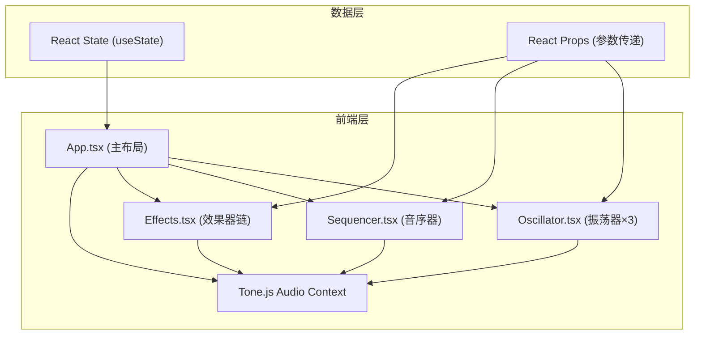

## 1. 架构设计



## 2. 技术说明

- **前端框架**：React@18 + TypeScript@5 + Vite@5
- **音频引擎**：Tone.js@14.7.77（Web Audio API封装）
- **构建工具**：Vite
- **样式方案**：原生CSS + CSS变量，无需Tailwind
- **工具库**：uuid@9（生成唯一ID）

## 3. 性能优化

- **音频缓冲区大小**：256 samples（低延迟）
- **目标帧率**：60 FPS
- **交互响应**：≤50ms
- **动画实现**：CSS transitions/animations（GPU加速）
- **状态管理**：React useState（轻量级，避免不必要重渲染）

## 4. 项目结构

```
├── index.html                 # 入口HTML
├── package.json               # 依赖配置
├── vite.config.js             # Vite构建配置
├── tsconfig.json              # TypeScript配置
└── src/
    ├── main.tsx               # React入口
    ├── App.tsx                # 主组件，布局+状态管理
    ├── styles/
    │   └── global.css         # 全局样式+CSS变量
    └── components/
        ├── Oscillator.tsx     # 振荡器组件
        ├── Sequencer.tsx      # 音序器组件
        └── Effects.tsx        # 效果器组件
```

## 5. 数据类型定义

```typescript
// 波形类型
type WaveformType = 'sine' | 'sawtooth' | 'square' | 'triangle';

// 音高范围 C3-C6
type NoteType = 'C3' | 'C4' | 'C5' | 'C6' | string;

// 振荡器参数
interface OscillatorParams {
  id: string;
  waveform: WaveformType;
  pitch: number; // MIDI note number (48-84)
  volume: number; // 0-100
  color: string; // 霓虹色
}

// 效果器参数
interface EffectsParams {
  filterFrequency: number; // 200-20000
  filterResonance: number; // 0-1
  reverbDecay: number; // 0.5-5
  reverbMix: number; // 0-100
}

// 音序器状态
type SequencerGrid = boolean[][]; // 4行 × 16列

// 全局状态
interface AppState {
  oscillators: OscillatorParams[];
  effects: EffectsParams;
  sequencerGrid: SequencerGrid;
  bpm: number; // 60-200
  isPlaying: boolean;
  currentStep: number; // 0-15
}
```

## 6. 核心组件Props

### Oscillator.tsx
```typescript
interface OscillatorProps {
  id: string;
  waveform: WaveformType;
  pitch: number;
  volume: number;
  color: string;
  synth: Tone.Synth | null;
  onWaveformChange: (w: WaveformType) => void;
  onPitchChange: (p: number) => void;
  onVolumeChange: (v: number) => void;
}
```

### Sequencer.tsx
```typescript
interface SequencerProps {
  grid: SequencerGrid;
  bpm: number;
  isPlaying: boolean;
  currentStep: number;
  colors: string[];
  onGridChange: (row: number, col: number, value: boolean) => void;
  onBpmChange: (bpm: number) => void;
  onPlayToggle: () => void;
  onStepChange: (step: number) => void;
  triggerNote: (oscillatorIndex: number) => void;
}
```

### Effects.tsx
```typescript
interface EffectsProps {
  filterFrequency: number;
  filterResonance: number;
  reverbDecay: number;
  reverbMix: number;
  filter: Tone.Filter | null;
  reverb: Tone.Reverb | null;
  onFilterFrequencyChange: (v: number) => void;
  onFilterResonanceChange: (v: number) => void;
  onReverbDecayChange: (v: number) => void;
  onReverbMixChange: (v: number) => void;
}
```

## 7. 音频信号流

```
Oscillator 1 ──┐
Oscillator 2 ──┼──> Filter ──> Reverb ──> Master Output
Oscillator 3 ──┘
```

## 8. 响应式断点

| 断点 | 布局 | 音序器格子大小 |
|------|------|----------------|
| ≥1200px | 三列 (osc | seq | fx) | 40px |
| 768-1199px | 两列osc + seq+fx | 32px |
| <768px | 单列堆叠 | 28px |
