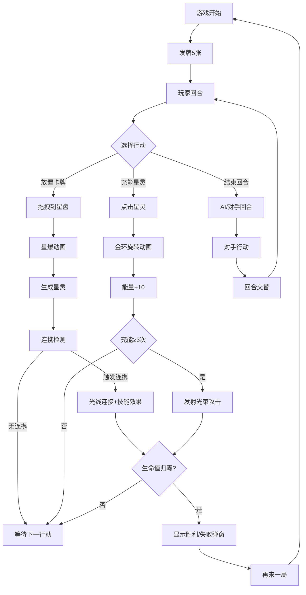

## 1. 产品概述

星盘召唤师 - 一款沉浸式古代占星师主题策略卡牌对战游戏，玩家在虚拟星盘中通过组合黄道十二宫卡牌、调整星灵位置来触发连携技能，体验星空穹顶下的神秘对战。

- **核心玩法**：回合制卡牌策略对战，放置星座卡牌、触发连携技能、充能发射光束
- **目标用户**：策略卡牌游戏爱好者、占星/星座文化爱好者
- **市场价值**：融合传统文化与现代游戏机制，提供独特的沉浸式策略体验

## 2. 核心功能

### 2.1 功能模块

1. **星空穹顶主界面**：深蓝星空背景、闪烁星星动画、双方星盘对战区域
2. **星座卡牌系统**：12黄道星座卡牌、手牌管理、拖拽放置
3. **星盘战斗系统**：星灵放置、星座连携检测、光束攻击
4. **回合管理系统**：回合交替、星力充能、伤害结算
5. **游戏结束系统**：胜负判定、结果弹窗、再来一局

### 2.2 页面详情

| 页面名称 | 模块名称 | 功能描述 |
|----------|----------|----------|
| 对战主界面 | 星空背景 | 500-800颗闪烁星星，深蓝黑渐变背景 |
| 对战主界面 | 星盘区域 | 双方对称星盘，半透明金色光圈，旋转星云纹理 |
| 对战主界面 | 手牌区域 | 底部5张星座卡牌，悬停放大动画，拖拽放置 |
| 对战主界面 | 连携系统 | 火/水/土/风象三角连携，金色光线连接，触发技能 |
| 对战主界面 | 战斗系统 | 星力充能、光束攻击、伤害计算、生命值管理 |
| 对战主界面 | 界面元素 | 顶部血条、回合指示器、游戏结束弹窗 |

## 3. 核心流程

玩家进入游戏 → 发牌获得5张星座卡牌 → 回合开始 → 选择行动（放置卡牌/充能星灵/结束回合）→ 放置卡牌触发星爆动画 → 检测星座连携触发技能 → 回合交替 → 重复直到一方生命值归零 → 显示结果 → 再来一局

## 4. 用户界面设计

### 4.1 设计风格

- **设计方向**：星际神秘主义、古代占星术、星空穹顶沉浸式体验
- **主色调**：深蓝星空 `#0a0e27` → `#1a1a40` 渐变
- **高亮色**：金色 `#d4af37`、星轨蓝 `#87ceeb`、星爆金 `#ffd700`
- **星灵色**：蓝紫色调 `#7b68ee` → `#9370db`
- **敌方色**：红紫色调 `#6a0dad` → `#8b008b`
- **字体**：使用 Cinzel Decorative（标题）+ Noto Serif SC（正文）组合，营造神秘古典氛围
- **动画缓动**：统一使用 `cubic-bezier(0.4,0,0.2,1)`，时长 0.2-0.5秒
- **边框效果**：1px 发光细线，使用 box-shadow 实现光晕
- **背景纹理**：径向渐变星云 + 模糊效果，营造深邃太空感

### 4.2 页面设计要素

| 模块 | UI 元素 | 视觉细节 |
|------|---------|----------|
| 星空背景 | 闪烁星星 | 500-800颗，大小1-3px随机，闪烁周期1.5-3秒随机，颜色 `#ffffff` 到 `#a0c4ff` 渐变 |
| 星盘区域 | 圆形星盘 | 直径500px，外环半透明金色光圈 `#d4af37`，内圈星云纹理旋转（0.3度/秒） |
| 卡牌 | 星座卡牌 | 75px×105px，半透明深蓝 `#16213e`，星轨蓝边框 `#87ceeb`，圆角8px，悬停上浮15px放大1.1倍 |
| 连携效果 | 金色连线 | 线宽2px，流动光点速度40px/秒，0.4秒动画 |
| 攻击效果 | 光束攻击 | 渐变 `#ffd700` → `#ff6347`，线宽3px，0.4秒动画 |
| 血条 | 生命条 | 400px×20px，圆角，渐变红色 `#e74c3c` → `#c0392b`，百分比数字居中 |

### 4.3 响应式设计

- **桌面优先**：最小分辨率 1280x720，不提供移动端适配
- **布局单位**：使用 rem 和百分比单位，确保大屏幕适配
- **星盘定位**：左右对称布局，左侧玩家星盘，右侧对手星盘

### 4.4 游戏场景指引

- **环境氛围**：深蓝星空穹顶，模拟古代天文台的观测体验
- **光照效果**：星盘自发光效果，卡牌放置时的星爆光源
- **动画节奏**：星云缓慢旋转（0.3度/秒），星星闪烁（1.5-3秒周期），战斗效果快速果断（0.3-0.5秒）
- **视觉焦点**：中央星盘区域为核心视觉焦点，放置和攻击效果集中在此区域
- **性能预算**：粒子上限500，核心帧率稳定45FPS以上，使用 requestAnimationFrame 和 CSS transforms 加速
