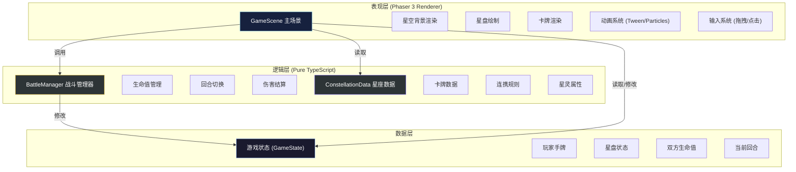
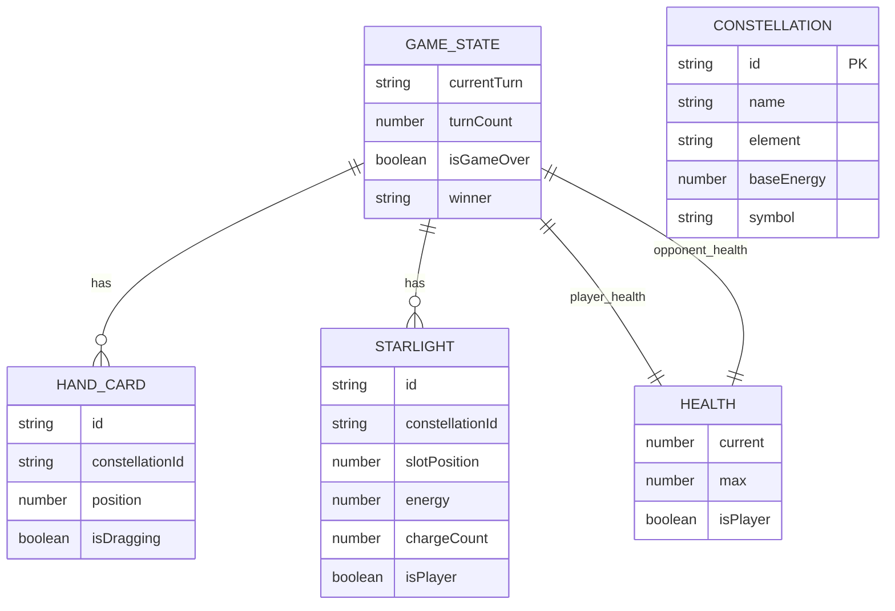

## 1. 架构设计



## 2. 技术栈说明

- **游戏引擎**：Phaser 3.60.0 - 成熟的 2D 游戏引擎，内置 Tween 动画系统、粒子发射器、物理引擎
- **开发语言**：TypeScript 5.x - 严格模式，目标 ES2020，提供完整类型安全
- **构建工具**：Vite 5.x - 极速热更新，优化的生产构建
- **动画系统**：Phaser Tween + 自定义粒子系统，使用 requestAnimationFrame 驱动
- **渲染优化**：CSS transforms 加速，减少 DOM 重排，Canvas 2D 渲染

## 3. 项目文件结构

```
├── package.json              # 项目依赖与脚本
├── vite.config.js            # Vite 构建配置
├── tsconfig.json             # TypeScript 配置
├── index.html                # 入口 HTML
└── src/
    ├── main.ts               # Phaser 游戏配置与启动
    ├── scenes/
    │   └── GameScene.ts      # 核心游戏场景（渲染+交互）
    ├── utils/
    │   ├── BattleManager.ts  # 战斗逻辑模块（纯逻辑）
    │   └── ConstellationData.ts # 静态数据模块
    └── types/
        └── game.ts           # 全局类型定义
```

## 4. 核心模块定义

### 4.1 BattleManager 战斗管理器

```typescript
interface BattleManager {
  // 生命值管理
  updateHealth(isPlayer: boolean, delta: number): void;
  getHealth(isPlayer: boolean): number;
  
  // 回合管理
  switchTurn(): void;
  getCurrentTurn(): 'player' | 'opponent';
  getTurnCount(): number;
  
  // 连携技能
  triggerConstellation(comboType: string): { 
    damage: number; 
    removeRandom: boolean;
    shockwave: boolean;
  };
  
  // 星力充能
  chargeStarlight(starlightId: string): { 
    newEnergy: number; 
    canAttack: boolean; 
  };
  
  // 光束攻击
  fireBeam(attackerId: string, targetId: string): {
    damage: number;
    targetEnergy: number;
  };
  
  // 游戏状态
  checkGameOver(): 'player' | 'opponent' | null;
  resetGame(): void;
}
```

### 4.2 ConstellationData 星座数据模块

```typescript
interface ConstellationData {
  id: string;           // 唯一标识 'aries' | 'taurus' | ...
  name: string;         // 中文名称 '白羊座'
  nameEn: string;       // 英文名称 'Aries'
  element: 'fire' | 'water' | 'earth' | 'air';
  energy: number;       // 1-5 星能量值
  symbol: string;       // 星座符号 Unicode
  iconColor: string;    // 星灵图标颜色
}

interface ComboGroup {
  id: string;
  name: string;
  element: string;
  constellations: string[];  // 3个星座ID
  damage: number;
  effect: string;
}

// 导出方法
declare function getConstellationById(id: string): ConstellationData | undefined;
declare function getAllConstellations(): ConstellationData[];
declare function getComboGroups(): ComboGroup[];
declare function checkCombo(placedIds: string[]): ComboGroup | null;
```

## 5. 数据模型

### 5.1 游戏状态模型



### 5.2 TypeScript 类型定义

```typescript
// 星座元素类型
type ElementType = 'fire' | 'water' | 'earth' | 'air';

// 星座卡牌数据
interface IConstellation {
  id: string;
  name: string;
  nameEn: string;
  element: ElementType;
  energy: number;
  symbol: string;
  iconColor: string;
}

// 星灵实例
interface IStarlight {
  id: string;
  constellationId: string;
  slotIndex: number;  // 0-11 位置
  energy: number;     // 0-100
  chargeCount: number;
  isPlayer: boolean;
}

// 手牌实例
interface IHandCard {
  id: string;
  constellationId: string;
}

// 连携组合
interface IComboGroup {
  id: string;
  name: string;
  element: ElementType;
  constellations: [string, string, string];
  damage: number;
}

// 游戏状态
interface IGameState {
  playerHealth: number;
  opponentHealth: number;
  currentTurn: 'player' | 'opponent';
  turnCount: number;
  playerStarlights: IStarlight[];
  opponentStarlights: IStarlight[];
  playerHand: IHandCard[];
  isGameOver: boolean;
  winner: 'player' | 'opponent' | null;
}
```

## 6. 动画与性能优化方案

### 6.1 动画实现策略

| 动画效果 | 实现方式 | 性能等级 |
|----------|----------|----------|
| 星星闪烁 | Phaser Time + Tween (alpha 渐变) | 高 |
| 星云旋转 | Phaser Graphics + 每帧 rotation 递增 | 高 |
| 卡牌悬停 | Tween (y 位移 + scale) | 高 |
| 星爆效果 | Particles Emitter (50粒子上限) | 中 |
| 金色连线 | Graphics + 动态 texture + 流动光点 | 中 |
| 光束攻击 | Tween + Graphics line 渐变 | 高 |
| 震荡波效果 | Tween (圆形 scale + alpha) | 高 |

### 6.2 性能优化要点

1. **粒子系统**：全局粒子池复用，总粒子上限 500
2. **渲染层分离**：星空背景层 → 星盘层 → 卡牌层 → 特效层 → UI层
3. **对象池**：复用连线、光束、爆炸粒子对象，避免频繁 GC
4. **事件节流**：拖拽事件使用 requestAnimationFrame 节流
5. **脏标记**：仅在状态变化时重绘 UI，避免每帧全量更新
6. **资源预加载**：Phaser Loader 预加载所有纹理和粒子配置

## 7. 连携检测算法

```typescript
// 核心逻辑：检测三个相邻位置是否构成元素三角
function checkConstellationCombo(
  starlights: IStarlight[],
  combos: IComboGroup[]
): IComboGroup | null {
  // 1. 获取所有已放置的位置（0-11环形排列）
  const occupiedSlots = starlights
    .filter(s => s !== null)
    .map(s => s.slotIndex)
    .sort((a, b) => a - b);
  
  // 2. 检查每组相邻3个位置（环形处理）
  for (let i = 0; i < occupiedSlots.length; i++) {
    const slots = [
      occupiedSlots[i],
      occupiedSlots[(i + 1) % occupiedSlots.length],
      occupiedSlots[(i + 2) % occupiedSlots.length]
    ];
    
    // 检查是否为相邻位置（差值<=1 或 环形相邻）
    const isAdjacent = slots.every((slot, idx) => {
      if (idx === 0) return true;
      const diff = Math.abs(slot - slots[idx - 1]);
      return diff === 1 || diff === 11; // 11为环形相邻（0和11）
    });
    
    if (!isAdjacent) continue;
    
    // 3. 获取这三个位置的星座ID
    const constellationIds = slots
      .map(slot => starlights.find(s => s.slotIndex === slot)?.constellationId)
      .filter(Boolean) as string[];
    
    // 4. 匹配连携组合
    for (const combo of combos) {
      const sortedIds = [...constellationIds].sort();
      const sortedCombo = [...combo.constellations].sort();
      if (sortedIds.join(',') === sortedCombo.join(',')) {
        return combo;
      }
    }
  }
  
  return null;
}
```
