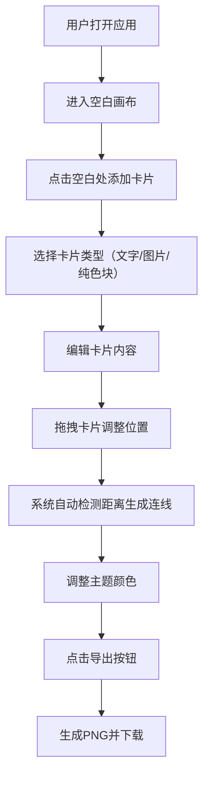

## 1. 产品概述

虚拟灵感墙与情绪板创作工具，帮助创意写作者和设计师通过拖拽视觉卡片构建情绪板，自动生成灵感关系图。

- **核心价值**：提供直观的可视化创作环境，帮助用户整理和关联创意灵感
- **目标用户**：创意写作者、设计师、内容创作者
- **解决问题**：传统灵感收集方式缺乏视觉关联和动态组织能力

## 2. 核心功能

### 2.1 功能模块

1. **情绪板主界面**：全屏画布、拖拽平移、滚轮缩放、网格背景
2. **卡片系统**：创建文字/图片/纯色块卡片、编辑内容、拖拽移动、删除
3. **动态连线系统**：基于距离自动生成虚线连线、颜色渐变效果
4. **颜色主题系统**：12种预设色彩、自定义取色器、文字颜色自适应
5. **导出功能**：PNG图片导出、2倍分辨率、自动下载

### 2.2 页面详情

| 页面名称 | 模块名称 | 功能描述 |
|---------|---------|---------|
| 主画布 | 画布控制 | 空格键+拖拽平移、滚轮缩放（0.5x-2.5x）、网格背景 |
| 主画布 | 卡片管理 | 添加/编辑/删除卡片、拖拽移动、缩放动画 |
| 主画布 | 连线系统 | 距离小于150px自动生成虚线、颜色渐变、实时更新 |
| 主画布 | 颜色面板 | 12种预设色、自定义取色器、主题色切换 |
| 主画布 | 导出功能 | PNG导出、2倍分辨率、隐藏辅助UI |

## 3. 核心流程

## 4. 用户界面设计

### 4.1 设计风格

- **主背景色**：浅米色 #faf0e6
- **卡片风格**：圆角12px、柔和阴影、悬停动效
- **字体**：使用优雅的衬线字体搭配清晰的无衬线字体
- **动效**：淡入淡出过渡0.3秒、拖拽缩放过渡0.2秒
- **网格背景**：40px间隔、透明度0.05、颜色#d4c9b5

### 4.2 预设色彩方案

| 颜色名称 | 色值 |
|---------|------|
| 淡紫 | #e8d5f5 |
| 薄荷 | #c8f7c5 |
| 桃粉 | #ffd1dc |
| 天蓝 | #b3d9ff |
| 姜黄 | #ffe066 |
| 珊瑚 | #ffa07a |
| 薰衣草 | #b39ddb |
| 柠檬 | #fff9c4 |
| 玫瑰 | #f48fb1 |
| 鼠尾草 | #9ccc9c |
| 奶油 | #ffe0b2 |
| 钢蓝 | #81d4fa |

### 4.3 页面设计概述

| 页面名称 | 模块名称 | UI元素 |
|---------|---------|--------|
| 主画布 | 卡片组件 | 标题、描述/图片、主题色背景、阴影、圆角 |
| 主画布 | 连线SVG | 虚线1.5px、4px间隔、渐变颜色 |
| 主画布 | 颜色面板 | 圆角矩形色块、取色器、淡入动画 |
| 主画布 | 工具栏 | 导出按钮、位置固定、悬停效果 |

### 4.4 响应式设计

- **桌面端**：卡片宽度200px、顶部工具栏
- **移动端（<768px）**：卡片宽度160px、字体缩小10%、底部固定工具栏
- **触摸优化**：拖拽区域扩大、手势支持

## 5. 性能约束

- 支持50张卡片同时存在
- 300条以上连线时帧率不低于40fps
- 拖拽和缩放操作流畅无卡顿
- SVG连线实时更新无可见延迟
