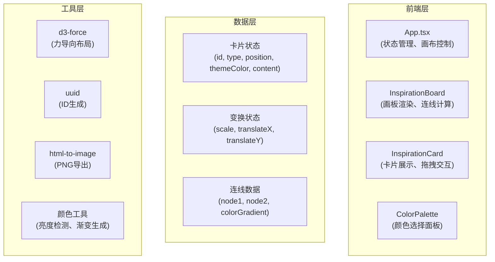

## 1. 架构设计



## 2. 技术描述

- **前端框架**：React 18 + TypeScript 5
- **构建工具**：Vite 5
- **状态管理**：React useState/useReducer（轻量场景）
- **力导向图**：d3-force
- **ID生成**：uuid
- **图片导出**：html-to-image
- **样式方案**：CSS Modules + CSS Variables

## 3. 文件结构与调用关系

```
src/
├── main.tsx              # 入口文件 → 挂载 App
├── App.tsx               # 主应用 → 管理状态、渲染 Board
├── types/
│   └── index.ts          # 类型定义 → 被所有组件引用
├── utils/
│   ├── color.ts          # 颜色工具 → 亮度检测、渐变
│   └── export.ts         # 导出工具 → PNG生成
├── hooks/
│   ├── useCanvasTransform.ts  # 画布变换Hook
│   └── useForceSimulation.ts  # 力导向Hook
└── components/
    ├── InspirationBoard.tsx   # 画板 → SVG连线 + 卡片列表
    ├── InspirationCard.tsx    # 卡片 → 内容展示 + 拖拽
    └── ColorPalette.tsx       # 调色板 → 颜色选择
```

**数据流方向**：
1. `App.tsx` 持有 cards 状态 → 传递给 `InspirationBoard`
2. `InspirationBoard` 计算连线 → 渲染 SVG 和 `InspirationCard` 列表
3. `InspirationCard` 触发位置更新 → 回调 `App.tsx` 更新状态
4. 状态变化 → `InspirationBoard` 重新计算连线

## 4. 核心数据模型

### 4.1 卡片类型定义

```typescript
type CardType = 'text' | 'image' | 'color';

interface Card {
  id: string;
  type: CardType;
  x: number;
  y: number;
  width: number;
  height: number;
  themeColor: string;
  title?: string;
  description?: string;
  imageUrl?: string;
  zIndex: number;
}

interface Connection {
  sourceId: string;
  targetId: string;
  distance: number;
}

interface CanvasTransform {
  scale: number;
  translateX: number;
  translateY: number;
}
```

### 4.2 常量定义

```typescript
const PRESET_COLORS = [
  '#e8d5f5', '#c8f7c5', '#ffd1dc', '#b3d9ff',
  '#ffe066', '#ffa07a', '#b39ddb', '#fff9c4',
  '#f48fb1', '#9ccc9c', '#ffe0b2', '#81d4fa'
];

const CANVAS_CONFIG = {
  minScale: 0.5,
  maxScale: 2.5,
  connectionDistance: 150,
  gridSize: 40,
  cardWidth: 200,
  cardWidthMobile: 160,
  borderRadius: 12,
};
```

## 5. 关键算法

### 5.1 连线生成算法

```
for each pair of cards (i, j):
  distance = sqrt((xi - xj)² + (yi - yj)²)
  if distance < CONNECTION_DISTANCE:
    create connection with gradient color
```

### 5.2 亮度检测算法

```
function getLuminance(color):
  r, g, b = hexToRgb(color)
  return (0.299 * r + 0.587 * g + 0.114 * b) / 255

function getContrastColor(color):
  return getLuminance(color) > 0.5 ? '#333333' : '#ffffff'
```

### 5.3 画布变换

```
onWheel:
  newScale = clamp(scale * (1 + deltaY * 0.001), min, max)
  update scale around mouse position

onSpaceDrag:
  translateX += deltaX
  translateY += deltaY

screenToWorld(x, y):
  worldX = (x - translateX) / scale
  worldY = (y - translateY) / scale
```

## 6. 性能优化策略

1. **useMemo 缓存连线计算结果**
2. **React.memo 包裹卡片组件**
3. **requestAnimationFrame 节流拖拽更新**
4. **CSS transform 替代 top/left 定位**
5. **SVG 连线批量更新**
6. **will-change 提示浏览器优化**
