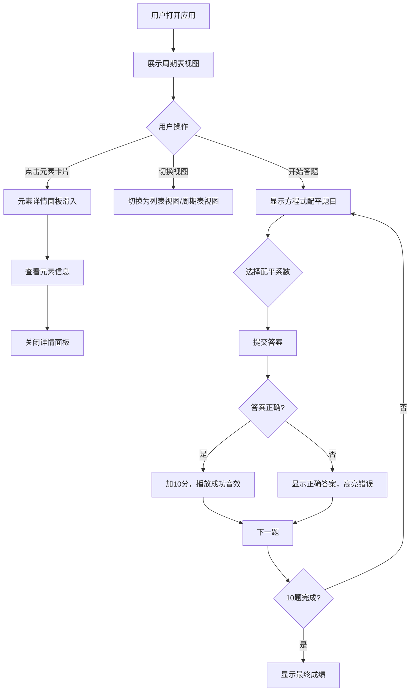

## 1. 产品概述

化学元素周期表探索与方程式配平游戏是一款面向中学生的互动式教育应用，通过可视化的周期表探索和趣味化的方程式配平挑战，帮助学生学习和巩固化学元素知识。

- 目标用户：中学生、化学教育工作者
- 核心价值：将抽象的化学元素知识转化为可视化、可交互的学习体验
- 市场定位：辅助化学教学的趣味学习工具

## 2. 核心功能

### 2.1 用户角色

| 角色 | 注册方式 | 核心权限 |
|------|----------|----------|
| 学生用户 | 无需注册，直接使用 | 浏览元素周期表、查看元素详情、参与方程式配平挑战 |

### 2.2 功能模块

1. **周期表探索**：118种元素的可视化周期表，支持点击查看详情
2. **元素详情**：展示元素的原子序数、符号、名称、类别、电子排布等信息
3. **视图切换**：周期表视图与列表视图切换
4. **方程式配平挑战**：10道随机生成的配平题目，难度递增
5. **得分系统**：实时计分、进度条、正确率统计

### 2.3 页面详情

| 页面名称 | 模块名称 | 功能描述 |
|----------|----------|----------|
| 主页面 | 周期表视图 | 网格状展示118种元素，点击卡片查看详情，支持悬停提示 |
| 主页面 | 列表视图 | 按原子序数列示所有元素，显示符号、名称、类别色块 |
| 主页面 | 元素详情面板 | 右侧滑入式面板，展示元素完整信息，支持关闭动画 |
| 主页面 | 方程式挑战区 | 随机生成配平题目，倒计时答题，得分反馈 |
| 主页面 | 得分进度条 | 显示得分、已答题目数、正确率，渐变色进度条 |

## 3. 核心流程

## 4. 用户界面设计

### 4.1 设计风格

- **设计主题**：深色科技风 / 赛博朋克教育风
- **主背景色**：#0f172a（深蓝灰色）
- **卡片背景**：#1e293b（深灰蓝色）
- **主色调**：霓虹蓝 #00d2ff（边框、交互元素）
- **辅助色**：粉色 #ff6b6b（错误反馈、强调）
- **文字颜色**：#f1f5f9（白色）
- **类别颜色**：金属 #ff6b6b、非金属 #48dbfb、过渡金属 #ffa502
- **进度条渐变**：绿色 #2ed573 → 黄色 #ffa502 → 红色 #ff4757
- **按钮风格**：圆角霓虹边框，hover 时发光效果
- **字体**：现代无衬线字体，清晰易读
- **布局风格**：上下分栏结构，支持拖拽调整比例
- **动效风格**：平滑过渡 0.2-0.3s，毛玻璃效果，波纹扩散动画

### 4.2 页面设计概述

| 页面名称 | 模块名称 | UI 元素 |
|----------|----------|---------|
| 主页面 | 顶部工具栏 | 视图切换按钮、得分显示、进度条 |
| 主页面 | 周期表/列表区 | 元素卡片网格/列表，悬停上浮效果，点击波纹动画 |
| 主页面 | 元素详情面板 | 右侧滑入，毛玻璃背景，类别色标识，关闭按钮旋转动效 |
| 主页面 | 挑战面板 | 方程式展示、系数选择按钮、倒计时、提交按钮、结果反馈 |
| 主页面 | 拖拽分隔条 | 垂直虚线，hover 变实线加粗 |

### 4.3 响应式设计

- **桌面宽屏 (>1024px)**：上下两栏布局，上栏60%高度显示周期表，下栏40%显示挑战面板
- **平板 (768-1024px)**：上栏全宽，下栏放到底部
- **手机 (<768px)**：上下栏均全宽，元素卡片缩小为40x40px

### 4.4 交互动效

- 元素卡片悬停：上浮 4px，背景微光动画 0.2s
- 元素卡片点击：同心圆波纹扩散动画，起点为点击位置
- 详情面板：右侧滑入/滑出，300px 宽，毛玻璃效果
- 视图切换：淡入淡出 0.3s opacity 过渡
- 答题反馈：正确绿色高亮，错误红色抖动
- 进度条：平滑宽度变化动画
