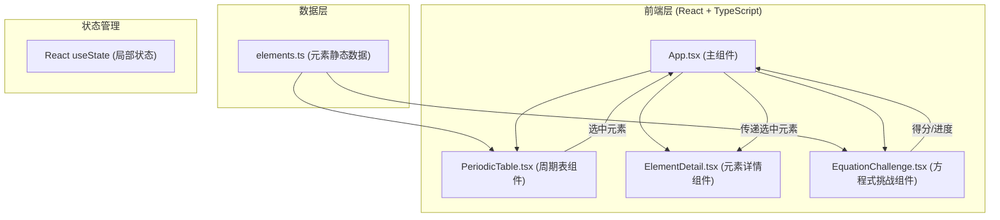

## 1. 架构设计



## 2. 技术描述

- **前端框架**：React 18 + TypeScript
- **构建工具**：Vite 5 + @vitejs/plugin-react
- **语言版本**：ES2020
- **状态管理**：React useState（轻量级，无需复杂状态管理）
- **样式方案**：原生 CSS + CSS Modules / 内联样式（项目无后端，纯前端）
- **第三方依赖**：
  - `react`、`react-dom`：核心框架
  - `typescript`：类型安全
  - `vite`、`@vitejs/plugin-react`：构建工具
  - `uuid`：生成唯一标识符（用于元素卡片 key、题目 ID 等）

## 3. 路由定义

本项目为单页面应用，无路由配置。所有功能在主页面内通过组件切换和状态管理实现。

| 视图 | 描述 |
|------|------|
| 周期表视图 | 默认视图，网格状展示118种元素 |
| 列表视图 | 按原子序数排列的元素列表 |

## 4. 数据模型

### 4.1 元素数据模型

```typescript
interface Element {
  atomicNumber: number;      // 原子序数
  symbol: string;            // 元素符号
  name: string;              // 中文名称
  nameEn: string;            // 英文名称
  category: string;          // 元素类别
  atomicMass: number;        // 相对原子质量
  electronConfiguration: string; // 电子排布
  period: number;            // 周期
  group: number;             // 族
  color?: string;            // 类别对应颜色
}
```

### 4.2 方程式题目模型

```typescript
interface EquationQuestion {
  id: string;
  equation: {
    reactants: { symbol: string; coefficient: number }[];  // 反应物
    products: { symbol: string; coefficient: number }[];   // 生成物
  };
  userAnswer: number[];     // 用户选择的系数
  correctAnswer: number[];  // 正确答案
  difficulty: 'easy' | 'hard'; // 难度
}
```

### 4.3 游戏状态模型

```typescript
interface GameState {
  score: number;            // 当前得分
  currentQuestionIndex: number; // 当前题目索引
  totalQuestions: number;   // 总题目数
  correctCount: number;     // 正确题数
  streak: number;           // 连续正确数
  skipChance: number;       // 跳过机会数
  questions: EquationQuestion[]; // 所有题目
}
```

## 5. 文件结构

```
project-root/
├── index.html                  # 入口 HTML
├── package.json                # 项目依赖配置
├── vite.config.js              # Vite 构建配置
├── tsconfig.json               # TypeScript 配置
└── src/
    ├── main.tsx                # React 入口
    ├── App.tsx                 # 主应用组件
    ├── App.css                 # 全局样式
    ├── data/
    │   └── elements.ts         # 118种元素静态数据
    ├── components/
    │   ├── PeriodicTable.tsx   # 周期表组件
    │   ├── PeriodicTable.css   # 周期表样式
    │   ├── ElementDetail.tsx   # 元素详情组件
    │   ├── ElementDetail.css   # 元素详情样式
    │   ├── EquationChallenge.tsx  # 方程式挑战组件
    │   └── EquationChallenge.css  # 方程式挑战样式
    └── hooks/
        └── useEquationGenerator.ts  # 方程式生成 Hook（可选）
```

## 6. 组件调用关系与数据流

### 6.1 组件树结构

```
App.tsx
├── 顶部工具栏 (得分、视图切换)
├── PeriodicTable 或 ListView (视图切换)
│   └── ElementCard (118个)
├── ElementDetail (侧边面板)
└── EquationChallenge
    ├── QuestionDisplay
    ├── CoefficientSelector
    └── ScoreBoard
```

### 6.2 数据流

1. **元素数据流向**：
   - `src/data/elements.ts` → `PeriodicTable.tsx` → 渲染 118 个元素卡片
   - 用户点击元素卡片 → `onSelectElement` 回调 → `App.tsx` 更新选中状态 → `ElementDetail.tsx` 显示详情

2. **方程式挑战数据流**：
   - `App.tsx` 初始化游戏状态 → `EquationChallenge.tsx`
   - 用户选择系数 → 更新本地状态 → 提交答案 → 校验 → 更新得分
   - 得分变化 → `App.tsx` 更新顶部进度条

3. **视图切换数据流**：
   - 用户点击切换按钮 → `App.tsx` 更新视图模式 → 条件渲染 `PeriodicTable` 或 `ListView`

## 7. 性能优化策略

### 7.1 渲染性能

- **元素卡片优化**：使用 React.memo 包裹 ElementCard 组件，避免不必要的重渲染
- **列表虚拟化**：列表视图考虑使用虚拟滚动（如元素过多时）
- **CSS 动画优化**：使用 transform 和 opacity 属性实现动画，避免触发重排
- **requestAnimationFrame**：复杂动画使用 rAF 确保 60fps

### 7.2 加载性能

- **静态数据内联**：元素数据直接打包在 JS 中，无网络请求
- **代码分割**：按需加载（如方程式挑战模块可延迟加载）
- **图片资源**：本项目无图片资源，主要为 CSS 和 JS

## 8. 无障碍与键盘导航

- 所有交互元素支持 Tab 键导航
- 元素卡片可通过 Enter/Space 键触发点击
- 详情面板可通过 Esc 键关闭
- 方程式系数可通过数字键 1-9 快速选择
