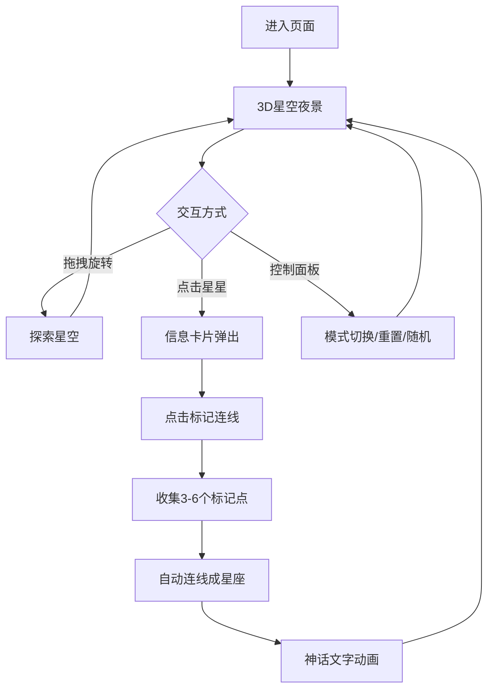

## 1. 产品概述

虚拟天文馆与星座漫游仪——让用户在浏览器中化身荒原观星者，仰望并探索一片动态生成的3D星空。通过手势划动旋转视角、点击星星查看信息、选中亮星连线勾勒星座轮廓，并播放星座神话文字动画。

- 目标用户：天文爱好者、教育场景、沉浸式体验追求者
- 核心价值：在浏览器中提供零门槛的沉浸式星空探索体验，兼具科普与审美

## 2. 核心功能

### 2.1 功能模块

1. **星空场景页**（唯一页面，全屏沉浸）：
   - 渐变色夜空背景（#0a0a2e → #1a1a40）
   - ~800颗随机分布闪烁星星（1-3px，闪烁周期1.5-4秒，颜色#ffffff → #a0c4ff）
   - 银河光带（半透明径向渐变+多层模糊圆环，60秒缓慢旋转）
   - 底部深灰色山峦剪影（CSS clip-path，固定不动）

2. **3D星空交互**：
   - Three.js球面坐标半球壳分布（半径200，仰角0-90°，方位角0-360°）
   - 鼠标拖拽/触摸旋转摄像头（俯仰0-85°，水平360°自由旋转）
   - 惯性阻尼（摩擦系数0.95）
   - 缩放0.3-3.0倍，远处光点→靠近带光晕小圆球

3. **星星信息交互**：
   - 点击星星：高亮闪烁（1.5倍放大，金黄色#ffd700，0.6秒后恢复）
   - 左上角信息卡片（圆角12px，毛玻璃blur 8px，rgba(10,10,30,0.7)）
   - 显示：编号、视星等（1.0-6.5）、距离（4.5-1500光年）
   - "标记连线"按钮

4. **星座连线与神话**：
   - 标记点：白色圆环8px，脉冲周期1秒
   - 3-6个标记点自动连线（半透明白色虚线，线宽2px，透明度0.6，发光描边#00bfff）
   - 星座名称与神话故事打字机效果（120字/分钟，淡金色#d4af37）

5. **控制面板**（右侧180px，毛玻璃）：
   - "星座模式"开关（滑动切换）
   - "重置视角"按钮（1.5秒平滑复位）
   - "随机星座"按钮

### 2.2 页面详情

| 页面名称 | 模块名称 | 功能描述 |
|----------|----------|----------|
| 星空主场景 | 夜空背景 | 渐变色背景+800颗闪烁星星+银河光带+山峦剪影 |
| 星空主场景 | 3D星空 | Three.js半球壳星星分布+拖拽旋转+缩放+惯性阻尼 |
| 星空主场景 | 星星交互 | 点击高亮+信息卡片+标记连线按钮 |
| 星空主场景 | 星座连线 | 标记点连线+星座名称+神话打字机动画 |
| 星空主场景 | 控制面板 | 星座模式开关+重置视角+随机星座 |

## 3. 核心流程

用户进入页面 → 看到3D星空夜景 → 拖拽旋转探索 → 点击星星查看信息 → 标记3-6颗星 → 自动连线成星座 → 显示星座神话 → 可通过控制面板切换模式/重置/随机

## 4. 用户界面设计

### 4.1 设计风格

- **主色调**：深邃夜空蓝 (#0a0a2e, #1a1a40)
- **强调色**：金黄 (#ffd700)、冰蓝 (#00bfff)、淡金 (#d4af37)
- **按钮风格**：半透明毛玻璃圆角按钮
- **字体**：无衬线体，信息卡片用等宽字体显示数据
- **布局风格**：全屏沉浸，UI元素浮动叠加

### 4.2 页面设计概览

| 页面名称 | 模块名称 | UI元素 |
|----------|----------|--------|
| 星空主场景 | 夜空背景 | 渐变CSS+闪烁粒子+银河径向渐变+山峦clip-path |
| 星空主场景 | 信息卡片 | 左上角浮动，12px圆角，毛玻璃，淡入0.3s |
| 星空主场景 | 星座连线 | 虚线+发光描边+脉冲圆环标记点 |
| 星空主场景 | 控制面板 | 右侧180px浮动，8px圆角，毛玻璃，窄屏折叠为浮动图标 |

### 4.3 响应式设计

- 桌面优先设计，最小支持1024x768
- 星星分布和UI布局自动适配不同宽高比
- 窄屏下控制面板折叠为右下角浮动图标（点击展开）

### 4.4 3D场景指导

- **环境氛围**：深邃夜空，静谧荒原观星
- **光照**：极弱环境光，星星自发光为主
- **相机**：透视相机，半球壳中心为原点，带惯性阻尼旋转
- **交互**：拖拽旋转、点击选星、滚轮缩放
- **动画**：星星闪烁、银河旋转、标记点脉冲、连线绘制
- **性能目标**：Chrome 110+，1080p，60fps
