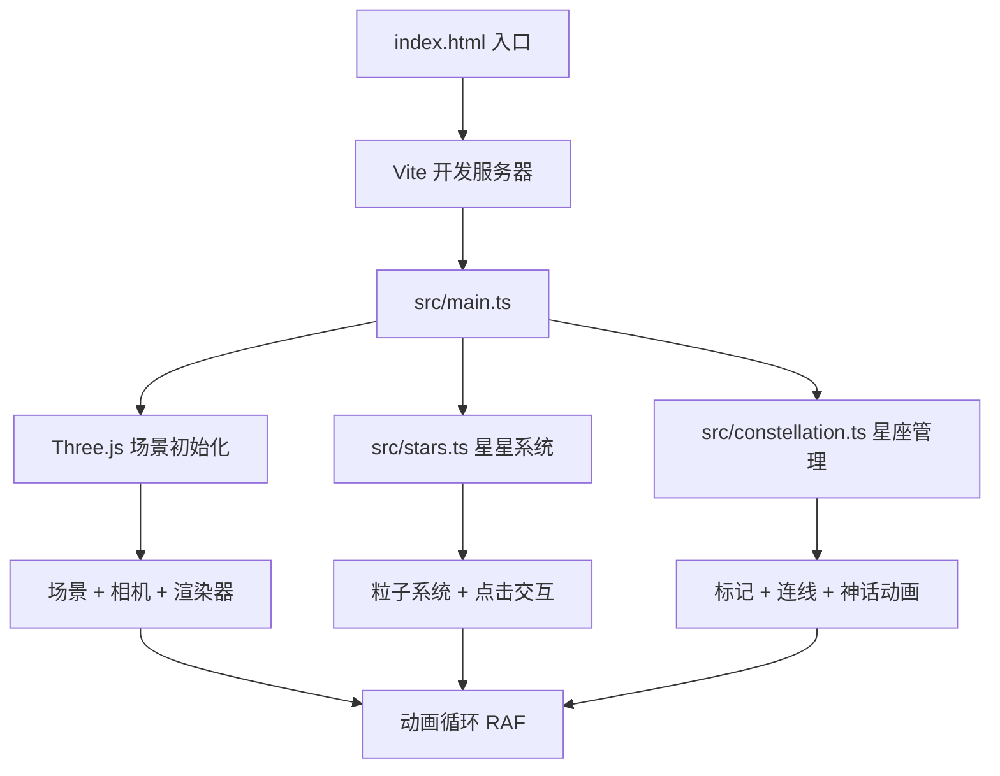

## 1. 架构设计



## 2. 技术说明

- **前端**：TypeScript + Three.js@0.160.0 + Vite
- **构建工具**：Vite（TypeScript支持，base: './'）
- **后端**：无（纯前端项目）
- **数据**：所有星星数据随机模拟生成，无外部API

## 3. 文件结构

```
project/
├── package.json          # 依赖与脚本
├── index.html            # 入口HTML
├── vite.config.js        # Vite构建配置
├── tsconfig.json         # TypeScript配置
└── src/
    ├── main.ts           # 场景/相机/渲染器/事件/动画循环
    ├── stars.ts          # 星星数据+粒子系统+点击交互
    └── constellation.ts  # 星座标记+连线+神话动画
```

## 4. 核心模块设计

### 4.1 stars.ts - 星星系统

- `generateStarData(count)`: 生成800颗星星的球面坐标数据（半径200，仰角0-90°，方位角0-360°）
- 每颗星属性：position, magnitude(1.0-6.5), distance(4.5-1500光年), id, color(#ffffff→#a0c4ff)
- `createStarParticles(starData)`: 使用Three.js Points + BufferGeometry + PointsMaterial创建粒子系统
- `createStarMeshes(starData)`: 创建可交互的透明球体用于raycasting点击检测
- 闪烁动画：通过shader或逐帧修改粒子大小属性实现（周期1.5-4秒随机）
- 点击检测：Raycaster + 鼠标坐标归一化

### 4.2 constellation.ts - 星座管理

- `addMark(star)`: 添加标记点（白色圆环，8px，脉冲1秒）
- `checkAndConnect()`: 检测标记点数量3-6个时自动连线
- `createConstellationLines(markedStars)`: 半透明白色虚线+发光描边(#00bfff)
- `showConstellationInfo(name, myth)`: 打字机效果文字动画（120字/分钟，#d4af37）
- `toggleConstellationMode()`: 星座模式开关（高亮+缓慢旋转所有已标记星座）
- `resetView()`: 1.5秒平滑视角复位
- `randomConstellation()`: 随机选择3-6颗亮星自动标记连线

### 4.3 main.ts - 主入口

- Three.js场景初始化：Scene, PerspectiveCamera, WebGLRenderer
- CSS2DRenderer或HTML叠加层用于UI元素
- 事件绑定：mousedown/move/up, touchstart/move/end, wheel, click
- 相机旋转：球坐标计算，俯仰限制0-85°，惯性阻尼0.95
- 动画循环：requestAnimationFrame，更新闪烁/标记/连线动画

## 5. 性能策略

- 星星闪烁：自定义ShaderMaterial避免逐帧CPU计算
- 点击检测：仅对可交互球体做Raycaster，不检测粒子
- UI动画：CSS transition/animation优先，时长0.3-0.5秒
- 渲染：requestAnimationFrame，目标60fps
