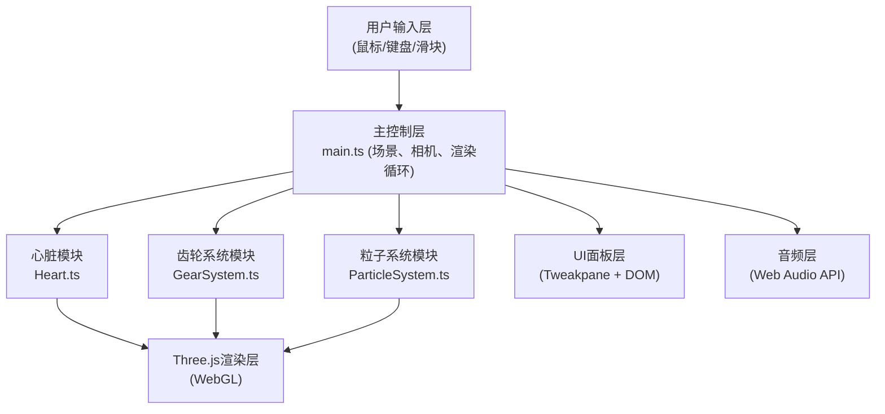

## 1. 架构设计



## 2. 技术说明

- **前端框架**：TypeScript + Vite
- **3D引擎**：Three.js @0.160.0
- **UI控制面板**：Tweakpane
- **动画库**：GSAP (视角切换缓动)
- **音频**：Web Audio API (原生)
- **构建工具**：Vite

## 3. 模块定义

| 文件路径 | 职责 | 导出 |
|----------|------|------|
| src/main.ts | 场景初始化、相机、灯光、渲染器、动画循环、用户输入处理 | 默认无 |
| src/Heart.ts | 心脏几何生成、材质、搏动逻辑、泵室活塞运动 | Heart类 |
| src/GearSystem.ts | 齿轮几何、啮合计算、传动比、旋转逻辑 | GearSystem类、Gear子类 |
| src/ParticleSystem.ts | 火花粒子池、位置更新、透明度衰减、生命周期 | ParticleSystem类 |

## 4. 数据流向

```
用户输入 → main.ts → update(参数)
                      ├→ Heart.update(beatFrequency) → 心室缩放 + 泵室位移
                      ├→ GearSystem.update(driveSpeed) → 齿轮转速计算 + 旋转
                      │     └→ 啮合位置 → ParticleSystem.addSpark()
                      └→ ParticleSystem.update() → 粒子位置 + 透明度更新
                                                              ↓
                                                       Three.js 渲染
```

## 5. 核心数据模型

### 5.1 Heart 类
```typescript
class Heart {
  group: THREE.Group
  ventricle: THREE.Mesh      // 中央心室
  pumps: THREE.Mesh[]        // 8个辅助泵室
  basePositions: THREE.Vector3[]  // 泵室基础位置
  update(beatFrequency: number, time: number): void
}
```

### 5.2 GearSystem 类
```typescript
class GearSystem {
  group: THREE.Group
  gears: Gear[]
  driveGear: Gear            // 驱动齿轮
  update(driveSpeed: number, deltaTime: number): void
  getContactPoints(): THREE.Vector3[]
}

class Gear {
  mesh: THREE.Mesh
  teeth: number
  radius: number
  speed: number              // rad/s
  isInternal: boolean
  connectedGears: Gear[]     // 啮合的齿轮
}
```

### 5.3 ParticleSystem 类
```typescript
class ParticleSystem {
  particles: THREE.Points
  pool: Particle[]
  addSpark(position: THREE.Vector3): void
  update(deltaTime: number): void
}
```

## 6. 性能优化策略

1. **粒子池化**：预分配30个粒子，循环复用，避免GC
2. **齿轮LOD**：远处使用低精度几何（减少齿面细分）
3. **材质复用**：所有齿轮共享同一黄铜材质实例
4. **节流火花生成**：每秒最多20个火花粒子
5. **矩阵更新优化**：仅标记需要更新的对象
