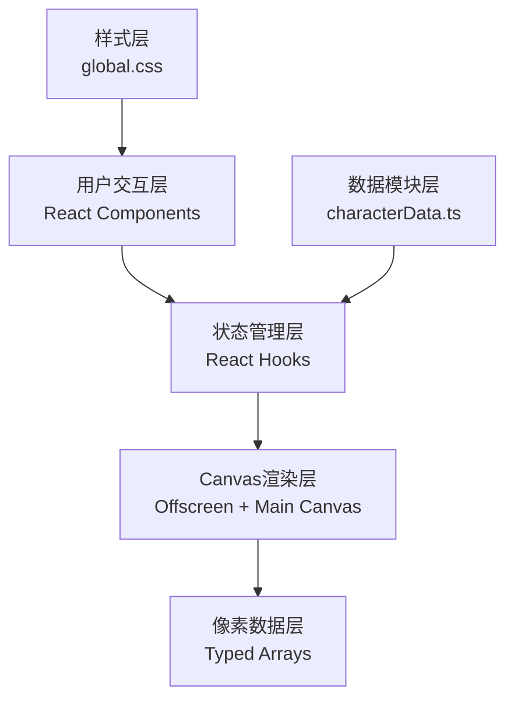

## 1. 架构设计



## 2. 技术栈描述

- **前端框架**：React@18 + TypeScript@5
- **构建工具**：Vite@5 + @vitejs/plugin-react@4
- **渲染技术**：Canvas 2D API + OffscreenCanvas（离屏渲染）
- **状态管理**：React useState / useRef（无额外状态库）
- **拖拽实现**：原生HTML5 Drag and Drop API
- **第三方库**：uuid（生成唯一ID）
- **后端**：无（纯前端应用，数据本地存储）
- **数据库**：无（内置词库和字符数据）

## 3. 文件结构

```
├── package.json          # 项目依赖配置
├── vite.config.js        # Vite构建配置
├── tsconfig.json         # TypeScript配置
├── index.html            # 入口HTML
└── src/
    ├── App.tsx           # 主布局组件，状态管理
    ├── components/
    │   ├── StoneTablet.tsx    # 石碑组件（拓印核心）
    │   └── NotebookPanel.tsx  # 笔记面板组件
    ├── utils/
    │   └── characterData.ts   # 字符数据和词库
    └── styles/
        └── global.css         # 全局样式和动画
```

## 4. 核心数据类型定义

```typescript
// 字符数据类型
interface CharacterData {
  id: string;
  character: string;           // 现代汉字
  bronzeScript: number[][];    // 金文字形像素矩阵 (16x16)
  blurredState: number[][];    // 模糊初始态 (40%像素)
  clearState: number[][];      // 清晰态
  meaning: string;             // 释义
  pronunciation: string;       // 读音
  clarity: number;             // 当前清晰度 0-100
  position: { x: number; y: number }; // 石碑上的位置
}

// 拓印工具类型
type ToolType = 'pad' | 'brush' | 'spray';

// 词库词条类型
interface VocabularyEntry {
  id: string;
  characters: string[];        // 组成词语的字符
  meaning: string;             // 词语释义
  background: string;          // 历史背景
}

// 像素状态类型
interface PixelState {
  x: number;
  y: number;
  opacity: number;             // 墨迹透明度 0-1
  isRevealed: boolean;         // 是否已显示
  timestamp: number;           // 最后拓印时间
}

// 笔记面板字符项
interface NotebookItem {
  id: string;
  characterId: string;
  character: string;
  meaning: string;
  pronunciation: string;
}

// 破译区格子状态
interface DecodeSlot {
  index: number;
  item: NotebookItem | null;
}
```

## 5. 核心算法

### 5.1 拓印压力计算算法
```typescript
function calculatePressure(
  pressDuration: number,      // 鼠标按下时长(ms)
  moveSpeed: number,          // 移动速度(px/ms)
  tool: ToolType
): number {
  // 基础压力 0.3-1.0
  const basePressure = Math.min(1, pressDuration / 500);
  const speedFactor = Math.max(0.3, 1 - moveSpeed / 2);
  const toolMultiplier = tool === 'pad' ? 1.2 : tool === 'brush' ? 1.0 : 0.8;
  return Math.min(1, basePressure * speedFactor * toolMultiplier);
}
```

### 5.2 墨迹扩散算法
```typescript
function diffuseInk(
  ctx: CanvasRenderingContext2D,
  x: number,
  y: number,
  radius: number,
  pressure: number,
  duration: number = 500
): void {
  const startTime = performance.now();
  const animate = (currentTime: number) => {
    const elapsed = currentTime - startTime;
    const progress = Math.min(1, elapsed / duration);
    const currentRadius = radius * (0.5 + progress * 0.5);
    const currentOpacity = pressure * (1 - progress * 0.3);
    
    ctx.beginPath();
    ctx.arc(x, y, currentRadius, 0, Math.PI * 2);
    ctx.fillStyle = `rgba(26, 26, 26, ${currentOpacity})`;
    ctx.fill();
    
    if (progress < 1) requestAnimationFrame(animate);
  };
  requestAnimationFrame(animate);
}
```

### 5.3 墨汁晕染检测
```typescript
function checkInkBleeding(
  lastPosition: { x: number; y: number },
  currentPosition: { x: number; y: number },
  lastTimestamp: number,
  currentTimestamp: number,
  areaCm2: number = 1
): boolean {
  const distance = Math.sqrt(
    Math.pow(currentPosition.x - lastPosition.x, 2) +
    Math.pow(currentPosition.y - lastPosition.y, 2)
  );
  const timeDelta = (currentTimestamp - lastTimestamp) / 1000;
  const speed = distance / timeDelta; // px/s
  const speedThreshold = 50; // px/s，低于此值触发晕染
  return speed < speedThreshold / areaCm2;
}
```

### 5.4 字符清晰度计算
```typescript
function calculateClarity(revealedPixels: Set<string>, totalPixels: number): number {
  return Math.round((revealedPixels.size / totalPixels) * 100);
}
```

### 5.5 词库匹配算法
```typescript
function matchVocabulary(
  slots: DecodeSlot[],
  vocabulary: VocabularyEntry[]
): VocabularyEntry | null {
  const characters = slots
    .filter(s => s.item)
    .map(s => s.item!.character);
  
  if (characters.length < 2) return null;
  
  return vocabulary.find(entry => 
    entry.characters.length === characters.length &&
    entry.characters.every((ch, i) => ch === characters[i])
  ) || null;
}
```

## 6. 性能优化策略

### 6.1 离屏Canvas渲染
- 使用 OffscreenCanvas 进行像素级绘制
- 主 Canvas 仅在拓印完成后更新最终状态
- 避免频繁重绘，保证60FPS

### 6.2 像素数据优化
- 使用 TypedArray (Uint8ClampedArray) 存储像素状态
- 批量更新像素数据，减少Canvas API调用
- 采用脏矩形渲染，只更新变化区域

### 6.3 词库搜索优化
- 词库数据加载时构建前缀树(Trie)索引
- 搜索时间复杂度 O(n)，保证响应 < 100ms
- 缓存搜索结果，避免重复计算

### 6.4 动画优化
- 使用 requestAnimationFrame 进行动画
- 节流/防抖处理频繁的鼠标事件
- CSS transform 动画启用硬件加速

## 7. 状态管理

### 7.1 全局状态 (App.tsx)
- `characters: CharacterData[]` - 石碑上的字符列表
- `notebookItems: NotebookItem[]` - 已破译字符列表
- `decodeSlots: DecodeSlot[]` - 破译区8个格子
- `selectedTool: ToolType` - 当前选中的拓印工具
- `showSuccess: boolean` - 破译成功弹窗状态
- `matchedVocabulary: VocabularyEntry | null` - 匹配的词条

### 7.2 局部状态 (StoneTablet.tsx)
- `isDrawing: boolean` - 是否正在拓印
- `lastPosition: { x, y }` - 上一个鼠标位置
- `lastTimestamp: number` - 上一个时间戳
- `pressStartTime: number` - 按下开始时间
- `offscreenCanvas: OffscreenCanvas` - 离屏画布引用

## 8. 路由定义

| 路由 | 用途 |
|-------|---------|
| / | 主工作台（唯一页面） |

*此应用为单页应用，无复杂路由配置。*
