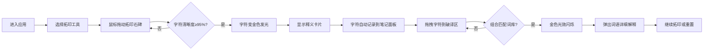

## 1. 产品概述

数字石板拓印与古文字破译交互式应用，为书法爱好者和历史迷提供沉浸式的网页拓印体验，让用户在虚拟石碑上体验传统拓印技艺，复现古老碑文并破译模糊的金文字符。

- 核心目标：将传统拓印技艺数字化，让用户在浏览器中体验拓印过程并学习古文字知识
- 目标用户：书法爱好者、历史文化爱好者、古文字研究者
- 产品价值：寓教于乐，通过互动方式传承中华传统文化

## 2. 核心 Features

### 2.1 功能模块
1. **虚拟石碑工作台**：深灰色花岗岩纹理背景，半透明石碑，支持三种拓印工具（拓包、刷子、喷雾）
2. **拓印交互系统**：根据鼠标压力（按下时长和移动速度）逐像素显示碑文字迹，墨迹扩散效果
3. **古文字系统**：10-15个金文/甲骨文字符，从模糊碎片逐渐清晰，完整拓印后显示释义读音
4. **破译笔记面板**：记录已拓印字符，拖拽组合成词语，内置30个古文字词汇库
5. **墨汁晕染效果**：低速拓印时墨迹自然晕染扩散，模拟真实墨汁浸润

### 2.2 页面详情
| 页面名称 | 模块名称 | 功能描述 |
|-----------|-------------|---------------------|
| 主工作台 | 石碑区域 | 500x400px石碑，CSS噪声纹理，离屏Canvas像素级拓印绘制 |
| 主工作台 | 工具栏 | 拓包/刷子/喷雾工具选择，重置按钮 |
| 右侧面板 | 笔记面板 | 已破译字符列表，8格破译区，拖拽排序 |
| 弹窗 | 字符释义卡片 | 从底部滑入，显示现代释义与读音 |
| 弹窗 | 词语解释卡片 | 奶油色背景，显示详细历史背景 |

## 3. 核心流程

## 4. 用户界面设计

### 4.1 设计风格
- **主色调**：古旧书卷色调，#d2c4a0 到 #e6d5b8 线性渐变
- **辅助色**：深褐 #5c4033，暗金 #8b7355，金色 #d4af37
- **石碑背景**：#3a3a3a 到 #4a4a4a 径向渐变（花岗岩纹理）
- **宣纸底纹**：#f5e6c8，透明度0.3
- **墨迹颜色**：#1a1a1a
- **按钮样式**：圆形重置按钮，直径40px，#8b4513背景，悬停变为#a0522d
- **字体**：使用楷体/宋体类书法字体，营造古典氛围
- **顶部装饰**：竹简横梁，多个矩形元素横向排列，旋转±2度，带有细孔和绳纹

### 4.2 页面设计概述
| 页面名称 | 模块名称 | UI元素 |
|-----------|-------------|-------------|
| 主工作台 | 石碑区域 | 径向渐变背景、CSS噪声纹理、Canvas绘制层、墨迹扩散动画 |
| 主工作台 | 工具栏 | 工具选择按钮（拓包/刷子/喷雾图标）、悬停效果、选中状态 |
| 右侧面板 | 笔记面板 | 深褐色背景、羊皮纸纹理、圆角8px、字符卡片、8格空位 |
| 弹窗 | 字符卡片 | 底部滑入动画0.3s、金色边框、发光效果 |
| 弹窗 | 词语解释 | 奶油色背景#fff8dc、圆角12px、阴影深度8px |

### 4.3 响应式设计
- **桌面端**：右侧350px宽笔记面板，石碑居中
- **平板端（≤768px）**：笔记面板折叠为底部抽屉，石碑自适应宽度
- **触控优化**：支持触摸事件，拖拽区域放大，确保移动端可操作

### 4.4 动画效果
- **拓印效果**：墨迹从中心向外扩散，持续0.5秒
- **字符完成**：灰色变金色边框，阴影扩展4px，微微发光
- **释义卡片**：从底部滑入，动画0.3秒
- **破译成功**：石碑区域金色光效闪烁，关键帧动画0.6秒
- **交互反馈**：轻微触感抖动，transform: translateX(±3px) 0.1s
- **墨汁晕染**：低速拓印时半径增加5px，透明度降低0.1

## 5. 性能要求
- 拓印绘制使用离屏Canvas，主Canvas仅更新最终状态，保证60FPS
- 破译搜索响应时间低于100ms
- 像素级操作优化，避免频繁重绘
