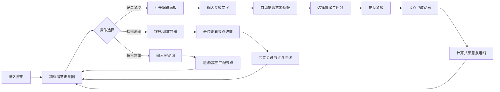

## 1. 产品概述

虚拟梦境日记与潜意识地图绘制仪——一款沉浸式的梦境记录与可视化应用，让用户以释梦师的视角记录、解析和探索自己的潜意识世界。系统将梦境片段转化为不断生长的抽象地图，通过节点聚类和情感连线揭示潜意识中的重复主题与情绪模式。

- **目标用户**：对梦境分析、心理学、自我探索感兴趣的普通用户
- **核心价值**：将抽象的梦境体验转化为可视化的认知地图，帮助用户发现潜意识中的模式

## 2. 核心功能

### 2.1 功能模块

1. **潜意识地图视口**：沉浸式Canvas地图，展示梦境节点、情感连线、动态粒子背景
2. **梦境记录面板**：全屏编辑器，支持文字输入、意象标签提取、情绪评分
3. **节点交互系统**：悬停高亮、信息气泡、节点膨胀动画
4. **地图导航系统**：拖拽平移、滚轮缩放、迷你小地图
5. **意象搜索系统**：关键词搜索、节点过滤、主题色高亮

### 2.2 页面详情

| 页面名称 | 模块名称 | 功能描述 |
|-----------|-------------|---------------------|
| 主界面 | 潜意识地图视口 | 90%宽70%高的Canvas区域，带粒子背景，节点气泡、连线动画 |
| 主界面 | 记录梦境按钮 | 右下角胶囊按钮，带光晕脉动动画，点击弹出编辑面板 |
| 主界面 | 搜索框 | 右上角意象搜索，支持节点过滤和高亮 |
| 主界面 | 迷你小地图 | 底部导航地图，显示视口位置，支持拖拽 |
| 梦境编辑面板 | 文字输入区 | 2000字限制，实时计数，淡蓝光标 |
| 梦境编辑面板 | 意象标签区 | 自动提取名词，彩色药丸标签，支持手动增删 |
| 梦境编辑面板 | 情绪滑块 | 四种情绪选择，强度评分0-10 |

## 3. 核心流程

用户进入应用 → 查看潜意识地图 → 点击记录梦境 → 填写内容与标签 → 提交后节点飞散到地图 → 自动计算连线与聚类 → 悬停探索节点关系 → 搜索意象发现主题模式

## 4. 用户界面设计

### 4.1 设计风格

- **主色调**：深蓝紫渐变背景 (#0f0c29 → #302b63 → #24243e)
- **情感色**：喜悦#f9ca24、悲伤#686de0、恐惧#ff6b6b、平静#7ed6df
- **强调色**：青色#00d2d3（按钮、边框、发光效果）
- **按钮风格**：半透明圆角胶囊，四周蓝紫色光晕扩散
- **字体**：系统无衬线字体，正文#e0e0e0，行高1.8
- **视觉风格**：梦幻、沉浸、毛玻璃、粒子动效、弹性物理感

### 4.2 页面设计概览

| 页面名称 | 模块名称 | UI元素 |
|-----------|-------------|-------------|
| 主界面 | 地图视口 | Canvas全屏、粒子飘动背景、半透明气泡节点、弹性连线动画 |
| 主界面 | 记录按钮 | 胶囊形状、#00d2d3背景、2秒光晕周期、固定右下角 |
| 主界面 | 搜索框 | #2a2a4a背景、1px#00d2d3边框、焦点8px外发光 |
| 主界面 | 小地图 | 150×100px、#0a0a1a背景、白色视口矩形、可拖拽 |
| 编辑面板 | 全屏覆盖 | #1a1a2e×0.95、backdrop-filter:blur(10px) |
| 编辑面板 | 文字区 | #e0e0e0字体、淡蓝光标、行高1.8、实时字数 |
| 编辑面板 | 标签区 | 彩色药丸渐变、悬停1.1倍放大阴影 |
| 节点交互 | 悬停效果 | 1.3倍膨胀、信息气泡、关联高亮0.8/无关0.2透明度 |

### 4.3 响应式设计

- **桌面端 (>768px)**：标准布局，地图90%×70%居中，侧栏控件正常显示
- **移动端 (≤768px)**：地图占满全屏，底部60px毛玻璃工具栏，图标+文字紧凑布局
- **矮屏 (≤500px高度)**：编辑面板顶部栏缩小，文字区与标签区左右各50%并排

## 5. 性能要求

- 节点数量 > 100 时帧率 ≥ 30fps
- Canvas绘制节点与连线，DOM仅用于交互层
- requestAnimationFrame驱动动画循环
- CSS过渡动画统一使用0.3-0.8秒时长
