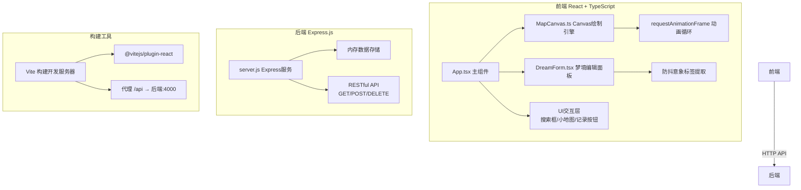
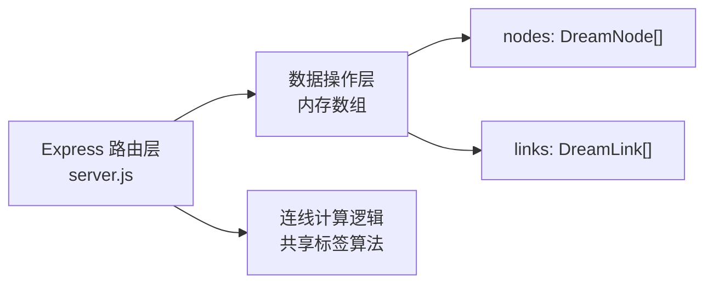
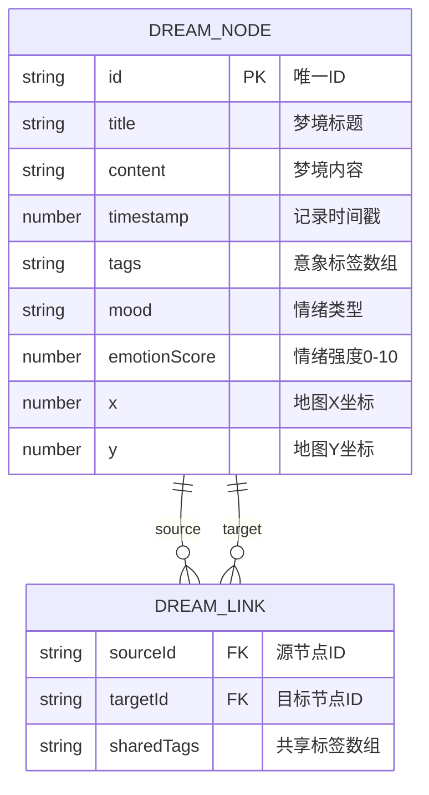

## 1. 架构设计



## 2. 技术描述

- **前端**：React 18 + TypeScript + Vite
- **后端**：Express 4.x（端口4000）
- **数据存储**：内存数组模拟持久化
- **动画**：Canvas 2D API + requestAnimationFrame
- **状态管理**：React useState/useRef（简单场景无需额外状态库）
- **构建**：Vite 5.x + @vitejs/plugin-react
- **附加库**：uuid（唯一ID）、canvas-confetti（提交庆祝动画）、cors（跨域）、body-parser（请求解析）

## 3. 路由与页面定义

| 路由 | 目的 |
|-------|---------|
| / | 主应用界面（潜意识地图） |

单页应用，所有交互通过组件状态管理。

## 4. API 定义

### 4.1 TypeScript 类型

```typescript
type MoodType = 'joy' | 'sadness' | 'fear' | 'calm';

interface DreamNode {
  id: string;
  title: string;
  content: string;
  timestamp: number;
  tags: string[];
  mood: MoodType;
  emotionScore: number;
  x: number;
  y: number;
  vx?: number;
  vy?: number;
}

interface DreamLink {
  sourceId: string;
  targetId: string;
  sharedTags: string[];
}

interface AppState {
  nodes: DreamNode[];
  links: DreamLink[];
  selectedNodeId: string | null;
  hoveredNodeId: string | null;
  searchQuery: string;
  isFormOpen: boolean;
}
```

### 4.2 REST API

| 方法 | 路径 | 请求体 | 响应 | 说明 |
|------|------|--------|------|------|
| GET | /api/nodes | - | `{nodes, links}` | 获取所有节点与连线 |
| POST | /api/nodes | `{title, content, tags, mood, emotionScore}` | 新创建的 `DreamNode` + 更新后的 `links` | 新增节点并计算连线 |
| DELETE | /api/nodes/:id | - | `{success: true}` | 删除节点及关联连线 |

## 5. 服务器架构



轻量级单体Express服务，业务逻辑内联在路由处理中，适合原型验证。

## 6. 数据模型

### 6.1 实体关系



### 6.2 连线计算规则

- 两个节点共享 ≥ 1 个意象标签时自动生成连线
- 线宽 = 2px + 共享标签数 × 0.5px（上限3px）
- 连线颜色 = 两节点情绪色按RGB通道取平均
- 连线上光点沿线性插值匀速移动（0.5单位/秒）
