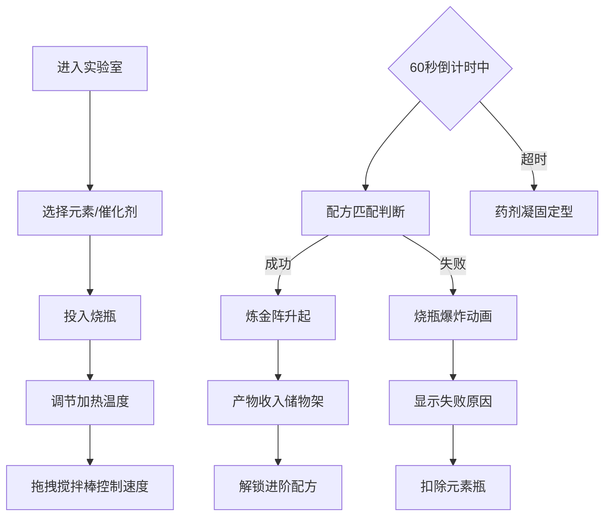

# 炼金术士实验室 - 产品需求文档

## 1. 产品概述
炼金术士实验室是一款沉浸式的互动炼金模拟游戏，玩家在复古风格的虚拟实验室中通过组合土、水、风、火四大元素，配合催化剂（砷、硫磺、汞），控制加热温度与搅拌速率，在60秒倒计时内调配出传说中的炼金产物。

- 核心目标：提供有趣、沉浸式的炼金体验，让玩家体验古老炼金术的神秘魅力
- 目标用户：喜欢探索、解谜和神秘学主题的休闲游戏玩家
- 产品价值：结合配方探索、时机把握与视觉特效，打造独特的互动体验

## 2. 核心功能

### 2.1 用户角色
| 角色 | 注册方式 | 核心权限 |
|------|---------|---------|
| 炼金术士 | 无需注册，直接游玩 | 选择元素、操控烧瓶、查看配方、收集产物 |

### 2.2 功能模块
1. **元素架（左栏）**：展示可用的四元素瓶（土、水、风、火）和三种催化剂（砷、硫磺、汞），显示剩余数量
2. **炼金工作台（中栏）**：三个玻璃烧瓶、加热火苗控件、搅拌棒控件、60秒倒计时、配方记录区、炼金阵特效
3. **储物架（右栏）**：3×3网格展示已成功炼金的产物，显示解锁状态和配方信息

### 2.3 页面详情
| 页面名称 | 模块名称 | 功能描述 |
|---------|---------|---------|
| 主页（单页应用） | 元素架 | 点击元素/催化剂瓶，选择后飞入当前激活的烧瓶 |
| 主页 | 烧瓶系统 | 实时显示液体颜色、气泡动画，支持多元素混合 |
| 主页 | 加热控件 | 点击火苗切换小火/中火/大火，控制温度（50-150度/档） |
| 主页 | 搅拌控件 | 鼠标拖拽搅拌棒控制低速/中速/高速搅拌 |
| 主页 | 倒计时 | 环形进度条，60秒内完成炼金，超时失败 |
| 主页 | 配方匹配 | 自动判断元素+催化剂+温度+搅拌+时间的组合 |
| 主页 | 炼金阵特效 | 成功时升起旋转炼金阵，显示产物名称与属性 |
| 主页 | 储物架 | 展示解锁的炼金产物，点击查看详情 |
| 主页 | 失败反馈 | 爆炸动画，显示失败原因百分比权重 |

## 3. 核心流程

玩家从元素架选择元素和催化剂投入烧瓶 → 调节加热档位和搅拌速度 → 在60秒内完成炼金 → 系统判断配方是否正确 → 成功：炼金阵升起，产物收入储物架，解锁新配方；失败：烧瓶爆炸，扣除元素瓶，显示失败原因。

## 4. 用户界面设计

### 4.1 设计风格
- **主色调**：深木色 #3e2723、暗绿色 #2e4c35、石板灰 #5d5d5d、金色 #d4af37
- **按钮风格**：复古木制边框，悬停时金色光晕扩散，点击时1.1倍缩放
- **字体**：使用衬线字体（如 Cinzel 或类似的复古风格字体）搭配优雅的标题
- **布局**：三栏结构（左180px + 中70% + 右180px），桌面端横向布局
- **图标风格**：炼金术风格元素符号，带发光效果

### 4.2 页面设计概览
| 页面名称 | 模块名称 | UI元素 |
|---------|---------|---------|
| 主页 | 元素架 | 木制边框包裹，椭圆形元素瓶，闪光催化剂粒子 |
| 主页 | 工作台 | 石板纹理桌面，透明玻璃烧瓶（径向渐变玻璃质感），气泡上浮动画 |
| 主页 | 加热控件 | CSS摇曳火焰动画（0.3秒周期，#ff4500到#ffd700渐变） |
| 主页 | 搅拌控件 | 搅拌棒图标，鼠标拖拽交互 |
| 主页 | 倒计时 | 环形进度条，金色描边 |
| 主页 | 炼金阵 | SVG路径（圆环+五芒星+六芒星交叠），2秒/圈旋转，金色到橙红渐变 |
| 主页 | 储物架 | 3×3网格，70x70px卡片，阴影与悬挂标签，发光图标 |

### 4.3 响应式设计
- 桌面端优先（宽度 ≥ 768px）：三栏横向布局
- 移动端（宽度 < 768px）：
  - 左栏折叠为顶部横向可滑动条
  - 中栏居中显示
  - 右栏折叠到页面底部

### 4.4 动画与特效
- **气泡动画**：2-6px随机大小，0.5-1.5秒/次上浮，同时不超过20个
- **火焰摇曳**：CSS动画，0.3秒周期
- **液体旋涡混合**：元素投入后1秒融合动画
- **成功特效**：彩色渐变扩散2秒，金色光晕脉冲2次，彩色星尘上升（5-10颗）
- **炼金阵**：SVG旋转动画60FPS，从下方升起
- **失败爆炸**：0.5秒爆裂动画，碎片飞溅
- **交互反馈**：悬停金色光晕（0.3秒），点击/拖拽1.1倍缩放（0.2秒）
- **背景遮罩**：炼金阵出现时 #000000 0.4透明度遮罩（0.5秒过渡）

## 5. 配方系统

### 5.1 基础配方（5种）
| 产物名称 | 元素组合 | 催化剂 | 温度 | 搅拌 |
|---------|---------|--------|------|------|
| 红宝石药水 | 土 + 火 | 硫磺 | 中/大火 | 中/高速 |
| 精灵药剂 | 水 + 风 | 汞 | 小火 | 低速 |
| 点金石粉 | 土 + 风 | 砷 | 中火 | 中速 |
| 月光精华 | 水 + 火 | 硫磺 | 小火/中火 | 中速 |
| 生命之水 | 土+水+风+火（平衡） | 砷+硫磺+汞（各半份） | 中火 | 中速 |

### 5.2 进阶配方
- **贤者之石**：点金石粉 + 月光精华 + 随机生成条件变量

### 5.3 库存系统
- 元素瓶：每种初始3个，最多同时持有12个
- 催化剂：每种初始2份
- 每次炼金消耗对应元素/催化剂
