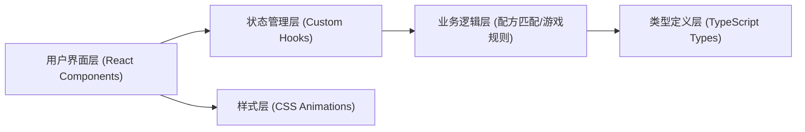

# 炼金术士实验室 - 技术架构文档

## 1. 架构设计



## 2. 技术描述

- **前端框架**：React 18 + TypeScript
- **构建工具**：Vite
- **状态管理**：React useState + useCallback + 自定义 Hook (useAlchemy)
- **样式方案**：原生 CSS（CSS变量、CSS动画、CSS渐变）
- **动画方案**：纯CSS动画（关键帧），保证60FPS性能
- **图标**：Lucide React
- **唯一ID**：uuid

## 3. 项目结构

```
auto136/
├── package.json              # 依赖配置
├── vite.config.js            # Vite构建配置
├── tsconfig.json             # TypeScript配置
├── index.html                # 入口HTML
└── src/
    ├── types.ts              # 类型定义
    ├── hooks/
    │   └── useAlchemy.ts     # 炼金逻辑Hook
    ├── components/
    │   ├── LabBench.tsx      # 炼金工作台
    │   ├── ElementShelf.tsx  # 元素架
    │   └── StorageShelf.tsx  # 储物架
    ├── App.tsx               # 主组件
    └── index.tsx             # 入口渲染
```

## 4. 数据模型

### 4.1 类型定义

```typescript
// 元素类型
type ElementType = 'earth' | 'water' | 'wind' | 'fire';

// 催化剂类型
type CatalystType = 'arsenic' | 'sulfur' | 'mercury';

// 加热档位
type HeatLevel = 'none' | 'low' | 'medium' | 'high';

// 搅拌速度
type StirSpeed = 'none' | 'low' | 'medium' | 'high';

// 炼金产物
type ProductType = 
  | 'ruby_potion'
  | 'spirit_elixir'
  | 'philosophers_powder'
  | 'moonlight_essence'
  | 'water_of_life'
  | 'philosophers_stone';

// 烧瓶状态
interface FlaskState {
  id: string;
  elements: ElementType[];
  catalysts: CatalystType[];
  heatLevel: HeatLevel;
  stirSpeed: StirSpeed;
  liquidColor: string;
  isMixing: boolean;
  isExploding: boolean;
  isSuccess: boolean;
}

// 配方定义
interface Recipe {
  id: string;
  name: string;
  description: string;
  elements: ElementType[];
  catalysts: CatalystType[];
  heatLevel: HeatLevel[];
  stirSpeed: StirSpeed[];
  unlocked: boolean;
  color: string;
}

// 库存
interface Inventory {
  elements: Record<ElementType, number>;
  catalysts: Record<CatalystType, number>;
  products: ProductType[];
}

// 炼金状态
interface AlchemyState {
  flasks: FlaskState[];
  activeFlaskId: string | null;
  inventory: Inventory;
  timeRemaining: number;
  isRunning: boolean;
  selectedElement: ElementType | null;
  selectedCatalyst: CatalystType | null;
  showAlchemyCircle: boolean;
  lastSuccessProduct: ProductType | null;
  lastFailureReason: string | null;
}
```

## 5. 核心逻辑设计

### 5.1 useAlchemy Hook 接口
```typescript
interface UseAlchemyReturn {
  state: AlchemyState;
  selectElement: (element: ElementType) => void;
  selectCatalyst: (catalyst: CatalystType) => void;
  addToFlask: (flaskId: string) => void;
  setHeatLevel: (flaskId: string, level: HeatLevel) => void;
  setStirSpeed: (flaskId: string, speed: StirSpeed) => void;
  startTimer: () => void;
  resetFlask: (flaskId: string) => void;
  checkRecipe: (flaskId: string) => ProductType | null;
}
```

### 5.2 配方匹配算法
- 检查元素组合是否匹配
- 检查催化剂是否匹配
- 检查加热温度是否在允许范围
- 检查搅拌速度是否在允许范围
- 所有条件满足则返回对应产物类型

### 5.3 失败原因权重
- 温度过高：30%
- 搅拌过慢：20%
- 时间过长：20%
- 元素不匹配：30%

## 6. 性能优化策略

1. **SVG动画**：使用 CSS `transform: rotate()` 实现炼金阵旋转，GPU加速，保持60FPS
2. **气泡数量控制**：每个烧瓶最多同时渲染20个气泡，使用对象池复用DOM
3. **CSS动画优先**：所有特效（星尘、爆炸、发光）使用 @keyframes 而非 JS逐帧
4. **首屏优化**：Vite 代码分割，懒加载非关键组件
5. **React优化**：使用 useCallback 包装事件处理器，避免不必要的重渲染
6. **动画性能**：使用 transform 和 opacity 属性，避免触发 layout/paint

## 7. 响应式断点

- **桌面端**：≥ 768px，三栏布局
- **移动端**：< 768px，单列上下滑动布局
