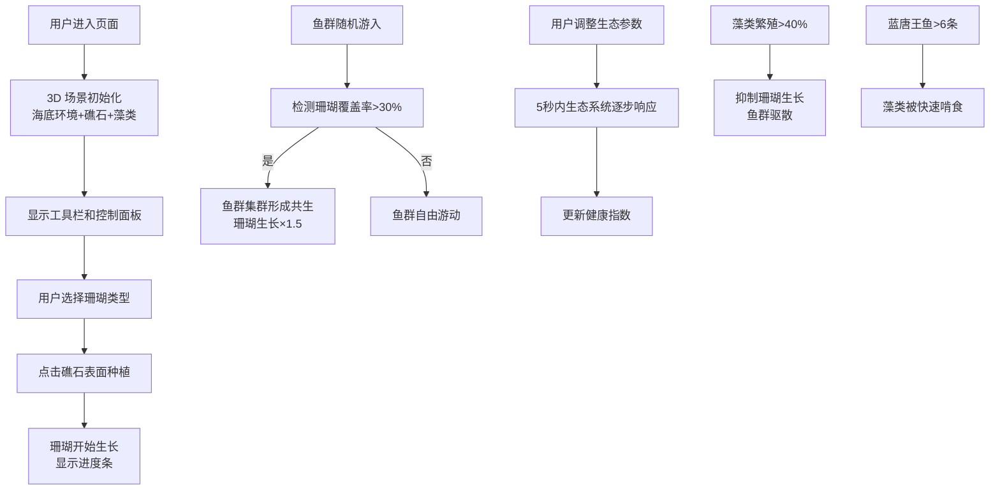

## 1. 产品概述

虚拟珊瑚礁生态演替与共生关系模拟器，让用户以海洋生态学家的视角，在浏览器中观察人工珊瑚礁在三年时间跨度内的生态演替过程，包括珊瑚定殖、生长、竞争，以及与鱼群、藻类的动态共生网络。

- 核心价值：沉浸式教育体验，直观展示珊瑚礁生态系统的复杂互动关系
- 目标用户：海洋生物爱好者、学生、教育工作者
- 市场价值：创新的科普教育工具，融合艺术与科学

## 2. 核心功能

### 2.1 功能模块

1. **3D 海底场景**：深海到浅海渐变背景、阳光柱动画、缓坡沙地、人工礁石基座
2. **珊瑚种植系统**：三种珊瑚（鹿角、脑珊瑚、软珊瑚），不同生长形态与速率，生长进度显示
3. **鱼群 AI 系统**：多种鱼类（小丑鱼、蓝唐王鱼、蝴蝶鱼），贝塞尔曲线路径，集群行为，共生效应
4. **藻类生态系统**：随机分布的藻类，繁殖扩增机制，草食鱼啃食，与珊瑚的竞争关系
5. **生态参数控制**：营养盐浓度、水温、光照强度三个滑块，实时调整生态系统
6. **健康指数监控**：基于珊瑚覆盖率、鱼群密度、藻类抑制率的加权生态健康指数
7. **信息卡片系统**：点击珊瑚或鱼群显示详细信息，淡入上滑动画

### 2.2 页面详情

| 页面名称 | 模块名称 | 功能描述 |
|-----------|-------------|---------------------|
| 主界面 | 3D 场景渲染 | 海底环境、礁石、珊瑚、鱼群、藻类的实时渲染 |
| 主界面 | 左侧工具栏 | 三种珊瑚苗选择按钮，点击后可在礁石表面种植 |
| 主界面 | 底部控制面板 | 营养盐、水温、光照三个生态参数滑块 |
| 主界面 | 右上角健康指数 | 环形进度条展示生态健康指数（0-100） |
| 主界面 | 信息卡片 | 点击珊瑚或鱼群时显示详细信息 |

## 3. 核心流程

## 4. 用户界面设计

### 4.1 设计风格

- **主色调**：深蓝海洋色系（#0b2b4a 到 #1c6e8a 渐变）
- **点缀色**：青绿色（#00b4d8）、珊瑚红（#ff6b6b）、海藻绿（#7ecf5a）、紫色（#c084fc）
- **背景**：深海到浅海垂直渐变，底部沙地 #d4c9a8 带噪点纹理
- **卡片/按钮**：#00b4d8 细边框 1px，半透明 #0b3a5a 毛玻璃背景（backdrop-filter: blur(8px)）
- **动画**：所有动画 60fps，参数调整使用 gsap 缓动过渡
- **滑块样式**：
  - 营养盐：半透明 #00ffff 圆角条
  - 水温：半透明 #ff6b6b 条
  - 光照：半透明 #ffd700 条

### 4.2 页面设计概述

| 页面名称 | 模块名称 | UI 元素 |
|-----------|-------------|-------------|
| 主界面 | 3D 场景 | 全屏 Canvas，渐变背景，光束动画，沙地噪点，3D 礁石 |
| 主界面 | 左侧工具栏 | 垂直排列的珊瑚选择按钮，带颜色标识和名称标签 |
| 主界面 | 底部控制栏 | 水平排列的三个滑块，带图标和数值 tooltip |
| 主界面 | 右上角健康指数 | 环形进度条，颜色从红色 #ff4757 渐变到绿色 #2ed573 |
| 主界面 | 信息卡片 | 毛玻璃效果，淡入+上滑 0.3s 动画，显示详细数据 |

### 4.3 响应性

- Desktop-first 设计，支持窗口大小自适应
- 3D 场景随窗口 resize 自动调整
- 控制面板在小屏幕上自动堆叠

### 4.4 3D 场景指导

**环境与氛围**
- 背景色：垂直渐变，从顶部深海 #0b2b4a 到底部浅海 #1c6e8a
- 光照：环境光 + 方向光模拟阳光，顶部投射 10 道半透明光束
- 雾气：轻微的指数雾增强深度感

**光束动画**
- 10 道光束从顶部投射
- 每道宽 30px，透明度 0.15
- 0.5 阻尼正弦摆动，周期 6 秒

**礁石基座**
- 随机凸包平坦多面体
- 高 2 单位，直径 6 单位
- 浅灰花岗岩纹理 #8a8a8a，bump 强度 0.3

**珊瑚系统**
- 鹿角珊瑚：红色 #ff6b6b，分枝生长，每 10 秒分支 0.3 单位
- 脑珊瑚：绿色 #7ecf5a，球状扩张，每 15 秒膨胀 0.2 单位
- 软珊瑚：紫色 #c084fc，扇形摆动，每 8 秒扩 0.4 单位，3s ease-in-out 摆动

**鱼群系统**
- 每群 5-12 条，大小 0.15-0.3 单位
- 随机颜色 #ffa07a #7fffd4 #ffd700
- 贝塞尔曲线随机路径，速度 0.5 单位/秒
- 正弦波身体摆动
- 蓝唐王鱼体型比普通鱼大 30%

**藻类系统**
- 1-3 簇，细长圆锥，高 0.5-1 单位
- 颜色 #2d8a4e 到 #4caf50
- 4s ease-in-out 水流摆动
- 营养盐>60 且光照>50% 时繁殖
