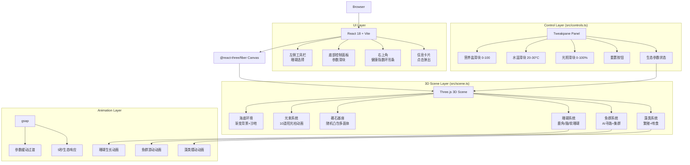

## 1. 架构设计



## 2. 技术描述

- **前端框架**：React 18 + TypeScript + Vite 5
- **3D 渲染**：Three.js 0.160.0 + @react-three/fiber 8 + @react-three/drei 9
- **动画系统**：gsap 3.12
- **控制面板**：tweakpane 4.0
- **状态管理**：React useState + useRef（局部状态，无需全局状态管理）
- **唯一标识**：uuid 9.0
- **构建工具**：Vite，启用 React 插件和 TypeScript
- **无后端**：纯前端应用，所有数据在客户端内存中管理

## 3. 数据模型

### 3.1 核心类型定义

```typescript
// 珊瑚类型
type CoralType = 'staghorn' | 'brain' | 'soft';

interface Coral {
  id: string;
  type: CoralType;
  position: [number, number, number];
  growth: number;           // 0-1 生长进度
  age: number;              // 生长天数
  coverage: number;         // 覆盖面积百分比
  color: string;
  isSymbiotic: boolean;     // 是否处于共生状态
  growthMultiplier: number; // 生长速率乘数
}

// 鱼类类型
type FishType = 'clownfish' | 'bluetang' | 'butterfly';

interface Fish {
  id: string;
  type: FishType;
  position: [number, number, number];
  rotation: [number, number, number];
  size: number;
  color: string;
  speed: number;
  targetPosition: [number, number, number];
  bezierPath: [number, number, number][];
  pathProgress: number;
  isSchooling: boolean;     // 是否集群
  symbioticCoralId: string | null; // 共生的珊瑚ID
  stayTimer: number;        // 停留计时器
}

// 藻类
interface Algae {
  id: string;
  position: [number, number, number];
  height: number;
  radius: number;
  color: string;
  swayOffset: number;       // 摆动相位偏移
}

// 生态参数
interface EcoParams {
  nutrients: number;        // 0-100
  temperature: number;      // 20-30
  light: number;            // 0-100
}

// 生态健康指数
interface EcoHealth {
  score: number;            // 0-100
  coralCoverage: number;    // 权重 40%
  fishDensity: number;      // 权重 30%
  algaeControl: number;     // 权重 30%
}

// 场景状态
interface SceneState {
  corals: Coral[];
  fishes: Fish[];
  algae: Algae[];
  ecoParams: EcoParams;
  ecoHealth: EcoHealth;
  timeSpeed: number;        // 时间流速
  totalDays: number;        // 总模拟天数
}
```

## 4. 文件结构

```
auto137/
├── package.json           # 项目依赖和脚本
├── index.html             # 入口 HTML，全屏深蓝背景
├── vite.config.js         # Vite 配置
├── tsconfig.json          # TypeScript 配置
└── src/
    ├── App.tsx            # React 根组件
    │   ├── Canvas 3D 场景渲染
    │   ├── Tweakpane 控制面板集成
    │   ├── 生态状态显示 UI
    │   └── 珊瑚/鱼群/藻类渲染循环
    ├── scene.ts           # Three.js 场景核心
    │   ├── 海底环境创建
    │   ├── 光束系统
    │   ├── 礁石基座生成
    │   ├── 珊瑚种植与生长逻辑
    │   ├── 鱼群 AI 与寻路
    │   ├── 藻类繁殖与啃食
    │   └── 生态参数响应函数
    ├── controls.ts        # Tweakpane 面板配置
    │   ├── 三个生态参数滑块
    │   ├── 速度重置按钮
    │   └── 值变化监听与传递
    └── types.ts           # 共享类型定义（可选）
```

## 5. 核心算法

### 5.1 珊瑚生长算法

```
每种珊瑚独立计时器：
- 鹿角珊瑚：每10秒生长一次，分支向外扩展0.3单位
- 脑珊瑚：每15秒生长一次，球状膨胀0.2单位
- 软珊瑚：每8秒生长一次，扇面扩展0.4单位

生长速率乘数 = 基础速率 × (1 + (水温-25)×0.1) × 共生加成 × 藻类抑制
- 共生加成：附近有鱼群时 ×1.5
- 藻类抑制：藻类覆盖率>40%时 ×0.5
```

### 5.2 鱼群 AI 算法

```
鱼群行为状态机：
1. 自由游动：贝塞尔曲线随机路径
2. 检测：附近珊瑚覆盖率>30%时切换到集群模式
3. 集群：保持0.5单位间距，集群半径2单位
4. 停留：在珊瑚附近停留3-5秒，触发生长加成
5. 驱散：藻类覆盖率>40%时游向新区域

蓝唐王鱼特殊行为：数量>6条时优先寻找藻类啃食
```

### 5.3 生态健康指数算法

```
健康指数 = 珊瑚覆盖率×0.4 + 鱼群密度×0.3 + 藻类抑制率×0.3

珊瑚覆盖率 = 已种植珊瑚覆盖面积 / 礁石总面积 × 100
鱼群密度 = 当前鱼群数量 / 最大鱼群容量 × 100
藻类抑制率 = max(0, 100 - 藻类覆盖率×2.5)

颜色映射：
- 0-30: 红色 #ff4757
- 30-60: 黄色 #ffa502
- 60-100: 绿色 #2ed573
```

## 6. 性能优化

- **渲染优化**：使用 InstancedMesh 渲染大量鱼类和藻类
- **动画优化**：requestAnimationFrame 循环中仅更新必要对象
- **内存管理**：及时清理已删除的 3D 对象和定时器
- **帧率控制**：所有动画目标 60fps，使用 deltaTime 确保速率一致
- **几何体复用**：相同类型的珊瑚/鱼/藻类共享几何体
