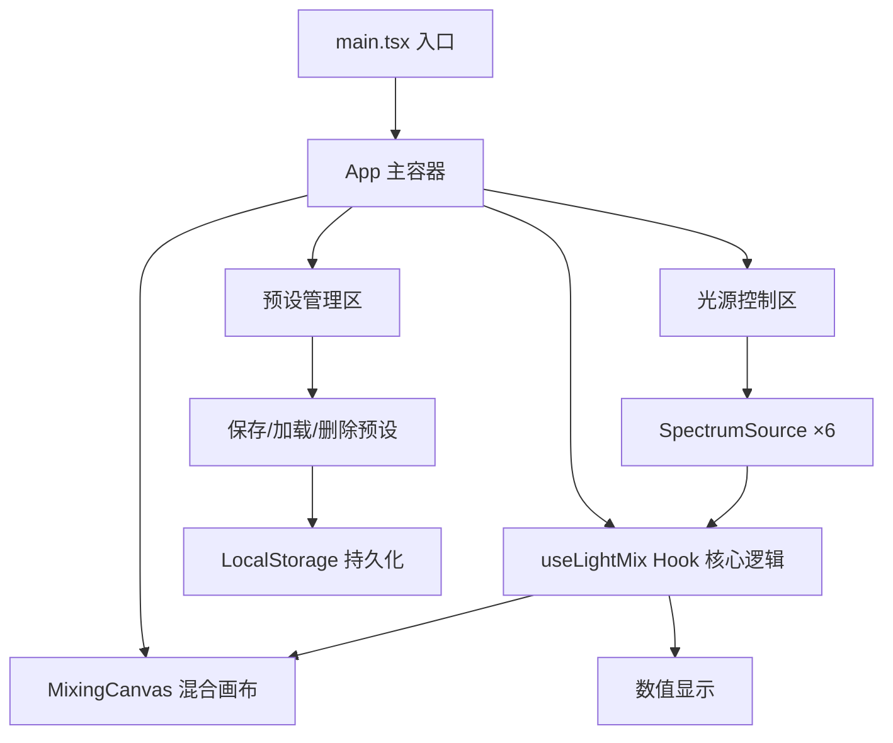

## 1. 架构设计
纯前端React应用，无后端依赖，使用本地状态管理。



## 2. 技术描述
- **前端框架**：React@18 + TypeScript
- **构建工具**：Vite@5 + @vitejs/plugin-react
- **核心库**：
  - `uuid`：预设唯一ID生成
  - `d3-scale`：波长-颜色渐变插值计算
  - `gsap`：高级动画效果（光束切换、预设卡片）
- **初始化工具**：vite-init（react-ts模板）
- **后端**：无
- **数据持久化**：LocalStorage

## 3. 路由定义
| 路由 | 用途 |
|-------|---------|
| / | 实验室主页（单页应用，无路由切换） |

## 4. 数据模型

### 4.1 数据类型定义

```typescript
interface LightSource {
  id: string;
  wavelength: number; // 380-780nm, 步进10nm
  intensity: number;  // 0-100%
  enabled: boolean;
}

interface Preset {
  id: string;
  name: string;
  timestamp: number;
  sources: LightSource[];
  mixedColor: {
    r: number; g: number; b: number;
    hex: string;
    hsl: { h: number; s: number; l: number };
  };
}

interface MixedColorResult {
  r: number; g: number; b: number;
  hex: string;
  hsl: { h: number; s: number; l: number };
  colorTemperature: string;
  sourceColors: Array<{
    r: number; g: number; b: number;
    intensity: number;
    enabled: boolean;
  }>;
}
```

### 4.2 核心数据结构
- **光源数组**：6个LightSource对象，初始值分布在可见光关键波段
- **预设数组**：最多10个Preset对象，存储在LocalStorage

## 5. 核心技术实现要点

### 5.1 波长转RGB算法（useLightMix核心）
使用分段线性近似模拟CIE 1931色彩空间：
- 380-440nm：紫→蓝（R衰减，B增长）
- 440-490nm：蓝→青（G增长）
- 490-510nm：青→绿（R=0，B衰减）
- 510-580nm：绿→黄（R增长）
- 580-645nm：黄→红（G衰减）
- 645-780nm：红（R恒定，G=B=0）
- 两端衰减因子：380-420nm和700-780nm应用强度衰减曲线

### 5.2 加色混合算法
每个光源贡献 = RGB值 × (intensity/100)，最终混合色 = 所有enabled光源贡献之和，通道值上限255。

### 5.3 色温估算
根据加权平均波长判断：
- <450nm：冷白（Cool White）
- 450-520nm：冷蓝（Cool Blue）
- 520-565nm：日光白（Daylight）
- 565-590nm：暖白（Warm White）
- 590-630nm：暖黄（Warm Yellow）
- >630nm：暖红（Warm Red）

### 5.4 性能优化策略
- 滑块使用React受控组件，onChange即时计算（无debounce）
- 颜色计算为纯数学运算，单次<1ms
- DOM更新仅限于CSS属性（backgroundColor, opacity, transform）
- 动画全部使用CSS transition（0.2s ease-out）
- 6个光源×3通道加法运算，复杂度O(n)可忽略

## 6. 项目文件结构
```
/
├── package.json
├── vite.config.js
├── tsconfig.json
├── index.html
└── src/
    ├── main.tsx
    ├── App.tsx
    ├── types/
    │   └── index.ts
    ├── hooks/
    │   └── useLightMix.ts
    ├── components/
    │   ├── SpectrumSource.tsx
    │   ├── MixingCanvas.tsx
    │   ├── ColorInfo.tsx
    │   └── PresetManager.tsx
    └── utils/
        ├── wavelengthToRgb.ts
        └── colorUtils.ts
```
