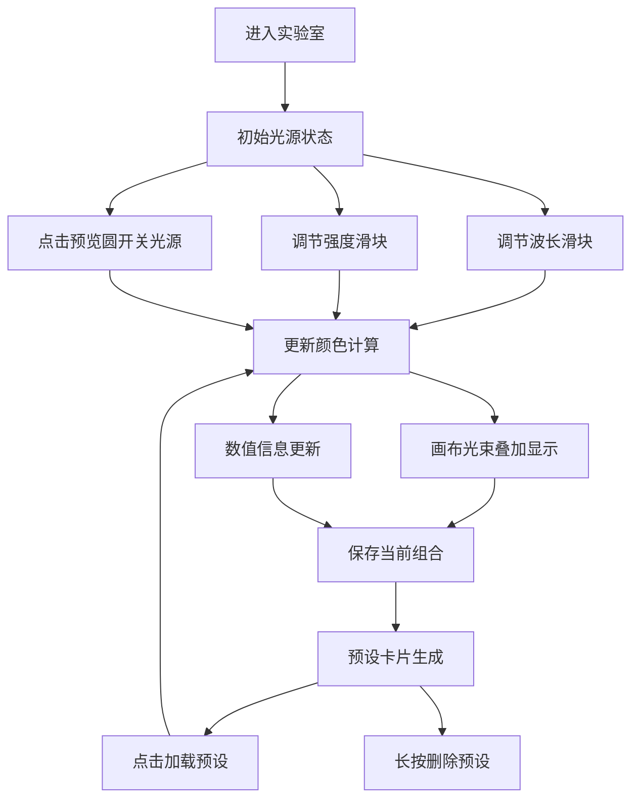

## 1. 产品概述

虚拟光谱实验室与光色混合模拟应用，让用户以光学研究员的身份在浏览器中调节单色光参数，实时观察加色混合（RGB）效应。
- 主要用途：教育演示、物理教学辅助、色彩设计灵感工具
- 目标用户：学生、教师、设计师、物理爱好者
- 产品价值：将抽象的光学原理具象化，提供沉浸式交互体验

## 2. 核心功能

### 2.1 功能模块
1. **主混合画布区**：暗室背景、锥形光束叠加、实时混合色显示
2. **光源控制面板**：6个独立光谱光源（波长+强度调节）、开关动画
3. **数值信息面板**：RGB/HSL/HEX实时显示、色温估算
4. **预设管理系统**：保存/加载/删除光谱组合预设（最多10个）

### 2.2 页面详情
| 页面名称 | 模块名称 | 功能描述 |
|-----------|-------------|---------------------|
| 实验室主页 | 混合画布 | 600×400px暗室画布，锥形光束从顶部射入，CSS混合模式叠加 |
| 实验室主页 | 光源控制区 | 6个光源模块，波长380-780nm步进10nm，强度0-100%步进1% |
| 实验室主页 | 色光预览圆 | 40px直径预览，点击开关（缩放动画0.3s），透明度随强度变化 |
| 实验室主页 | 数值显示 | RGB、HSL、十六进制三种格式，等宽字体显示，色温估算 |
| 实验室主页 | 预设卡片 | #1e1e1e背景圆角12px，点击加载，长按删除（带确认） |

## 3. 核心流程
用户进入实验室 → 调节各光源波长与强度 → 实时观察画布中光束叠加效果 → 查看RGB/HSL/HEX数值变化 → 保存满意的光谱组合为预设 → 切换/管理预设 → 继续探索光色混合

## 4. 用户界面设计

### 4.1 设计风格
- **主色调**：深黑实验室主题 #0d0d0d，画布边框 #2a2a2a，控制面板半透明磨砂
- **按钮/滑块**：自定义圆角轨道+圆形光晕手柄，0.2s ease-out过渡
- **字体**：数值区使用Monaco/Courier New等宽字体，标题区可使用现代无衬线字体
- **布局**：画布居中 + 下方控制面板磨砂玻璃效果 + 预设卡片区域
- **视觉元素**：锥形光束、色光预览圆、渐变滑块轨道

### 4.2 页面设计概述
| 页面名称 | 模块名称 | UI元素 |
|-----------|-------------|-------------|
| 实验室主页 | 混合画布 | 600×400px、圆角20px、10px深灰边框、黑色暗室背景、锥形光束CSS clip-path |
| 实验室主页 | 光源控制区 | 6个300×80px卡片、#1a1a1a背景+光晕阴影、圆角12px、内边距12px、波长滑块（紫-红渐变）、强度滑块（白-灰-黑渐变） |
| 实验室主页 | 色光预览圆 | 40px直径圆、100%强度纯色填充、opacity随强度变化、缩放动画0.3s |
| 实验室主页 | 数值信息 | 等宽字体、与混合色匹配的颜色、RGB/HSL/HEX/色温四行显示 |
| 实验室主页 | 预设卡片 | #1e1e1e背景、圆角12px、标题用当前混合色、长按删除确认 |
| 实验室主页 | 响应式 | <768px：控制面板横向滑动、画布100%宽、光源两列排列 |

### 4.3 响应式
- 桌面优先设计，视口<768px时切换为移动布局
- 控制面板变为横向可滑动容器
- 画布宽度缩至100%
- 光源控制改为两列网格排列
- 触摸优化：滑块增大触控区域，长按删除时间设为800ms

## 5. 性能要求
- 滑块调节时颜色计算与画布更新<16ms（60FPS）
- 不使用requestAnimationFrame以外的重复定时器
- 混合色变化使用CSS transition而非JS逐帧驱动
