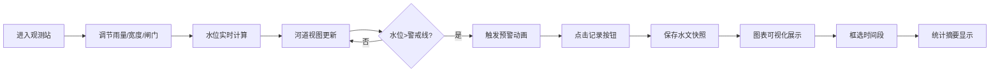

## 1. 产品概述

古制水文观测录是一款在浏览器中模拟古代水文观测站的交互式Web应用，让水务爱好者和教育工作者通过调整雨量、河道宽度和闸门开合来观察水位变化、蓄洪泄洪并触发预警，理解水文监测与防洪调度的动态过程。

- 核心目标：以古风交互界面生动呈现水文原理，兼具教育性与观赏性
- 目标用户：水务爱好者、教育工作者、学生群体
- 市场价值：填补水文科普交互工具的古风美学空白

## 2. 核心功能

### 2.1 用户角色
| 角色 | 注册方式 | 核心权限 |
|------|----------|----------|
| 访客用户 | 无需注册 | 使用所有模拟与记录功能 |

### 2.2 功能模块
1. **水文模拟工作台**：动态河道横截面视图、水位实时计算、闸门开合动画、波浪动画
2. **参数控制面板**：雨量滑块、河道宽度滑块、闸门开度滑块、古风数值显示与描述
3. **水位预警系统**：柳条灯颜色渐变、警戒光晕闪烁、堤防告急横幅
4. **数据记录面板**：实时水文参数显示、记录按钮、历史时间轴列表
5. **图表可视化**：水位-时间折线图、流量-雨量散点图、框选交互、统计摘要

### 2.3 页面详情
| 页面名称 | 模块名称 | 功能描述 |
|----------|----------|----------|
| 主工作台 | 河道横截面 | 动态河床、水面波浪动画、闸门开合动画、水位实时更新 |
| 主工作台 | 左侧参数面板 | 三个古风滑块控件，实时数值显示，状态描述文字 |
| 主工作台 | 预警系统 | 柳条灯变色、警戒光晕、告急横幅动画 |
| 主工作台 | 竹简数据面板 | 实时参数显示、记录按钮、历史记录时间轴 |
| 主工作台 | 底部图表区 | 折线图与散点图、框选交互、统计摘要 |

## 3. 核心流程

用户进入页面后，可通过调节左侧三个参数滑块来控制水文模拟状态：调节雨量会影响水位上升速度，调节河道宽度会影响水位高度，调节闸门开度会影响泄洪速度。水位变化实时反映在中央河道视图中，当水位超过警戒线时触发预警。用户可随时点击记录按钮保存当前状态，所有记录在底部图表中可视化呈现，支持框选时间段查看统计数据。

## 4. 用户界面设计

### 4.1 设计风格
- 主色调：赭石 #8b4513、青灰 #7395a8、米白 #f5f0e0、暗金 #b8860b
- 背景：宣纸色 #f5f0e0 到浅青灰色 #dce8e0 的渐变，模拟竹简与青石质感
- 组件风格：圆角方形 border-radius: 6px，内阴影模拟浮雕感
- 字体：Ma Shan Zheng（篆体数字）、毛笔楷体风格
- 动效：所有交互200ms内响应，ease-out曲线，自然流畅

### 4.2 页面设计概述
| 页面名称 | 模块名称 | UI元素 |
|----------|----------|--------|
| 主工作台 | 河道视图 | 深褐色河床纹理、半透明蓝色水面波浪动画、木制闸门带铆钉、柳条灯SVG |
| 主工作台 | 参数面板 | 水滴形滑块手柄（雨量）、木桩形手柄（宽度）、铁环形手柄（闸门）、篆体大号数值 |
| 主工作台 | 预警系统 | 绿色→黄色→红色渐变灯、径向光晕闪烁、枣红色烫金横幅 |
| 主工作台 | 竹简面板 | 竹片拼接背景、卷轴轴头装饰、毛笔楷体数字、方印式记录按钮 |
| 主工作台 | 图表区 | 暗金色坐标轴、中国传统色谱配色、隶书刻度、虚线框选 |

### 4.3 响应式
- 桌面优先设计，最小宽度960px，最大宽度1400px
- 内容区水平居中，两侧留白随窗口平滑过渡
- 视口宽度小于768px时，图表垂直堆叠，高度增加100px
- 小于960px时自动缩小面板间距

### 4.4 性能要求
- 图表更新和UI响应帧率45FPS以上
- 水位模拟计算和绘图更新延迟不超过50ms
- 滑块响应延迟小于100ms
