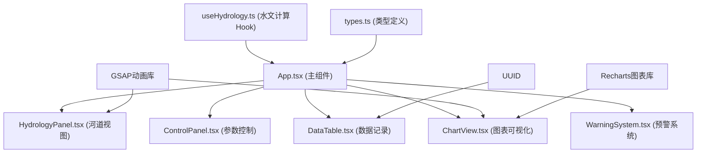

## 1. 架构设计



## 2. 技术描述

- 前端框架：React 18 + TypeScript
- 构建工具：Vite 5
- 图表库：Recharts 2
- 动画库：GSAP 3
- 字体：@fontsource/ma-shan-zheng
- 工具库：uuid
- 纯前端应用，无后端服务

## 3. 项目文件结构

```
├── index.html
├── package.json
├── vite.config.js
├── tsconfig.json
└── src/
    ├── App.tsx          # 主组件，状态管理
    ├── main.tsx         # 入口文件
    ├── index.css        # 全局样式
    ├── types/
    │   └── index.ts     # 类型定义
    ├── hooks/
    │   └── useHydrology.ts  # 水文计算Hook
    ├── utils/
    │   └── constants.ts     # 常量配置
    └── components/
        ├── HydrologyPanel.tsx   # 河道横截面视图
        ├── ControlPanel.tsx     # 左侧参数控制面板
        ├── DataTable.tsx        # 竹简数据记录面板
        ├── ChartView.tsx        # 图表可视化
        └── WarningBanner.tsx    # 预警横幅
```

## 4. 核心数据模型

### 4.1 水文参数类型
```typescript
interface HydrologyParams {
  rainfall: number;      // 雨量 0-200 mm/h
  riverWidth: number;    // 河道宽度 5-20 m
  gateOpening: number;   // 闸门开度 0-100 %
  waterLevel: number;    // 当前水位 m
  flowRate: number;      // 流量估算 m³/s
  levelChangeRate: number; // 水位变化率 mm/s
}
```

### 4.2 历史记录类型
```typescript
interface HydrologyRecord {
  id: string;
  timestamp: Date;
  rainfall: number;
  riverWidth: number;
  gateOpening: number;
  waterLevel: number;
  flowRate: number;
}
```

### 4.3 图表选中范围
```typescript
interface SelectionRange {
  startIndex: number;
  endIndex: number;
}
```

## 5. 水位计算逻辑

基础水位 = 0.5m

水位计算公式：
```
水位 = 基础水位 + (雨量 × 0.01m) - (闸门开度 × 0.005m) - (河道宽度 × 0.002m) + 随机扰动(±0.1m)
```

警戒线：河道深度的70%（约1.4m）
危险线：河道深度的90%（约1.8m）

流量估算：
```
流量 ≈ 水位 × 河道宽度 × 流速系数
流速系数与闸门开度正相关
```

## 6. 性能优化策略

- 使用 useMemo 缓存计算结果
- 使用 useCallback 优化回调函数引用
- 图表数据节流更新，避免频繁重绘
- CSS动画优先使用transform和opacity属性
- 列表虚拟滚动（如需要）
