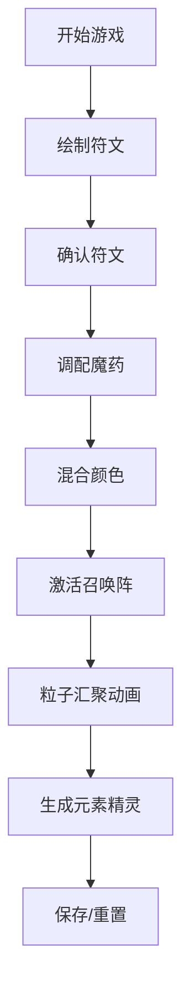

## 1. 产品概述

魔法符文绘制与元素精灵召唤游戏，让幻想文学爱好者在浏览器中体验炼金术师的日常工作，通过绘制魔法符文、调配魔药和激活炼金阵，召唤并驯服一只元素精灵。

- 核心玩法：符文绘制 + 魔药调配 + 召唤仪式三大模块组合
- 目标用户：幻想文学爱好者、轻度休闲游戏玩家

## 2. 核心功能

### 2.1 功能模块

1. **符文绘制模块**：400x400 画布，鼠标拖拽绘制发光符文，支持撤销（最多5步），确认后输出点坐标数组
2. **魔药调配模块**：10种材料拖拽至坩埚（最多4种），颜色混合动画，输出最终颜色字符串
3. **召唤阵模块**：接收符文数据和魔药颜色，播放粒子汇聚动画，生成元素精灵
4. **元素判定系统**：根据魔药颜色自动判定精灵属性（火/水/风/地）
5. **存档系统**：支持重置、保存为 JSON 下载

### 2.2 页面详情

| 页面名称 | 模块名称 | 功能描述 |
|----------|----------|----------|
| 主游戏页 | 符文画布 | 鼠标拖拽绘制符文线条，发光淡紫色，撤销，确认 |
| 主游戏页 | 魔药坩埚 | 拖拽材料图标，颜色混合渐变动画，输出平均色 |
| 主游戏页 | 召唤阵 | 圆形魔法阵展示，粒子汇聚动画，精灵CSS帧动画 |
| 主游戏页 | 操作栏 | 重置、保存、撤销按钮，悬停金色光晕 |

## 3. 核心流程

用户依次完成符文绘制 → 魔药调配 → 点击召唤 → 粒子汇聚动画 → 生成精灵，可随时重置或保存。

## 4. 用户界面设计

### 4.1 设计风格
- **主色**：深紫罗兰 `#1a0f2e`，金色 `#d4af37`，淡紫发光 `#b39ddb`
- **字体**：Cinzel（Google Fonts），烫金标题风格
- **按钮**：深紫底色 `#4a2c6e` 悬停渐变至 `#6b3fa0`，金色文字，悬停放大 1.05x，点击下沉
- **布局**：上中下三栏，中部三个并列区域（符文/魔药/召唤阵）
- **视觉效果**：边框 1px 半透明金色，圆角 12px，内阴影 `inset 0 0 15px rgba(0,0,0,0.6)`，悬停金色光晕 `box-shadow: 0 0 8px #d4af37`

### 4.2 页面设计

| 页面名称 | 模块名称 | UI 元素 |
|----------|----------|---------|
| 主游戏页 | 顶部标题区 | 烫金文字"远古召唤阵"，Cinzel 字体，`#d4af37`，文字阴影 `#8b6914` 偏移 2px |
| 主游戏页 | 中部三栏区 | 符文画布、魔药坩埚、召唤阵各占 1/3，深紫内部背景 `#2a1b3d` |
| 主游戏页 | 星空背景 | Canvas 动态 100 个光点，1-2px，透明度 0.3-0.6，速度 0.2-0.5px/帧 |
| 主游戏页 | 底部操作栏 | 重置、保存、撤销按钮，金色光晕悬停效果 |

### 4.3 响应式
- 桌面优先：三栏横向排列
- 屏幕 < 768px：三栏纵向堆叠，每栏 100% 宽度自适应高度

### 4.4 动画与特效
- **符文线条**：发光淡紫色 `#b39ddb`
- **材料混合**：0.6 秒颜色渐变动画
- **召唤阵粒子**：200 颗粒子从四角飞向阵心，1.2 秒近大远小动画
- **精灵动画**：4 帧 CSS 精灵循环，帧间隔 0.25 秒，悬浮上下浮动 ±10px，周期 2 秒
