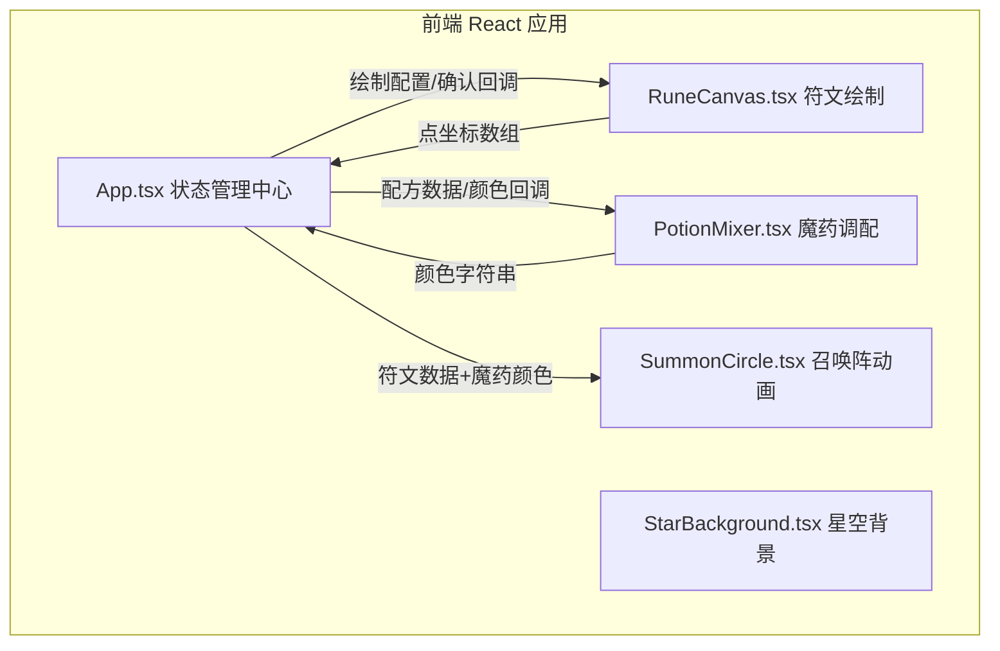

## 1. 架构设计



**数据流向**：
- `App.tsx` 作为单一状态源，管理 `runePoints`、`potionColor`、`selectedMaterials`、`summoned` 等状态
- `RuneCanvas` 接收 `onConfirm(points[])` 回调输出坐标数据
- `PotionMixer` 接收 `onColorChange(color)` 回调输出混合颜色
- `SummonCircle` 接收 `runePoints` 和 `potionColor` props 渲染动画

## 2. 技术描述

- **前端框架**：React 18 + TypeScript 5 + Vite 5
- **构建工具**：Vite，配置 base: './'，启用 @vitejs/plugin-react
- **额外依赖**：
  - `canvas-confetti`：粒子效果
  - `react-colorful`：颜色辅助（可选）
- **CSS 方案**：原生 CSS + CSS 变量 + @keyframes 动画
- **Canvas 绘制**：原生 HTML5 Canvas API（符文绘制、星空背景、召唤阵粒子）

## 3. 文件结构与职责

| 文件路径 | 职责 | 输入 | 输出/回调 |
|----------|------|------|-----------|
| `src/main.tsx` | React 渲染入口，加载全局样式 | - | - |
| `src/App.tsx` | 主组件，全局状态管理与协调 | - | 子组件 props 分发 |
| `src/RuneCanvas.tsx` | 符文绘制画布 | 绘制配置（颜色、尺寸） | `onConfirm(Point[])` |
| `src/PotionMixer.tsx` | 魔药调配拖拽区 | 材料列表 | `onColorChange(string)` |
| `src/SummonCircle.tsx` | 召唤阵动画与精灵渲染 | `runePoints: Point[]`, `potionColor: string` | 渲染 DOM/Canvas |
| `src/StarBackground.tsx` | 底部星空粒子背景 | - | Canvas 动画 |
| `src/styles/global.css` | 全局样式、CSS 变量、动画关键帧 | - | - |
| `src/utils/elementDetector.ts` | 根据颜色判定元素属性 | `color: string` | `'fire' \| 'water' \| 'earth' \| 'wind'` |
| `src/types/index.ts` | TypeScript 类型定义 | - | 类型导出 |

## 4. 类型定义

```typescript
// src/types/index.ts
export interface Point {
  x: number;
  y: number;
}

export interface Material {
  id: string;
  name: string;
  color: string;
  icon: string; // emoji 或 svg 路径
}

export type ElementType = 'fire' | 'water' | 'earth' | 'wind';

export interface SaveData {
  runePoints: Point[][];       // 每条符文线为一个 Point[]
  materials: string[];         // 材料名称
  potionColor: string;         // 最终混合色 hex
  element: ElementType;        // 精灵属性
  timestamp: number;
}
```

## 5. 性能约束

| 场景 | 指标 | 实现策略 |
|------|------|----------|
| 符文绘制 | ≥ 55fps | 节流 mousemove，requestAnimationFrame 批量绘制 |
| 星空背景 | ≥ 50fps | 单个 Canvas，100 粒子，纯数学位移 |
| 召唤粒子 | ≤ 200 颗，60fps | Canvas 离屏绘制，粒子池复用 |
| 响应式 | < 768px 纵向排列 | CSS Media Queries，flex-direction: column |

## 6. 关键算法

**颜色混合（平均取色）**：
```
将每个材料颜色 hex 转 RGB，各通道取算术平均后转回 hex
```

**元素属性判定（HSL 色相区间）**：
- 火 (fire)：色相 0° - 40°（红 → 橙）
- 水 (water)：色相 180° - 240°（蓝 → 青）
- 地 (earth)：色相 60° - 140°（绿 → 黄绿）
- 风 (wind)：色相 260° - 330°（紫 → 粉）
