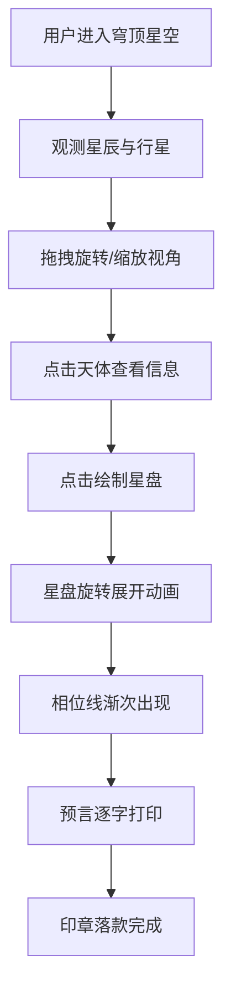

## 1. 产品概述

古代占星家星盘游戏——让用户化身占星师，在虚拟天文台穹顶下观测恒星、行星和彗星，绘制个人命运星盘，系统根据行星落入的星宫和相位关系生成占星预言。
- 目标用户：对中国古代占星文化感兴趣的普通用户
- 产品价值：沉浸式占星体验，融合天文可视化与传统文化

## 2. 核心功能

### 2.1 用户角色
| 角色 | 注册方式 | 核心权限 |
|------|----------|----------|
| 占星师（访客） | 无需注册 | 观测星空、绘制星盘、获取预言 |

### 2.2 功能模块
1. **穹顶星空页**：圆形穹顶界面，200+闪烁星辰、黄道十二宫符号、旋转缩放交互
2. **天体信息面板**：点击天体后右侧弹出信息面板
3. **命运星盘**：绘制十二宫位、相位线、生辰八字
4. **占星预言**：根据星盘生成中文预言，逐字打印显示

### 2.3 页面详情
| 页面名称 | 模块名称 | 功能描述 |
|----------|----------|----------|
| 穹顶星空 | 星辰粒子系统 | Canvas绘制200+闪烁粒子，随机尺寸1-3px，闪烁频率1-4秒，透明度0.3-1跳动 |
| 穹顶星空 | 黄道十二宫符号 | 金色SVG图标环绕穹顶边缘，鼠标悬停放大1.3倍并显示宫位名称 |
| 穹顶星空 | 旋转交互 | 鼠标拖拽旋转穹顶（Y轴），惯性阻尼0.9，半透明星轨拖尾 |
| 穹顶星空 | 缩放交互 | 滚轮缩放0.5-3倍，拉近时恒星浮现光晕（径向渐变光圈） |
| 天体信息 | 信息面板 | 300px宽，半透明羊皮纸色背景，显示天体名称、神话关联、黄道位置、相位影响 |
| 命运星盘 | 十二宫位 | 400px直径Canvas，30度扇形，淡金/深紫/暗红三色交替 |
| 命运星盘 | 相位线 | 合相金色、刑相红色、冲相蓝色 |
| 命运星盘 | 生辰八字 | 星盘中心随机生成四柱天干地支 |
| 占星预言 | 预言长卷 | 80%宽、120px高，仿古绢帛色背景，楷体逐字打印（100ms/字），红色篆书印章 |

## 3. 核心流程

用户打开页面 → 看到穹顶星空（星辰闪烁+黄道符号） → 鼠标拖拽旋转/滚轮缩放观测天体 → 点击天体查看信息面板 → 点击"绘制星盘"按钮 → 星盘从中心旋转展开 → 相位线渐次出现 → 预言文字逐字打印 → 印章落款

## 4. 用户界面设计

### 4.1 设计风格
- 主色：深夜蓝紫（#0e1428、#1a0F2e）
- 辅色：古铜金（#c9a84c、#d4af37）
- 点缀：暗红（#8b0000）
- 按钮风格：古铜金边框圆角按钮，hover发光效果
- 字体：楷体 serif（预言文字），衬线体（标题）
- 布局：全屏穹顶，右侧信息面板，底部预言长卷
- 图标：黄道十二宫SVG金色符号

### 4.2 页面设计概览
| 页面名称 | 模块名称 | UI元素 |
|----------|----------|--------|
| 穹顶星空 | 穹顶背景 | 径向渐变#0e1428→#1a0F2e，Canvas全屏 |
| 穹顶星空 | 星辰粒子 | Canvas逐帧绘制，1-3px闪烁粒子 |
| 穹顶星空 | 十二宫符号 | 金色# c9a84c SVG，20px，环绕边缘 |
| 穹顶星空 | 绘制星盘按钮 | 古铜金边框，居中下方 |
| 天体信息 | 信息面板 | 300px宽，羊皮纸色#f5e6c8半透明，右侧滑入 |
| 命运星盘 | 星盘Canvas | 400px直径，中央浮现，旋转展开1.5s |
| 占星预言 | 预言长卷 | 80%宽，120px高，绢帛色#ead0a8，竖纹纹理 |

### 4.3 响应式
- 桌面优先设计，Canvas自适应窗口尺寸
- 信息面板和预言长卷固定定位，不随Canvas缩放

### 4.4 动画规范
- 过渡时间：0.3秒，ease-in-out缓动
- 星盘生成：从中心向外旋转展开，持续1.5秒
- 相位线：从源头到终点渐次出现，每条0.5秒错开0.15秒
- 性能目标：60帧流畅运行，Canvas帧率不低于55 FPS
