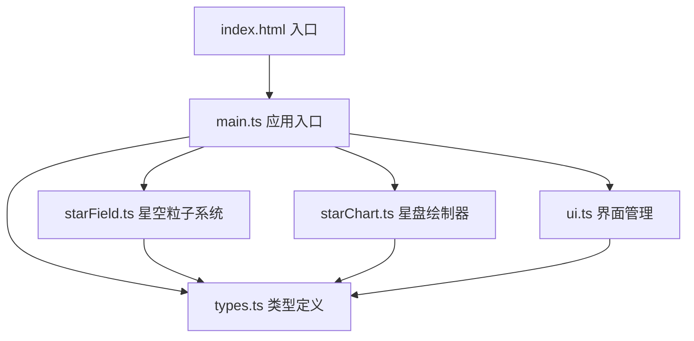
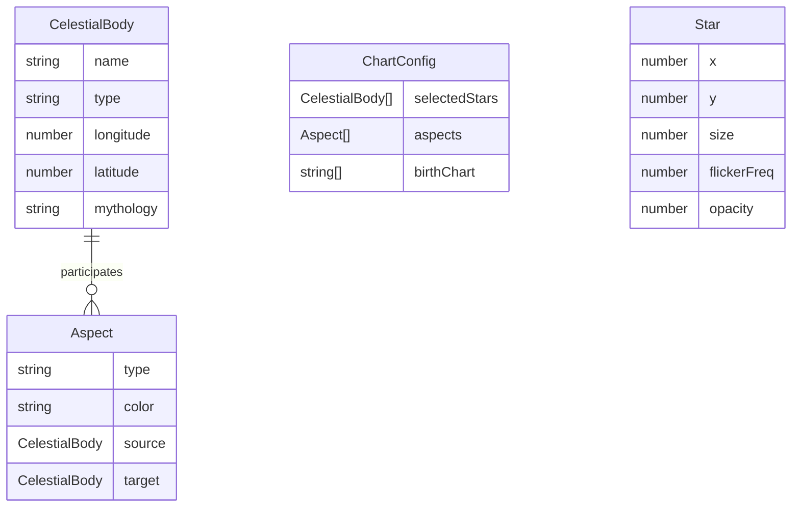

## 1. 架构设计



纯前端架构，无后端服务。所有逻辑在浏览器端运行，使用原生Canvas API和DOM操作。

## 2. 技术说明

- 前端：TypeScript + Vite + 原生Canvas API + DOM操作
- 初始化工具：Vite
- 后端：无
- 数据库：无，所有数据在内存中生成
- 运行时依赖：无（仅开发依赖 typescript、vite）

## 3. 路由定义

单页应用，无路由。所有功能在同一页面内通过Canvas和DOM元素交互完成。

## 4. API定义

无外部API。系统内部数据结构：

- `CelestialBody`：天体（名称、类型、黄道位置、神话关联）
- `Aspect`：相位关系（类型、涉及天体、颜色）
- `ChartConfig`：星盘配置（选中天体、相位列表、生辰八字）
- `Star`：星辰粒子（位置、尺寸、闪烁频率、透明度）

## 5. 文件结构

```
├── package.json
├── vite.config.js
├── tsconfig.json
├── index.html
└── src/
    ├── main.ts        # 应用入口，初始化和事件分发
    ├── starField.ts   # 穹顶星空粒子系统
    ├── starChart.ts   # 命运星盘绘制器
    ├── ui.ts          # 界面UI管理
    └── types.ts       # 类型定义和常量
```

## 6. 数据模型

### 6.1 数据模型定义



### 6.2 核心常量

- 黄道十二宫：白羊座→双鱼座，每宫30度
- 行星：日、月、水星、金星、火星、木星、土星
- 相位类型：合相(0°)、刑相(90°)、冲相(180°)
- 天干：甲乙丙丁戊己庚辛壬癸
- 地支：子丑寅卯辰巳午未申酉戌亥

### 6.3 性能优化策略

- Canvas分层：星空层、星盘层分开绘制，避免全量重绘
- requestAnimationFrame驱动动画循环
- 星辰粒子使用对象池，避免GC
- 缩放时仅更新光晕层，不重绘整个星空
- 惯性旋转使用阻尼衰减，无需额外定时器
