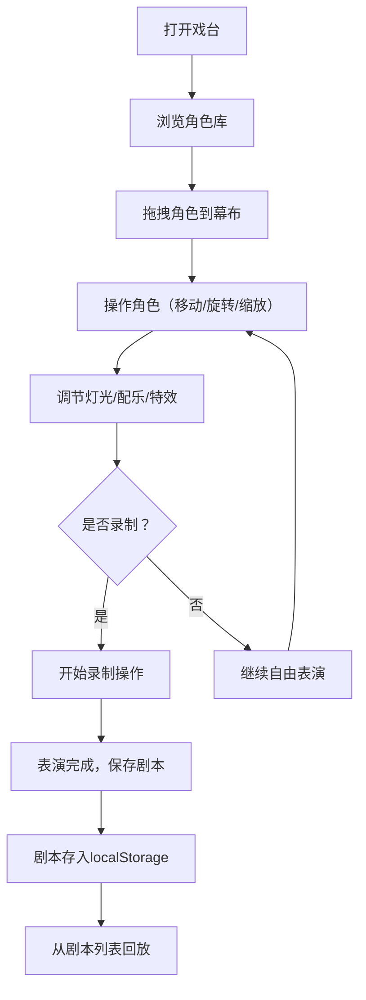

## 1. 产品概述

虚拟皮影戏台是一款基于浏览器的交互式传统文化体验应用，让用户像民间艺人一样，通过拖拽剪纸风格的皮影角色在幕布后上演西游小剧场，并配合灯光、配乐和特效来渲染剧情氛围。主要面向传统文化爱好者和教育工作者，解决在网页上体验皮影操作、剧情编排和舞台调度的问题。

- 提供沉浸式古风戏台界面，真实模拟皮影戏表演场景
- 支持拖拽、旋转、缩放等操作，还原皮影操控体验

## 2. 核心功能

### 2.1 用户角色

| 角色 | 使用方式 | 核心权限 |
|------|----------|----------|
| 普通用户 | 无需注册 | 拖拽角色、操作舞台、录制回放剧本 |

### 2.2 功能模块

1. **主舞台页面**：古风戏台界面、幕布区域、角色拖放、灯光控制、特效触发、录制回放

### 2.3 页面详情

| 页面名称 | 模块名称 | 功能描述 |
|----------|----------|----------|
| 主舞台页面 | 古风戏台 | 深赭石色背景、红色帷幔摆动、中央半透明幕布、灯光投射 |
| 主舞台页面 | 角色库 | 6个可拖拽皮影角色（孙悟空、猪八戒、沙僧、唐僧、白骨精、蜘蛛精），SVG剪纸风格，浮动动画 |
| 主舞台页面 | 角色操作 | 点击选中角色后出现圆形操作手柄，支持移动、旋转（步进15度）、缩放（0.5-1.5倍）、删除 |
| 主舞台页面 | 剧场控制条 | 五档灯光色轮、四首剧情配乐（Web Audio API）、四种CSS粒子特效、播放/暂停按钮 |
| 主舞台页面 | 录制回放 | 录制5分钟内表演操作（移动/旋转/缩放/删除+时间戳），保存到localStorage，剧本列表回放 |
| 主舞台页面 | 剧本管理 | 右侧剧本列表，显示已保存剧本，点击回放 |

## 3. 核心流程

用户从左侧角色库拖拽皮影角色到中央幕布区域 → 在幕布上自由操作角色（移动、旋转、缩放） → 通过控制条调节灯光色、配乐、特效渲染氛围 → 点击录制按钮记录操作序列 → 保存剧本到localStorage → 从右侧剧本列表选择回放

## 4. 用户界面设计

### 4.1 设计风格

- 主色：深赭石 #4a2c2a、辅色：金色 #d4af37、强调色：朱红 #b22222
- 按钮风格：古风圆角按钮，金色边框，悬停时scale 1.05并增加亮度，点击时scale 0.95
- 字体：中文使用系统宋体/楷体，标题使用大号粗体，正文使用常规体
- 布局风格：横向三栏式（左15%角色库、中65%幕布、右20%剧本面板）
- 图标风格：简洁线条图标搭配金色描边

### 4.2 页面设计概览

| 页面名称 | 模块名称 | UI元素 |
|----------|----------|--------|
| 主舞台页面 | 戏台背景 | 深赭石色主背景、红色帷幔CSS摆动动画（8px幅度/5秒周期）、绢布纹理幕布 |
| 主舞台页面 | 幕布区域 | 600px×400px半透明幕布、顶部径向渐变灯光、CSS filter blur(1px)绢布质感 |
| 主舞台页面 | 角色库面板 | 垂直排列6个角色卡片、每个80×120px SVG剪影、浮动动画3px/2秒 |
| 主舞台页面 | 控制条 | 灯光色轮5档、配乐4首按钮、特效4个按钮、播放/暂停按钮 |
| 主舞台页面 | 剧本面板 | 剧本列表、保存对话框、回放按钮 |

### 4.3 响应式设计

- 桌面优先设计，三栏横向布局
- 宽度<768px时，左侧库和右侧面板折叠为上下两栏，幕布区域自动缩放
- 触屏设备支持拖拽操作

### 4.4 动画与特效

- 帷幔摆动：CSS animation，8px幅度，5秒周期
- 角色浮动：CSS animation，3px幅度，2秒周期
- 灯光切换：0.5s ease-in-out过渡
- 特效粒子：CSS粒子动画，持续3秒后淡出
- 操作手柄：0.2s smooth悬停过渡，0.08s点击压缩
- 幕布帧率：requestAnimationFrame驱动，≥50fps
