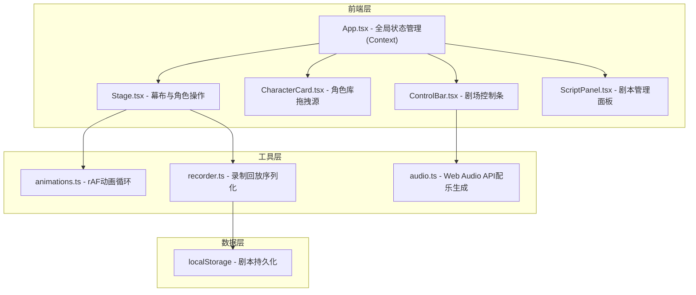
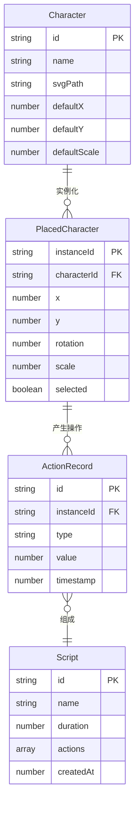

## 1. 架构设计



## 2. 技术说明

- 前端：React@18 + TypeScript + Vite
- 初始化工具：vite-init（react-ts模板）
- 状态管理：React Context + useReducer
- 样式方案：CSS Modules + CSS Variables
- 音频：Web Audio API（原生，无外部依赖）
- 存储：localStorage（剧本持久化）
- 依赖：react、react-dom、typescript、vite、@vitejs/plugin-react、uuid、canvas-confetti

## 3. 路由定义

| 路由 | 用途 |
|------|------|
| / | 主舞台页面，包含所有功能模块 |

本项目为单页应用，无需多路由。

## 4. 数据模型

### 4.1 数据模型定义



### 4.2 数据结构定义

- **PlacedCharacter**: 幕布上放置的角色实例，包含位置(x,y)、旋转角度(rotation, 步进15度)、缩放比例(scale, 0.5-1.5)
- **ActionRecord**: 操作记录，type为move/rotate/scale/remove，value为操作值，timestamp为相对录制开始的毫秒数
- **Script**: 剧本，包含名称、总时长、操作记录数组，序列化为JSON存入localStorage

## 5. 文件组织

```
├── package.json
├── vite.config.js
├── tsconfig.json
├── index.html
├── src/
│   ├── main.tsx
│   ├── App.tsx
│   ├── components/
│   │   ├── Stage.tsx          # 幕布组件
│   │   ├── CharacterCard.tsx   # 角色卡片
│   │   ├── ControlBar.tsx      # 控制条
│   │   └── ScriptPanel.tsx     # 剧本面板
│   ├── utils/
│   │   ├── animations.ts       # 动画工具
│   │   ├── recorder.ts         # 录制回放
│   │   └── audio.ts            # 配乐生成
│   ├── context/
│   │   └── StageContext.tsx     # 全局状态Context
│   └── types/
│       └── index.ts            # TypeScript类型定义
```
