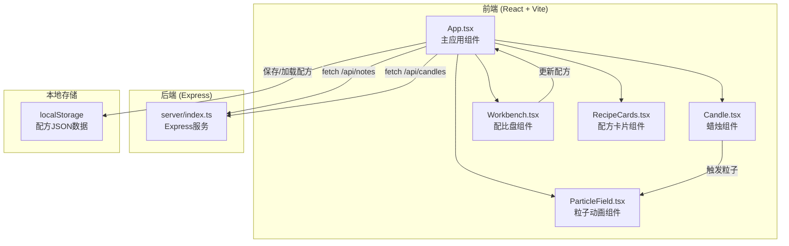
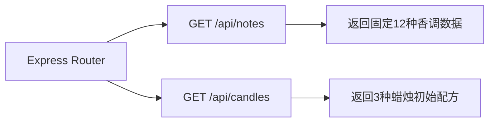
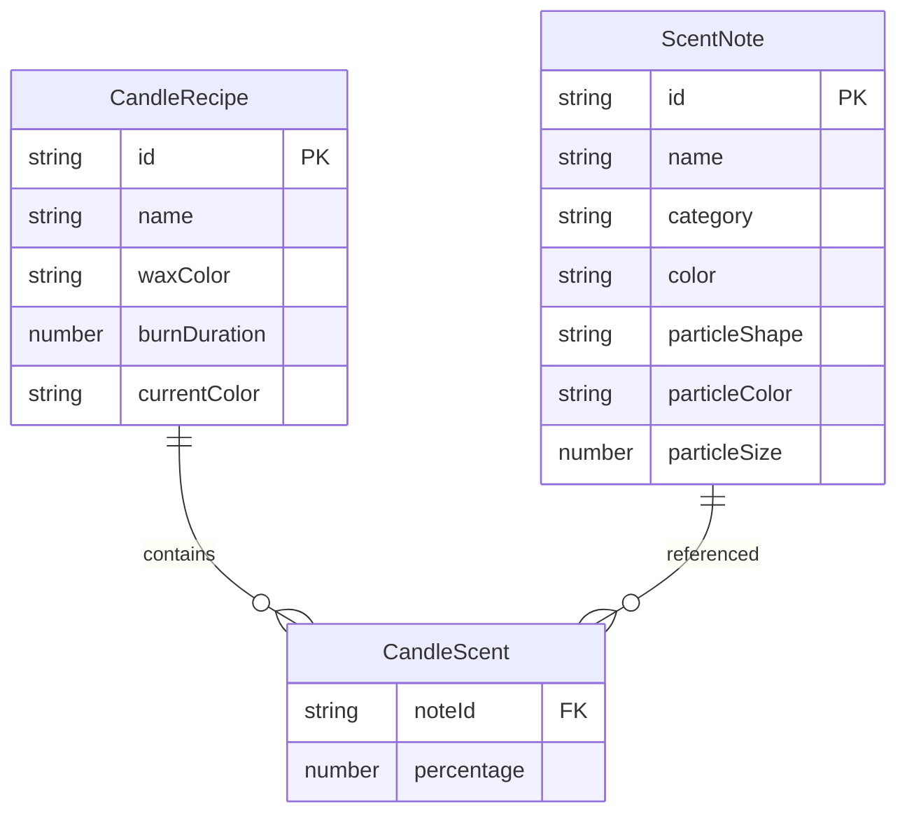

## 1. 架构设计



## 2. 技术说明

- 前端：React@18 + TypeScript + Vite + TailwindCSS
- 初始化工具：vite-init（react-express-ts模板）
- 后端：Express@4 + TypeScript + cors
- 数据库：无，使用localStorage + 后端固定数据
- 状态管理：zustand
- 动画：Canvas API（粒子系统）+ CSS动画（蜡烛融化/颜色过渡）

## 3. 路由定义

| 路由 | 用途 |
|------|------|
| / | 工坊主页，展示蜡烛、配比盘、配方卡片 |

## 4. API定义

### 4.1 TypeScript类型定义

```typescript
interface ScentNote {
  id: string;
  name: string;
  category: 'top' | 'middle' | 'base';
  color: string;
  particleShape: 'pulse' | 'spiral' | 'bubble' | 'bounce' | 'star' | 'float' | 'spiral_down' | 'wave' | 'zigzag' | 'slow_spread' | 'random_walk' | 'sink';
  particleColor: string;
  particleSize: number;
}

interface CandleRecipe {
  id: string;
  name: string;
  waxColor: string;
  scents: { noteId: string; percentage: number }[];
  burnDuration: number;
  currentColor: string;
}

interface CandleState {
  id: string;
  isBurning: boolean;
  burnTime: number;
  meltLevel: number;
  currentColor: string;
  recipe: CandleRecipe;
}

interface SaveData {
  id: string;
  name: string;
  waxColor: string;
  scents: { noteId: string; percentage: number }[];
  burnDuration: number;
  currentColor: string;
}
```

### 4.2 API端点

| 方法 | 路径 | 请求体 | 响应 |
|------|------|--------|------|
| GET | /api/notes | - | ScentNote[] |
| GET | /api/candles | - | CandleRecipe[] |

## 5. 服务端架构



## 6. 数据模型

### 6.1 数据模型定义



### 6.2 localStorage数据格式

```json
{
  "candleRecipes": [
    {
      "id": "uuid-string",
      "name": "蜜意黄昏",
      "waxColor": "#f5d78e",
      "scents": [
        { "noteId": "citrus", "percentage": 30 },
        { "noteId": "rose", "percentage": 40 },
        { "noteId": "sandalwood", "percentage": 30 }
      ],
      "burnDuration": 120,
      "currentColor": "#f5d78e"
    }
  ]
}
```

## 7. 粒子系统设计

### 7.1 粒子属性

| 属性 | 类型 | 说明 |
|------|------|------|
| x, y | number | 当前坐标 |
| vx, vy | number | 速度分量 |
| color | string | 香调对应颜色 |
| size | number | 4-8px随机 |
| opacity | number | 1→0，4秒衰退 |
| shape | string | 粒子路径类型 |
| createdAt | number | 创建时间戳 |
| lifespan | number | 4000ms |

### 7.2 渲染循环

1. 每帧清除Canvas
2. 根据香调比例生成新粒子（30-50个/秒）
3. 更新每个粒子位置（根据shape类型计算不同路径）
4. 更新透明度（线性衰退）
5. 移除已消亡粒子（opacity≤0或超出扩散半径）
6. requestAnimationFrame驱动，目标FPS≥40

### 7.3 性能策略

- 粒子池复用，避免GC
- 粒子总数上限2000
- Canvas使用2D context，关闭imageSmoothingEnabled
- 扩散半径随燃烧时间从300px缩小到200px
