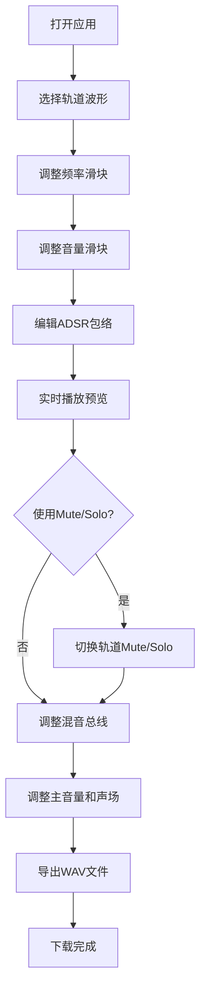

## 1. 产品概述

虚拟声音景观合成器与混合音轨混音效果器——一款面向音频爱好者和声音设计师的浏览器端全栈Web应用，支持通过合成、混合和调制不同声波类型来创作沉浸式环境音景（如雨林、海浪、城市街道），并实时预览混音效果、导出为WAV文件。

- 解决音频创作者在无专业DAW软件时快速原型化环境音景的需求
- 目标用户：音频爱好者、声音设计师、冥想/白噪声应用开发者

## 2. 核心功能

### 2.1 用户角色

| 角色 | 注册方式 | 核心权限 |
|------|----------|----------|
| 普通用户 | 无需注册 | 使用所有合成、混音、导出功能 |

### 2.2 功能模块

1. **合成器工作台页面**：四轨道声波合成面板、波形选择、频率/音量控制、ADSR包络编辑、Mute/Solo切换、实时频谱显示
2. **混音总线控制条**：主音量滑块、声场旋钮、WAV导出

### 2.3 页面详情

| 页面名称 | 模块名称 | 功能描述 |
|----------|----------|----------|
| 合成器工作台 | 声波轨道面板 | 四个独立轨道，每个含波形选择（正弦/方波/锯齿/噪声）、频率垂直滑块（20-2000Hz）、音量水平滑块（0-100%）、ADSR包络编辑Canvas、Mute/Solo按钮、实时FFT频谱Canvas |
| 合成器工作台 | 混音总线控制条 | 全局主音量滑块、声场旋钮（单声道-立体声0-100%）、导出混音按钮（16位44100Hz WAV） |

## 3. 核心流程

用户打开应用 → 选择轨道波形类型 → 调整频率和音量 → 编辑ADSR包络曲线 → 实时听到合成声音 → 观察频谱变化 → 使用Mute/Solo隔离轨道 → 调整混音总线的音量和声场 → 点击导出生成WAV文件下载

## 4. 用户界面设计

### 4.1 设计风格

- 主色调：深空灰色 #1e1e1e，深蓝色 #0d1b2a
- 点缀色：#4a9eff（蓝色高亮）、#ff4d4d（Mute红）、#ffaa00（Solo黄）、#b366ff（高频紫）
- 按钮风格：圆角矩形/圆形，选中时脉冲光晕动画
- 字体：JetBrains Mono（数值显示）、Outfit（UI文字）
- 布局风格：数字合成器工作台，磨砂玻璃面板，发光分割线
- 动画：GSAP缓动效果，脉冲光晕，弹性缩放

### 4.2 页面设计概览

| 页面名称 | 模块名称 | UI元素 |
|----------|----------|--------|
| 合成器工作台 | 声波轨道面板 | 深色径向渐变背景、半透明磨砂玻璃轨道（backdrop-filter: blur(8px)）、发光分割线#3a5a8a、圆形波形选择按钮（直径30px）、垂直频率滑块（宽20px高100px）、水平音量滑块、Canvas ADSR编辑（200x60px）、Canvas频谱（150x40px）、Mute/Solo方按钮（20x20px） |
| 合成器工作台 | 混音总线控制条 | 底部线性渐变条（高100px）、水平主音量滑块（宽80%）、Canvas声场旋钮（直径60px）、蓝色导出按钮（60x30px） |

### 4.3 响应式设计

- 桌面端（>1024px）：四轨道水平并排
- 平板端（768-1024px）：轨道两行两列
- 手机端（<768px）：轨道垂直堆叠，混音总线折叠为可展开面板

### 4.4 交互反馈

- 滑块悬停显示数值标签（白色背景黑色文字，圆角4px，上方10px弹出0.2s动画）
- 轨道面板悬停边框发光（#4a9eff光晕2px，0.3s过渡）
- 按钮点击弹性缩放0.9→1.05→1.0（0.4s GSAP）
- 滑块手柄拖拽放大1.2倍变为#8cb4ff
- 旋钮旋转时圆形光晕扩散（直径增大80px透明度降至0）
