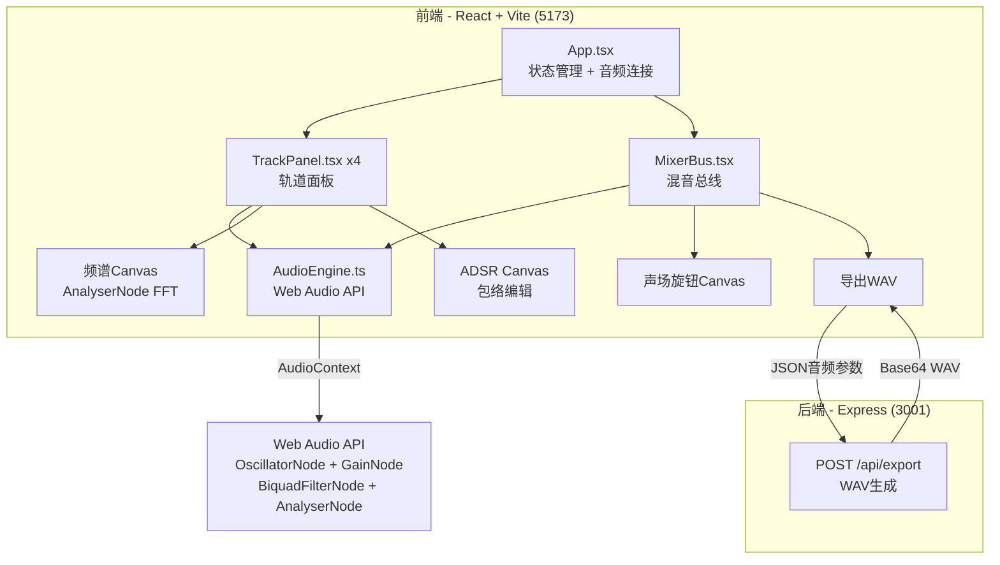
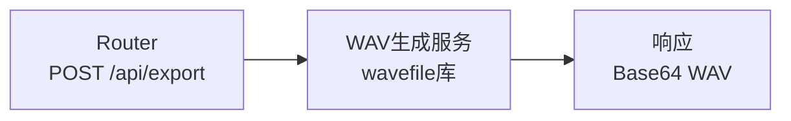
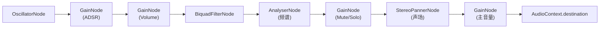

## 1. 架构设计



## 2. 技术说明

- 前端：React 18 + TypeScript + Vite + TailwindCSS + GSAP + Zustand
- 初始化工具：vite-init (react-express-ts 模板)
- 后端：Express 4 + TypeScript + wavefile
- 数据库：无（纯音频处理，无持久化需求）
- 音频引擎：Web Audio API (AudioContext, OscillatorNode, GainNode, BiquadFilterNode, AnalyserNode, OfflineAudioContext)

## 3. 路由定义

| 路由 | 用途 |
|------|------|
| / | 合成器工作台主页面 |

## 4. API定义

### POST /api/export

**请求体：**
```typescript
interface ExportRequest {
  tracks: {
    waveform: 'sine' | 'square' | 'sawtooth' | 'noise';
    frequency: number;
    volume: number;
    adsr: {
      attack: number;
      decay: number;
      sustain: number;
      release: number;
    };
    muted: boolean;
  }[];
  masterVolume: number;
  stereoWidth: number;
  duration: number;
  sampleRate: number;
}
```

**响应体：**
```typescript
interface ExportResponse {
  wavBase64: string;
  fileName: string;
}
```

## 5. 服务器架构图



## 6. 核心数据模型

### 6.1 轨道状态（前端Zustand Store）

```typescript
interface TrackState {
  id: string;
  name: string;
  waveform: 'sine' | 'square' | 'sawtooth' | 'noise';
  frequency: number;
  volume: number;
  adsr: {
    attack: number;
    decay: number;
    sustain: number;
    release: number;
  };
  muted: boolean;
  solo: boolean;
}
```

### 6.2 混音总线状态

```typescript
interface MixerState {
  masterVolume: number;
  stereoWidth: number;
}
```

## 7. 文件组织

```
├── package.json
├── vite.config.ts
├── tsconfig.json
├── index.html
├── src/
│   ├── App.tsx                  # 主应用组件
│   ├── main.tsx                 # 入口
│   ├── index.css                # 全局样式
│   ├── components/
│   │   ├── TrackPanel.tsx       # 轨道面板组件
│   │   ├── MixerBus.tsx         # 混音总线组件
│   │   ├── WaveformSelector.tsx # 波形选择按钮组
│   │   ├── FrequencySlider.tsx  # 垂直频率滑块
│   │   ├── VolumeSlider.tsx     # 水平音量滑块
│   │   ├── AdsEditor.tsx        # ADSR包络编辑器
│   │   ├── SpectrumDisplay.tsx  # 频谱显示
│   │   ├── StereoKnob.tsx       # 声场旋钮
│   │   └── MuteSoloButtons.tsx  # Mute/Solo按钮
│   ├── engine/
│   │   └── AudioEngine.ts       # 音频引擎类
│   ├── store/
│   │   └── useAppStore.ts       # Zustand状态管理
│   └── utils/
│       └── exportWav.ts         # WAV导出工具函数
├── server/
│   └── index.ts                 # Express服务器
```

## 8. 音频节点图


