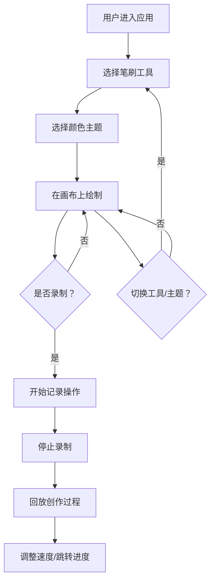

## 1. 产品概述
虚拟沙画台是一款在浏览器中运行的交互式艺术创作应用，用户可以通过鼠标或手指模拟沙画表演，在发光底板上进行撒沙、抹沙和捏沙操作，实时生成动态沙画作品，并支持录制和回放创作过程。

- 目标用户：沙画爱好者、艺术创作者、教育工作者
- 产品价值：提供低成本、无耗材的沙画创作体验，降低沙画艺术门槛

## 2. 核心功能

### 2.1 功能模块
1. **沙画绘制系统**：粒子系统模拟、撒沙/抹沙/捏沙操作
2. **工具系统**：三种笔刷（粗沙、细沙、捏沙）、两种擦除模式（轻抹、强力）
3. **主题系统**：三种颜色主题（夕阳金、极光绿、月光蓝）
4. **录制回放系统**：操作录制、回放控制、进度跳转、速度调节
5. **响应式界面**：桌面/移动端适配、触摸事件支持

### 2.2 页面详情
| 页面名称 | 模块名称 | 功能描述 |
|-----------|-------------|---------------------|
| 主页面 | 沙画板 | Canvas粒子绘制、鼠标/触摸事件处理、响应式布局 |
| 主页面 | 工具栏 | 笔刷切换、擦除模式、颜色主题选择 |
| 主页面 | 录制控制条 | 录制/停止按钮、回放进度条、速度控制、暂停/播放 |

## 3. 核心流程
用户打开应用 → 选择笔刷和主题 → 在沙画板上进行创作 → 可随时录制操作 → 回放查看创作过程 → 导出录制数据

## 4. 用户界面设计

### 4.1 设计风格
- 主色调：纯黑背景 #0a0a0a
- 毛玻璃效果：背景 rgba(20,20,20,0.7)，backdrop-filter: blur(10px)
- 激活高亮：#f0e68c（外发光）
- 按钮交互：悬停放大1.1倍、点击缩小0.95倍
- 字体：优雅的无衬线字体，深色主题适配

### 4.2 页面设计概述
| 页面名称 | 模块名称 | UI元素 |
|-----------|-------------|-------------|
| 主页面 | 沙画板 | 径向渐变发光底板、Canvas粒子绘制区域、80%视口宽度 |
| 主页面 | 工具栏 | 左上角浮动、三个圆形笔刷图标、主题下拉框、毛玻璃背景 |
| 主页面 | 录制控制条 | 右下角浮动、红色录制按钮（脉冲动画）、进度条、速度控制 |

### 4.3 响应式设计
- 桌面端：鼠标事件，画布占80%视口宽度
- 移动端：触摸事件适配，画布自适应屏幕尺寸，工具栏和控制条尺寸适配
