## 1. 架构设计

```mermaid
flowchart TD
    A["UI层 (React组件)"] --> B["状态管理层"]
    B --> C["核心绘制层 (Canvas)"]
    C --> D["粒子系统"]
    D --> E["录制管理模块"]
    E --> F["JSON导出/回放"]
    
    style A fill:#1a1a2e
    style B fill:#16213e
    style C fill:#0f3460
    style D fill:#533483
    style E fill:#e94560
    style F fill:#ff6b6b
```


## 2. 技术描述
- 前端框架：React 18 + TypeScript
- 构建工具：Vite
- 动画库：GSAP（用于颜色主题过渡动画）
- 状态管理：React Hooks (useState, useRef, useEffect)
- 渲染方式：HTML5 Canvas 2D API

## 3. 目录结构
```
src/
├── App.tsx              # 主组件，状态管理，UI布局
├── SandCanvas.tsx       # 核心沙画板组件
├── RecordingManager.ts  # 录制管理模块
└── main.tsx             # 应用入口
```

## 4. 核心数据模型

### 4.1 沙粒数据结构
```typescript
interface SandGrain {
  id: number;
  x: number;
  y: number;
  radius: number;
  color: string;
  opacity: number;
  vx: number;  // 扩散速度x
  vy: number;  // 扩散速度y
  createdAt: number;
}
```

### 4.2 录制操作数据结构
```typescript
interface RecordAction {
  timestamp: number;
  type: 'sprinkle' | 'erase' | 'pinch' | 'themeChange' | 'toolChange';
  x?: number;
  y?: number;
  tool?: ToolType;
  theme?: ThemeType;
  pressure?: number;
  velocity?: number;
}
```

### 4.3 工具与主题类型
```typescript
type ToolType = 'coarse' | 'fine' | 'pinch' | 'eraseLight' | 'eraseStrong';
type ThemeType = 'sunset' | 'aurora' | 'moonlight';
type PlaybackSpeed = 1 | 2;
```

## 5. 性能优化策略
1. **粒子合并**：沙粒数量超过15000时，合并距离小于3px的最旧沙粒
2. **离屏渲染**：使用requestAnimationFrame进行高效渲染循环
3. **事件节流**：鼠标/触摸事件使用节流优化，避免过度绘制
4. **粒子生命周期**：沙粒扩散速度随时间衰减，减少不必要的计算
5. **Canvas优化**：使用离屏Canvas预渲染底板效果
