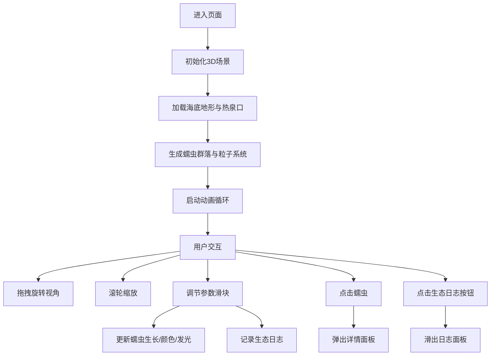

## 1. 产品概述

虚拟海底热泉生态圈与管状蠕虫群落成长模拟项目，让用户以深海生态学家的身份在浏览器中探索3D海底微缩生态圈，通过调节环境参数观察管状蠕虫群落的动态生长变化。

- 核心目的：提供沉浸式的深海生态教育与交互体验，让用户直观理解热泉生态系统的运作机制
- 目标用户：海洋生物爱好者、学生、教育工作者、科普受众
- 产品价值：将抽象的深海生态学概念转化为可视化、可交互的3D体验

## 2. 核心特性

### 2.1 功能模块
1. **3D深海场景**：漆黑深海背景、随机起伏海底地形、热泉口与烟羽粒子系统、管状蠕虫群落、星空粒子视差效果
2. **环境参数控制**：温度滑块（2-15°C）、硫化物浓度滑块（0.1-2.0）、洋流速度滑块（0-3）
3. **蠕虫详情面板**：点击蠕虫显示身高、触手分支数、共生菌活性指数、生长历史时间线
4. **生态日志系统**：记录用户参数调整历史，展示生态系统状态变化摘要
5. **相机交互**：鼠标拖拽旋转（Y轴）、滚轮缩放（5-20单位）

### 2.2 页面详情
| 页面名称 | 模块名称 | 功能描述 |
|-----------|-------------|---------------------|
| 主场景 | 3D渲染模块 | 实时渲染海底地形、热泉口、烟羽粒子、蠕虫群落、星空粒子 |
| 主场景 | 交互控制模块 | OrbitControls相机控制、射线检测蠕虫点击、参数滑块拖拽 |
| 控制面板 | 参数调节模块 | 三个带阻尼动画的滑块，实时调节环境参数 |
| 详情面板 | 数据展示模块 | 显示蠕虫个体数据、d3-scale绘制的生长历史折线图 |
| 生态日志 | 历史记录模块 | 左侧滑出面板，Markdown格式记录参数变化和生态响应 |

## 3. 核心流程

用户进入页面后，首先看到漆黑的3D深海场景，中央热泉口喷出黑色烟羽，周围散布多株管状蠕虫。用户可以通过鼠标拖拽旋转视角、滚轮缩放观察细节。通过右下角控制面板调节温度、硫化物浓度和洋流速度，观察蠕虫生长速度、颜色和共生菌发光强度的实时变化。点击任意蠕虫可查看其详细信息。点击右上角"生态日志"按钮可查看所有参数调整的历史记录。

## 4. 用户界面设计

### 4.1 设计风格
- **主色调**：深海蓝黑渐变（#03050a → #0a1628），代表深海环境
- **强调色**：科技蓝（#00aaff）用于控制面板边框，生命绿（#00ffaa）用于最新日志边框，血红（#cc0000）用于蠕虫触手
- **字体**：采用等宽科技字体如 'JetBrains Mono' 或 'Fira Code'，搭配清晰的无衬线字体
- **按钮风格**：圆角胶囊形状，悬浮时背景变亮，带有微妙的发光效果
- **布局风格**：沉浸式全屏3D场景，浮动半透明UI面板，营造科研仪器的视觉感受
- **图标风格**：简约线性图标，带微光效果，符合深海探测主题

### 4.2 页面设计概述
| 页面名称 | 模块名称 | UI元素 |
|-----------|-------------|-------------|
| 主场景 | 3D视口 | 全屏Canvas，深海渐变背景，动态粒子效果 |
| 控制面板 | 参数滑块 | 半透明毛玻璃面板（backdrop-filter: blur(12px)），背景rgba(0,10,20,0.7)，发光边框#00aaff，圆角16px |
| 详情面板 | 数据卡片 | 居中弹出动画（0.8→1缩放，easeOutBack缓动），显示统计数据和折线图 |
| 生态日志 | 侧滑面板 | 左侧滑入动画（0.5秒easeOut），宽350px，Markdown格式条目，最新条目带#00ffaa发光边框 |
| 顶部按钮 | 生态日志按钮 | 右上角胶囊形状，背景#004466，文字#e0f0ff，悬浮背景#006688 |

### 4.3 响应性
- 桌面端优先设计，全屏Canvas自适应窗口大小
- 控制面板固定在右下角，详情面板居中显示
- 生态日志面板在小屏幕上可调整为全屏覆盖
- 触摸设备支持双指缩放和单指旋转

### 4.4 3D场景指引
- **环境氛围**：极暗深海环境，背景色从#03050a渐变到#0a1628，营造2000米以下深海的压迫感
- **光照设置**：环境光强度0.1，点光源位于热泉口（色温3000K，强度2.0），蠕虫触手自发光，共生菌落粒子发光
- **相机设置**：PerspectiveCamera，fov 60，初始位置(0, 3, 10)，看向原点，近裁剪面0.1，远裁剪面100
- **构图**：热泉口位于场景中心，蠕虫围绕热泉口呈环形分布，背景星空粒子提供深度感
- **交互与动画**：
  - 烟羽粒子每帧生成30个，上升速度0.8单位/秒，寿命5秒
  - 蠕虫触手摆动幅度0.2弧度，频率0.5-1Hz随机
  - 滑块拖拽使用GSAP弹性缓动，持续0.3秒
  - 详情面板弹出动画0.3秒easeOutBack
  - 日志面板滑入动画0.5秒easeOut
- **后处理效果**：Bloom发光效果（共生菌落、热泉口），轻微的水下雾效，色彩校正
- **性能预算**：粒子总数控制在5000以内，Draw Call < 50，目标帧率60fps
