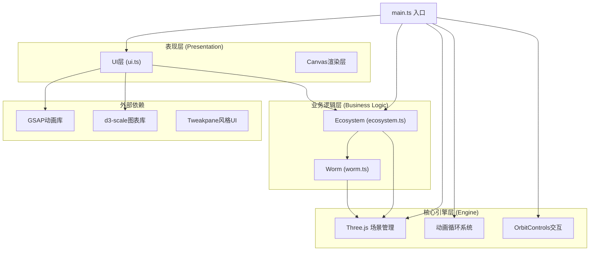

## 1. 架构设计



## 2. 技术描述

- **前端框架**：TypeScript + Three.js@0.160.0 + Vite
- **构建工具**：Vite 4.x，启用TypeScript支持
- **3D引擎**：Three.js 0.160.0，原生API调用，不使用React Three Fiber
- **动画库**：GSAP 3.x，用于UI阻尼动画和面板过渡
- **图表库**：d3-scale，用于生长历史时间线折线图
- **UI风格**：Tweakpane风格的自定义HTML/CSS组件，半透明毛玻璃效果
- **无后端**：纯前端项目，所有数据保存在内存中
- **无数据库**：生态日志仅存在于当前会话

## 3. 项目文件结构

| 文件路径 | 用途 |
|-------|---------|
| `package.json` | 项目依赖配置，包含three、typescript、vite、@types/three、tweakpane、gsap、d3-scale |
| `vite.config.js` | Vite构建配置，启用TypeScript，设置base: './' |
| `tsconfig.json` | TypeScript编译配置，严格模式，目标ES2020 |
| `index.html` | 入口HTML，全屏黑色背景#03050a |
| `src/main.ts` | 主入口：初始化Three.js场景、相机、渲染器，创建OrbitControls，加载所有模块，启动动画循环 |
| `src/ecosystem.ts` | Ecosystem类：管理热泉生态圈，烟羽粒子系统，蠕虫群落生成与生长逻辑，暴露参数调节方法 |
| `src/worm.ts` | Worm类：单株管状蠕虫，管体/触手/菌落粒子生成，生长动画，颜色变化，交互点击信息提取 |
| `src/ui.ts` | UI管理：控制面板、生态日志DOM交互，滑块动画，响应参数变化调用ecosystem方法 |

## 4. 核心类定义

### 4.1 Worm 类

```typescript
class Worm {
  public mesh: THREE.Group;
  public height: number;
  public baseHeight: number;
  public radius: number;
  public tentacleCount: number;
  public symbiosisIndex: number;
  public growthHistory: { timestamp: number; height: number }[];
  
  constructor(position: THREE.Vector3, baseHeight: number, radius: number);
  public update(deltaTime: number, temperature: number, sulfide: number, currentSpeed: number): void;
  public grow(amount: number): void;
  public setColorSaturation(saturation: number): void;
  public setColonyBrightness(brightness: number): void;
  public getInfo(): WormInfo;
  public dispose(): void;
}

interface WormInfo {
  height: number;
  tentacleBranches: number;
  symbiosisActivity: number;
  growthHistory: { timestamp: number; height: number }[];
}
```

### 4.2 Ecosystem 类

```typescript
class Ecosystem {
  public scene: THREE.Scene;
  public worms: Worm[];
  public temperature: number;
  public sulfideConcentration: number;
  public currentSpeed: number;
  
  constructor(scene: THREE.Scene);
  public init(): void;
  public createTerrain(): void;
  public createVent(): void;
  public createPlumeSystem(): void;
  public createWormColony(): void;
  public createStarfield(): void;
  public update(deltaTime: number): void;
  public setTemperature(value: number): void;
  public setSulfideConcentration(value: number): void;
  public setCurrentSpeed(value: number): void;
  public getWormAtPosition(intersect: THREE.Intersection): Worm | null;
  public dispose(): void;
}
```

### 4.3 UIManager 类

```typescript
class UIManager {
  private ecosystem: Ecosystem;
  private logEntries: LogEntry[];
  
  constructor(ecosystem: Ecosystem);
  public init(): void;
  public createControlPanel(): void;
  public createEcologyLogButton(): void;
  public createLogPanel(): void;
  public showWormDetail(worm: Worm): void;
  public hideWormDetail(): void;
  public addLogEntry(entry: Omit<LogEntry, 'id' | 'timestamp'>): void;
  public toggleLogPanel(): void;
}

interface LogEntry {
  id: number;
  timestamp: Date;
  message: string;
  parameters: {
    temperature?: number;
    sulfide?: number;
    currentSpeed?: number;
  };
}
```

## 5. 数据模型

### 5.1 环境参数模型
```typescript
interface EnvironmentParams {
  temperature: number;      // 范围: 2-15°C, 默认: 8°C
  sulfideConcentration: number;  // 范围: 0.1-2.0, 默认: 0.8
  currentSpeed: number;     // 范围: 0-3, 默认: 1
}
```

### 5.2 蠕虫状态模型
```typescript
interface WormState {
  id: string;
  position: { x: number; z: number };
  baseHeight: number;       // 2-4单位
  currentHeight: number;
  radius: number;           // 0.3-0.6单位
  tentacleBranches: number; // 3-5根
  colorSaturation: number;  // 0-1
  colonyBrightness: number; // 0.2-1.0
  growthRate: number;       // 每10秒增高0.05-0.3单位
  growthHistory: GrowthRecord[];
}

interface GrowthRecord {
  timestamp: number;
  height: number;
}
```

### 5.3 粒子系统模型
```typescript
interface Particle {
  position: THREE.Vector3;
  velocity: THREE.Vector3;
  life: number;
  maxLife: number;
  size: number;
  opacity: number;
}

interface PlumeConfig {
  spawnRate: number;        // 每帧30个
  riseSpeed: number;        // 0.8单位/秒
  lifetime: number;         // 5秒
  startSize: number;        // 2px
  endSize: number;          // 0.5px
  startOpacity: number;     // 0.6
  endOpacity: number;       // 0
}
```

## 6. 性能优化策略

1. **粒子池化**：烟羽粒子使用对象池复用，避免频繁创建销毁
2. **几何体合并**：海底地形使用单个BufferGeometry，蠕虫管体复用几何体
3. **材质复用**：相同类型的蠕虫共享材质实例，通过uniforms控制个体差异
4. **视锥剔除**：Three.js内置视锥剔除，距离过远的对象自动跳过渲染
5. **帧率自适应**：动画循环使用deltaTime，确保不同设备上的动画速度一致
6. **事件节流**：滑块值变化使用节流，避免频繁更新导致性能问题
