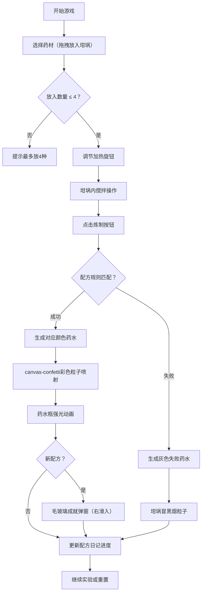

## 1. 产品概述

一款面向炼金术漫画爱好者的浏览器交互游戏，用户通过拖拽药材、调节加热温度、搅拌坩埚来合成魔法药水，根据隐藏配方规则判定成功/失败并触发绚丽视觉特效。

- 核心目标：让用户体验神秘炼金术调配过程，通过实验发现配方获得成就感
- 目标用户：炼金术/魔法题材爱好者、休闲游戏玩家
- 产品价值：沉浸式中世纪炼金工坊氛围，高可重玩性的配方探索玩法

## 2. 核心功能

### 2.1 用户角色

| 角色 | 注册方式 | 核心权限 |
|------|----------|----------|
| 炼金术士（玩家） | 无需注册，本地会话 | 调配药水、查看已发现配方、成就解锁 |

### 2.2 功能模块

1. **主工作台界面**：坩埚区、加热控制、搅拌交互、炼制按钮
2. **药材选择系统**：左侧药材架（7种药材）拖拽投放机制
3. **药水判定系统**：隐藏配方表匹配、成功/失败判定、颜色特效生成
4. **规则日记面板**：已发现配方进度、配方详情、稀有度星级
5. **成就弹窗系统**：新配方解锁通知弹窗

### 2.3 页面详情

| 页面名称 | 模块名称 | 功能描述 |
|----------|----------|----------|
| 主工作台 | 坩埚区 | 椭圆形金属坩埚（320x280px）、动态液面、Canvas冒泡粒子、铆钉边框装饰 |
| 主工作台 | 加热旋钮 | 0-100%旋钮控制、底部红光渐变、冒泡速度正比、GSAP缓动阻尼 |
| 主工作台 | 搅拌机制 | 按住拖动搅拌、角速度计算融合度、浑浊/清澈视觉切换 |
| 主工作台 | 炼制按钮 | 触发配方判定、成功/失败特效、全屏闪光、GSAP坩埚shake效果 |
| 药材架 | 药材卡片 | 7种药材（月光草/火焰苔/冰晶石/暗影菇/黄金花粉/雷霆根/深海珍珠）、色彩标识、稀有度显示、悬停发光边框 |
| 药材架 | 拖拽投放 | 半透明跟随虚影、坩埚上方释放、放入splash动画、最多4种限制 |
| 规则日记 | 配方列表 | 虚拟滚动、进度显示（3/10）、羊皮纸风格、滚动淡入 |
| 规则日记 | 配方详情 | 点击条目展开、配方完整描述、稀有度星级（1-5星） |
| 成就系统 | 弹窗通知 | 毛玻璃半透明、右侧滑入、GSAP动画、自动淡出 |

## 3. 核心流程

玩家打开页面进入炼金工坊 → 从左侧拖拽药材（最多4种）放入坩埚 → 调节加热旋钮控制温度 → 按住坩埚内壁拖动进行搅拌 → 点击"炼制"按钮触发反应 → 系统根据隐藏规则判定 → 成功：彩色粒子喷射+药水瓶强光+配方解锁+成就弹窗 / 失败：黑烟冒出+灰色药水

## 4. 用户界面设计

### 4.1 设计风格

**整体氛围：中世纪炼金术士秘密工坊，昏暗地窖神秘感**

- **主背景**：垂直线性渐变，深橡木色 `#3a2318` → 墨绿色 `#1a3a2a`，模拟木质操作台
- **坩埚**：椭圆形铸铁质感 `radial-gradient(#4a4a4a, #2a2a2a)`，8个7px铆钉圆点装饰边框
- **药材卡片**：深棕色半透明 `rgba(80,40,20,0.8)`，悬停时 `box-shadow: 0 0 15px 对应药材颜色`
- **规则日记面板**：羊皮纸色半透明 `rgba(245,230,200,0.95)`，边缘自然破损效果
- **入口页面**：深紫色渐变 `#1a0a2e`

**交互动效：**
- 药材卡片：GSAP spring弹性效果、拖拽半透明虚影
- 坩埚：炼制成功/失败GSAP shake抖动效果、全屏白色半透明闪光（0.3s淡出）
- 加热旋钮：GSAP缓动模拟阻尼感
- 规则日记：滚动内容淡入动画
- 成就弹窗：右滑入→停顿→淡出

**字体建议：**
- 标题：MedievalSharp 或 Cinzel Decorative（中世纪复古风格衬线字体）
- 正文：Cormorant Garamond 或 思源宋体（优雅易读的衬线体）

### 4.2 页面设计概览

| 页面名称 | 模块名称 | UI元素 |
|----------|----------|--------|
| 主工作台 | 坩埚区 | 椭圆形320x280px、径向渐变铸铁色、8铆钉边框、动态液面（高度动画）、Canvas冒泡层、搅拌鼠标追踪区域 |
| 主工作台 | 加热区 | 旋钮下方弧形红光渐变（0-100%透明度/亮度变化）、GSAP缓动调节、旋钮数字显示 |
| 主工作台 | 炼制按钮 | 金色复古边框、悬停发光、点击坩埚shake联动、全屏闪光层 |
| 药材架 | 药材卡片 | 120x35px卡片、药材名称+色彩标识圆点、稀有度（★1-5）、悬停发光边框、拖拽时半透明opacity 0.6 |
| 药材架 | 坩埚投放区 | 拖拽上方高亮提示、放入时splash涟漪动画 |
| 规则日记 | 面板主体 | 羊皮纸纹理背景、破损边缘mask、虚拟滚动容器（最多渲染可见区域） |
| 规则日记 | 配方条目 | 进度X/10标题、每条目药水色标+名称、星级、悬停展开完整配方 |
| 成就弹窗 | 弹窗主体 | backdrop-filter毛玻璃、深色半透明、右侧transform: translateX滑入、图标+名称+星级描述、3s后淡出 |

### 4.3 响应式

- **桌面端（≥800px）**：标准三栏布局 - 左药材架 / 中坩埚 / 右规则日记
- **窄屏（<800px）**：药材架折叠为顶部抽屉、规则日记折叠为底部抽屉、坩埚居中放大
- **触控优化**：搅拌区域支持touch事件、拖拽采用PointerEvents统一处理

## 5. 配方规则表（隐藏规则）

| 药水名称 | 颜色 | 配方组合 | 加热范围 | 稀有度 | 效果描述 |
|----------|------|----------|----------|--------|----------|
| 生命药水 | #7fff00 苹果绿 | 月光草 + 黄金花粉 | 30-40% | ★★ | 治愈伤口，恢复生机的翠绿药剂 |
| 爆燃药水 | #ff4500 橙红 | 火焰苔 + 雷霆根 | 75-90% | ★★★ | 剧烈爆炸的炽热橙红色液体 |
| 隐形药水 | #e0ffff 浅青 | 暗影菇 + 深海珍珠 | 15-25% | ★★★★ | 转瞬即逝的透明光流 |
| 冰霜药水 | #00ced1 深蓝 | 冰晶石 + 深海珍珠 | 5-15% | ★★ | 散发寒气的结晶蓝 |
| 雷电药水 | #ffff00 亮黄 | 雷霆根 + 黄金花粉 | 60-75% | ★★★ | 噼啪作响的金黄闪电 |
| 暗影药水 | #4b0082 暗紫 | 暗影菇 + 月光草 | 45-55% | ★★★ | 吞噬光线的深紫迷雾 |
| 黄金药水 | #ffd700 金色 | 黄金花粉 + 火焰苔 + 冰晶石 | 50-65% | ★★★★★ | 传说中炼金术的终极追求 |
| 深海药水 | #1e90ff 海蓝 | 深海珍珠 + 冰晶石 + 暗影菇 | 20-35% | ★★★★ | 来自深渊的神秘幽蓝 |
| 月光药水 | #f5f5dc 月白 | 月光草 + 深海珍珠 + 雷霆根 | 10-20% | ★★★ | 凝萃月辉的乳白光泽 |
| 失败药水 | #808080 灰色 | 任意不匹配组合 | 任意 | ★ | 一团毫无用处的浑浊泥浆 |
