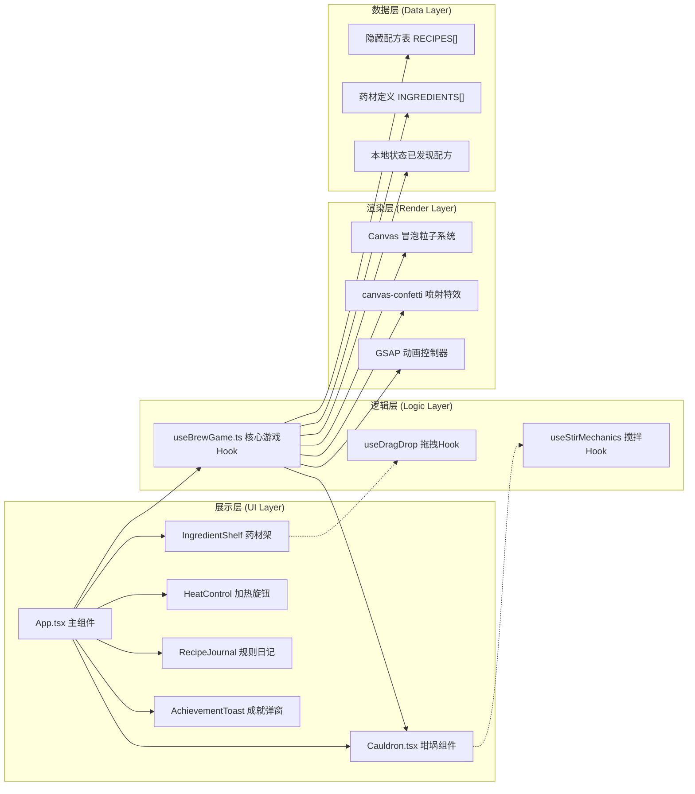

## 1. 架构设计

纯前端单页应用（SPA），无后端服务。采用 React 组件化架构，通过自定义 Hook 管理游戏核心状态与逻辑，Canvas 渲染粒子特效，GSAP 驱动动画时序。



**数据流向：**
- 用户交互（拖拽/旋钮/搅拌/点击）→ App.tsx 事件处理 → useBrewGame 更新状态 → 子组件接收新 props 重新渲染
- 炼制判定：useBrewGame 读取当前状态（药材组合/加热/融合度）→ 匹配 RECIPES → 返回结果（药水颜色/特效类型/成功状态）→ 渲染坩埚动画 + 触发特效
- 配方进度：成功炼制 → useBrewGame 更新已发现配方集合 → RecipeJournal 渲染 → 新配方时触发 AchievementToast

## 2. 技术描述

- **前端框架**：React@18 + TypeScript@5
- **构建工具**：Vite@5 + @vitejs/plugin-react
- **动画库**：GSAP@3（缓动/阻尼/shake/spring）
- **粒子特效**：canvas-confetti@1（成功喷射）+ 原生 Canvas 2D（冒泡/黑烟）
- **样式方案**：原生 CSS（CSS Modules 可选）+ CSS 变量主题系统
- **状态管理**：React Hooks（useState/useRef/useCallback），无额外状态库

## 3. 文件结构与调用关系

```
auto157/
├── package.json            # 依赖定义：react/react-dom/typescript/vite@5/@vitejs/plugin-react/canvas-confetti/gsap
├── vite.config.js          # React插件 + TypeScript + base='./'
├── tsconfig.json           # 严格模式 strict:true + target:ES2020 + moduleResolution:bundler
├── index.html              # 入口，深紫色渐变#1a0a2e背景
├── src/
│   ├── main.tsx            # React入口挂载点
│   ├── App.tsx             # 主组件：三栏布局、拖拽、搅拌交互、炼制触发
│   │   ├── 调用 useBrewGame() 获取游戏状态与动作
│   │   ├── 渲染 <Cauldron /> 传递 color/boilIntensity/stirProgress
│   │   ├── 渲染 <IngredientShelf /> 传递 onDropIngredient
│   │   ├── 渲染 <HeatControl /> 传递 onHeatChange
│   │   ├── 渲染 <RecipeJournal /> 传递 discoveredRecipes
│   │   └── 调用 confetti() / GSAP 触发特效
│   ├── hooks/
│   │   └── useBrewGame.ts  # 核心游戏逻辑
│   │       ├── 输入：addIngredient / removeIngredient / setHeat / setFusion
│   │       ├── 处理：matchRecipe() 匹配配方表
│   │       └── 输出：potionColor / effectType / isSuccess / discoveredRecipes
│   ├── components/
│   │   └── Cauldron.tsx    # 坩埚组件
│   │       ├── 输入 props：color（药水颜色）、boilIntensity（冒泡强度0-1）、fusionLevel（融合度0-100）
│   │       ├── CSS：椭圆形radial-gradient金属质感 + 8铆钉
│   │       ├── Canvas：冒泡粒子（requestAnimationFrame，最多200个粒子池复用）
│   │       └── 事件：onStirStart / onStirMove / onStirEnd（通过父组件回传角速度）
│   ├── data/
│   │   ├── ingredients.ts  # 7种药材定义：名称/颜色/稀有度/图标标识
│   │   └── recipes.ts      # 10种隐藏配方：药材集合(无序匹配)/加热范围/颜色/名称/星级/描述
│   └── styles/
│       ├── global.css      # CSS变量主题、全局字体、重置样式、响应式断点
│       └── animations.css  # 关键帧动画：液面波动、splash、黑烟、闪光、毛玻璃弹窗
```

**核心调用链：**
1. `App.tsx` → `useBrewGame.addIngredient(id)` → 状态更新 → `Cauldron` 液面上升动画
2. `App.tsx`(拖拽结束坐标落在坩埚区域内) → `onDropIngredient` → GSAP splash 动画
3. `Cauldron.onMouseMove`(搅拌) → 计算当前点与中心点的角度差/时间 → `setFusion(value)`
4. `App.tsx`(点击炼制) → `useBrewGame.brew()` → `matchRecipe()` → 返回结果 → `confetti()` / GSAP shake
5. `useBrewGame.discoveredRecipes` 变化 → `RecipeJournal` 渲染 → 新条目 `AchievementToast` 弹出

## 4. 核心数据模型

### 4.1 药材 Ingredient

```typescript
interface Ingredient {
  id: string;                    // 唯一标识：'moonHerb' | 'fireMoss' | ...
  name: string;                  // 中文名：月光草
  color: string;                 // 药材标识色：#c0c0ff
  rarity: 1 | 2 | 3 | 4 | 5;     // 稀有度星级
  emoji: string;                 // 视觉标识：🌿
}
```

### 4.2 配方 Recipe

```typescript
interface Recipe {
  id: string;
  name: string;                  // 生命药水
  color: string;                 // #7fff00
  ingredientIds: string[];       // ['moonHerb', 'goldPollen'] - 无序匹配，集合相等
  heatMin: number;               // 30  加热范围最小值 (%)
  heatMax: number;               // 40  加热范围最大值 (%)
  rarity: 1 | 2 | 3 | 4 | 5;
  description: string;           // 治愈伤口，恢复生机的翠绿药剂
  effectType: 'heal' | 'explode' | 'invisible' | 'ice' | 'thunder' | 'shadow' | 'gold' | 'deep' | 'moon' | 'fail';
}
```

### 4.3 游戏状态 GameState

```typescript
interface GameState {
  selectedIngredients: Ingredient[];  // 当前坩埚内药材（最多4个）
  heatLevel: number;                  // 加热 0-100
  fusionLevel: number;                // 融合度 0-100（搅拌累计）
  currentPotion: PotionResult | null; // 上次炼制结果
  discoveredRecipeIds: Set<string>;   // 已发现配方ID集合
}

interface PotionResult {
  recipeId: string;
  name: string;
  color: string;
  isSuccess: boolean;
  effectType: string;
  rarity: number;
  isNewDiscovery: boolean;
}
```

## 5. 配方匹配算法

```typescript
function matchRecipe(ingredients: Ingredient[], heat: number): Recipe | FAIL_RECIPE {
  const selectedSet = new Set(ingredients.map(i => i.id));
  
  // 按配方药材数量降序遍历（优先匹配多药材配方如黄金药水3种）
  const sortedRecipes = [...RECIPES].sort((a, b) => 
    b.ingredientIds.length - a.ingredientIds.length
  );
  
  for (const recipe of sortedRecipes) {
    const recipeSet = new Set(recipe.ingredientIds);
    // 集合相等判定
    if (selectedSet.size === recipeSet.size &&
        [...selectedSet].every(id => recipeSet.has(id)) &&
        heat >= recipe.heatMin && heat <= recipe.heatMax) {
      return recipe;
    }
  }
  return FAIL_RECIPE;
}
```

## 6. 性能优化方案

### 6.1 Canvas 粒子池

- 冒泡粒子：预分配对象池 `const BUBBLE_POOL = 200`，超出时复用最老粒子
- 每帧 `requestAnimationFrame` 批量更新 + 单次 `ctx` 绘制调用
- 冒泡速率公式：`bubblesPerFrame = heatLevel * 0.4 / 60`（60FPS），最大 40/s = 0.667/帧

### 6.2 虚拟滚动（配方列表）

- `RecipeJournal` 仅渲染可视区域条目：`visibleStart ~ visibleStart + visibleCount`
- `visibleCount = Math.ceil(containerHeight / itemHeight) + 2`（前后各缓冲1条）
- 滚动事件节流（RAF 双缓冲），条目使用 `transform: translateY` 定位避免重排

### 6.3 拖拽优化

- 使用 PointerEvents 统一鼠标/触控
- 拖拽跟随元素使用 `position: fixed` + `transform: translate(x,y,0)` 启动 GPU 合成层
- 目标区域判定在 `pointermove` 中使用 `getBoundingClientRect()` 缓存结果（拖拽期间坐标不变）

### 6.4 搅拌角速度计算

```typescript
// 50px 半径内的角速度（弧度/秒）累积至融合度
let lastAngle: number | null = null;
let lastTime = 0;

function onStirMove(x: number, y: number, centerX: number, centerY: number) {
  const dx = x - centerX, dy = y - centerY;
  const dist = Math.sqrt(dx * dx + dy * dy);
  if (dist < 20 || dist > 130) return; // 仅50px±有效搅拌区
  
  const angle = Math.atan2(dy, dx);
  const now = performance.now();
  
  if (lastAngle !== null) {
    let delta = angle - lastAngle;
    // 处理角度跳变 -π/π
    if (delta > Math.PI) delta -= 2 * Math.PI;
    if (delta < -Math.PI) delta += 2 * Math.PI;
    
    const dt = (now - lastTime) / 1000;
    if (dt > 0) {
      const angularVel = Math.abs(delta) / dt; // rad/s
      const fusionGain = Math.min(angularVel * 0.02, 2); // 单帧最多+2
      setFusion(prev => Math.min(100, prev + fusionGain * dt * 60));
    }
  }
  lastAngle = angle;
  lastTime = now;
}
```

## 7. 特效实现要点

| 特效 | 实现方式 |
|------|----------|
| 冒泡 | Canvas 2D：圆形粒子随机X位置，Y向上移动，半径扩大，alpha淡出，颜色=`potionColor`+白色高光 |
| 黑烟（失败） | Canvas 2D：大半径半透明黑色/灰色粒子，Y向上+X偏移飘动，尺寸随高度膨胀 |
| Confetti（成功） | `canvas-confetti`：`colors: 配方主色+白+金`，`particleCount: 150`，`spread: 80`，`origin: {y: 0.6}` |
| 坩埚shake | GSAP `gsap.to(cauldronRef, {x: [0,-5,5,-3,3,0], duration: 0.4, ease: 'power2.out'})` |
| 全屏闪光 | 绝对定位白色div `opacity: 0.8` → `0`，GSAP `duration: 0.3`，pointer-events:none |
| 药水瓶强光 | `box-shadow: 0 0 0px 透明 → 0 0 60px 30px potion色半透明`，GSAP 过渡 0.8s |
| 成就弹窗 | `transform: translateX(120%) → 0` GSAP `back.out(1.7)`，停顿2s后淡出 |
| 液面波动 | CSS `@keyframes wave` 用 `radial-gradient` 位置偏移，或 SVG path 动画 |
| splash动画 | 放入药材时，坩埚中心生成短暂扩大的半透明圆环+波纹扩散 |
