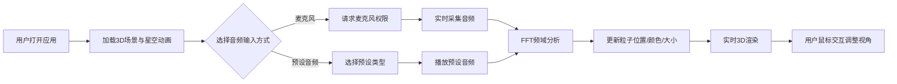

## 1. 产品概述

交互式3D声波可视化应用，通过麦克风输入或预设音频，在3D空间中实时展示声波频率与振幅的粒子云反馈。

- 面向音乐爱好者、视觉艺术家和对音频可视化感兴趣的用户
- 提供沉浸式的音频-视觉转换体验，将声音转化为可交互的3D粒子艺术

## 2. 核心功能

### 2.1 功能模块

1. **主可视化页面**: 3D粒子云展示、音频输入控制、UI控制面板

### 2.2 页面详情

| 页面名称 | 模块名称 | 功能描述 |
|-----------|-------------|---------------------|
| 主可视化页面 | 3D粒子系统 | 800+粒子，Z轴映射频率，Y轴映射振幅，颜色从蓝到红渐变 |
| 主可视化页面 | 音频输入模块 | 麦克风实时采集、预设音频（正弦波、白噪音、音乐片段） |
| 主可视化页面 | UI控制面板 | 开始/停止按钮、预设选择器、灵敏度滑块 |
| 主可视化页面 | 相机交互 | 轨道控制（拖拽旋转、滚轮缩放）、无音频时星空效果 |

## 3. 核心流程

用户打开应用 → 页面加载3D场景与星空粒子动画 → 用户选择音频输入方式（麦克风/预设） → 系统采集音频并进行FFT分析 → 粒子位置与颜色实时更新 → 用户可通过鼠标交互调整视角 → 用户可调整灵敏度或切换预设

## 4. 用户界面设计

### 4.1 设计风格

- **主色调**: 深空蓝 #0a0a2e
- **粒子色彩**: 低频蓝色(#0066ff) → 高频红色(#ff3300) 渐变
- **UI面板**: 半透明深色毛玻璃效果（backdrop-filter: blur(8px)），微弱蓝色发光边框
- **交互反馈**: 悬停时亮度提升 + 轻微缩放，按钮不压缩回弹动画
- **面板动画**: 从左侧滑入

### 4.2 页面设计概述

| 页面名称 | 模块名称 | UI元素 |
|-----------|-------------|-------------|
| 主可视化页面 | 3D场景 | 全屏Canvas、粒子云、星空背景动画 |
| 主可视化页面 | 控制面板 | 左下角浮动面板、按钮、下拉选择器、滑块 |

### 4.3 响应式

- 桌面端：UI面板左下角横向排列
- 移动端：UI控件堆叠为竖排，保持触控区域充足

### 4.4 3D场景指南

- **环境**: 深空背景（#0a0a2e径向渐变）
- **光照**: 环境光 + 点光源，突出粒子发光效果
- **相机**: PerspectiveCamera，轨道控制平滑阻尼
- **粒子**: Points + BufferGeometry，着色器优化性能
- **后处理**: 粒子发光效果，轻微辉光
- **性能目标**: 桌面端≥30fps，移动端≥24fps
