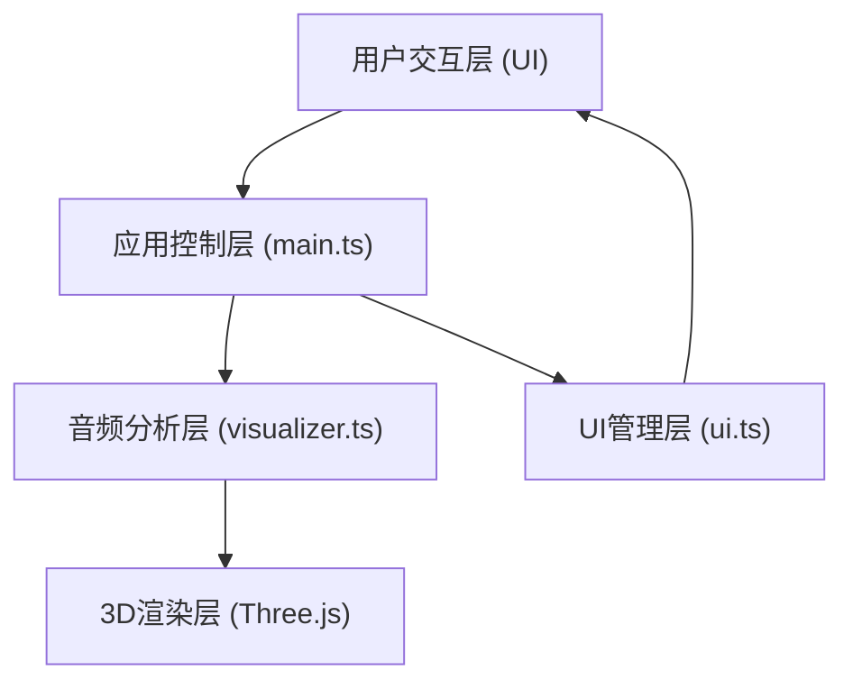

## 1. 架构设计

## 2. 技术描述

- **前端框架**: 原生 TypeScript + Three.js
- **构建工具**: Vite
- **核心依赖**:
  - three@0.160.0 - 3D渲染引擎
  - @types/three - Three.js类型定义
  - typescript - TypeScript语言支持
  - vite - 构建与开发服务器

## 3. 文件结构

| 文件路径 | 用途 |
|-------|---------|
| package.json | 依赖配置与脚本 |
| vite.config.js | Vite构建配置 |
| tsconfig.json | TypeScript编译配置 |
| index.html | 入口HTML页面 |
| src/main.ts | 场景初始化、音频上下文管理、动画循环 |
| src/visualizer.ts | 音频FFT分析、粒子系统生成与更新 |
| src/ui.ts | UI控件创建与交互管理 |

## 4. 核心模块设计

### 4.1 应用控制层 (main.ts)
- 初始化 Three.js Scene、PerspectiveCamera、WebGLRenderer
- 创建 OrbitControls 实现相机交互
- 管理 AudioContext 生命周期
- 驱动 requestAnimationFrame 动画循环
- 协调 visualizer 与 ui 模块

### 4.2 音频分析层 (visualizer.ts)
- 创建 AnalyserNode 进行 FFT 分析
- 管理至少800个粒子的 BufferGeometry
- 频率 → Z轴位置映射，振幅 → Y轴偏移映射
- 颜色插值：低频蓝色 → 高频红色
- 无音频输入时的星空随机飘动动画
- 灵敏度参数控制振幅缩放

### 4.3 UI管理层 (ui.ts)
- 创建半透明毛玻璃控制面板（左下角定位）
- 开始/停止按钮（文本切换、回弹动画）
- 预设音频下拉选择器（正弦波、白噪音、音乐片段）
- 灵敏度滑块（0.5-2.0，默认1.0）
- 悬停效果、面板滑入动画
- 响应式布局适配

## 5. 性能优化策略

- 使用 BufferGeometry 而非 Geometry 批量渲染粒子
- 共享 PointsMaterial，减少 draw call
- 粒子数据更新操作 TypedArray 直接写入
- 限制 FFT 尺寸与粒子数量比例
- 移动端检测与降级策略
