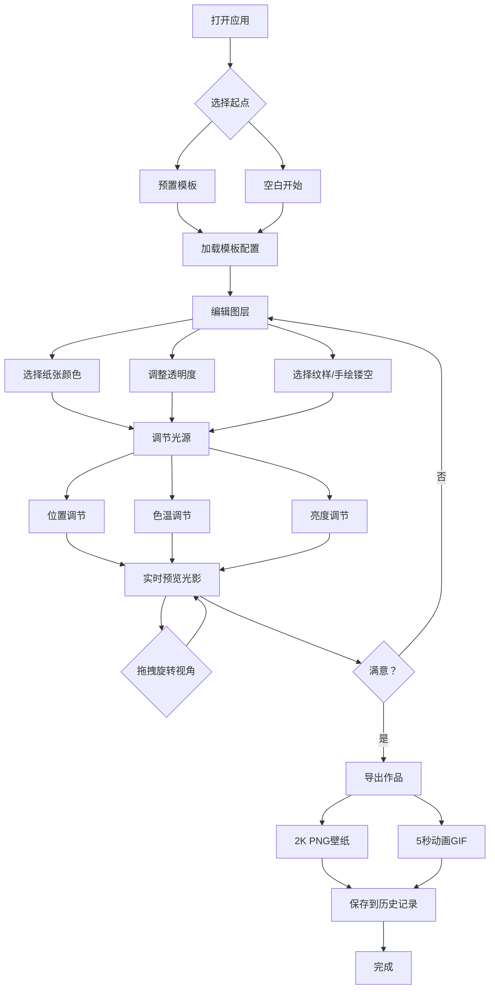

## 1. 产品概述

虚拟光影纸雕灯箱是一款浏览器端的创意工具，让用户像纸雕艺术家一样，在多层虚拟纸张上裁剪镂空图案，调整背光参数，实时预览立体光影效果，并将作品导出为高清壁纸或动画GIF。
- 面向创意爱好者、设计师和纸雕艺术爱好者，提供零门槛的数字纸雕创作体验
- 通过3D光影模拟让传统纸雕艺术数字化，降低创作门槛，激发创意表达

## 2. 核心功能

### 2.1 用户角色
无需角色区分，所有用户享有完整功能。

### 2.2 功能模块
1. **灯箱创作页面**：3D灯箱预览区、图层编辑面板、光源控制面板、模板选择、导出功能、历史记录

### 2.3 页面详情
| 页面名称 | 模块名称 | 功能描述 |
|---------|---------|---------|
| 灯箱创作页 | 灯箱预览区 | 中央4层纸雕3D预览，CSS 3D transform分层，鼠标拖拽旋转视角(-45~45°Y轴, -20~20°X轴) |
| 灯箱创作页 | 图层编辑面板 | 右侧工具栏，4层纸张独立编辑：颜色/透明度/纹样选择/手绘镂空(笔刷3-12px, Shift画直线) |
| 灯箱创作页 | 光源控制面板 | 底部LED灯带模拟：位置滑块(水平-50~50°, 垂直-30~30°)、色温(2700K~6500K)、亮度(10-100流明) |
| 灯箱创作页 | 模板系统 | 预置3个模板(竹林月光、城市夜景、极光山谷)或从空白开始 |
| 灯箱创作页 | 导出功能 | 2K PNG壁纸或5秒循环动画GIF(12fps, 1920px宽) |
| 灯箱创作页 | 历史记录 | 缩略图网格(100×130px)，最多20个，悬停放大120%显示名称和日期 |

## 3. 核心流程

用户打开应用 → 选择预置模板或从空白开始 → 在图层编辑面板编辑各层纸张颜色、透明度、镂空图案 → 可用手绘工具自定义镂空区域 → 调节底部光源的位置、色温、亮度 → 实时在灯箱预览区观察光影变化 → 可拖拽旋转预览视角 → 满意后导出PNG或GIF → 作品保存到历史记录

## 4. 用户界面设计

### 4.1 设计风格
- 主色调：深灰背景(#1a1a1a到#2a2a2a径向渐变)，让光影更突出
- 辅助色：暖白(#fdf5e6)到冷白(#f0f8ff)渐变(纸张色)
- 光源色：#ffd27f(暖黄)到#cce5ff(冷白)对应2700K~6500K色温
- 按钮/滑块：深色玻璃拟态风格，半透明背景，微弱边框高光
- 字体：使用 "Noto Serif SC"(衬线)作为标题字体 + "Noto Sans SC"(无衬线)作为UI字体，大小12-18px
- 布局：三栏布局 - 中央灯箱预览(主体) + 右侧图层编辑 + 底部光源控制
- 图标风格：线性描边风格(lucide-react)
- 阴影：rgba(0,0,0,0.15)层间阴影增强立体感
- 微交互：hover 0.3s ease-in-out放大1.05倍，点击0.1s缩小0.95再弹回

### 4.2 页面设计概述
| 页面名称 | 模块名称 | UI元素 |
|---------|---------|---------|
| 灯箱创作页 | 灯箱预览区 | 深灰径向渐变背景，CSS perspective 800px，4层3D卡片间距5px，鼠标拖拽旋转 |
| 灯箱创作页 | 图层编辑面板 | 右侧280px宽侧边栏，4层卡片列表，每层含色相环、饱和度/亮度滑块、透明度滑块、纹样网格(12个)、手绘Canvas |
| 灯箱创作页 | 光源控制面板 | 底部80px高面板，3个水平滑块(位置/色温/亮度)，实时数值显示 |
| 灯箱创作页 | 导出按钮 | 右上角，玻璃拟态按钮，hover发光效果 |
| 灯箱创作页 | 模板选择 | 左上角下拉/弹窗，3个模板缩略图预览 |
| 灯箱创作页 | 历史记录 | 左下角展开面板，100×130px缩略图网格，hover放大120% |

### 4.3 响应式
桌面优先设计，最小宽度1200px。灯箱预览区自适应剩余空间。图层编辑和光源控制面板固定宽度/高度。

### 4.4 3D场景指引
- 使用CSS 3D transform(perspective, translateZ, rotateX/Y)实现纸雕分层效果
- 4层纸张沿Z轴分布，每层间距5px，顶层(最靠近观察者)到底层(最靠近光源)
- 阴影根据光源角度动态投射，使用CSS filter: drop-shadow()实现
- 光源色温变化通过CSS渐变和混合模式叠加实现
- 鼠标拖拽控制整体灯箱旋转角度，使用requestAnimationFrame确保30fps以上
