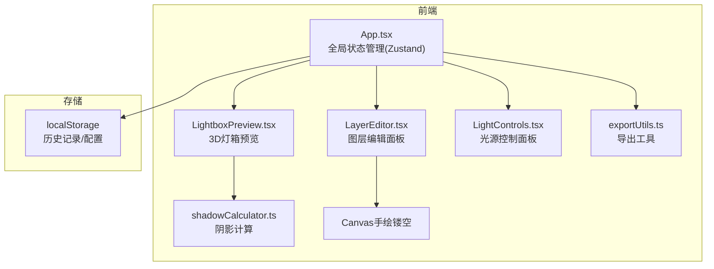
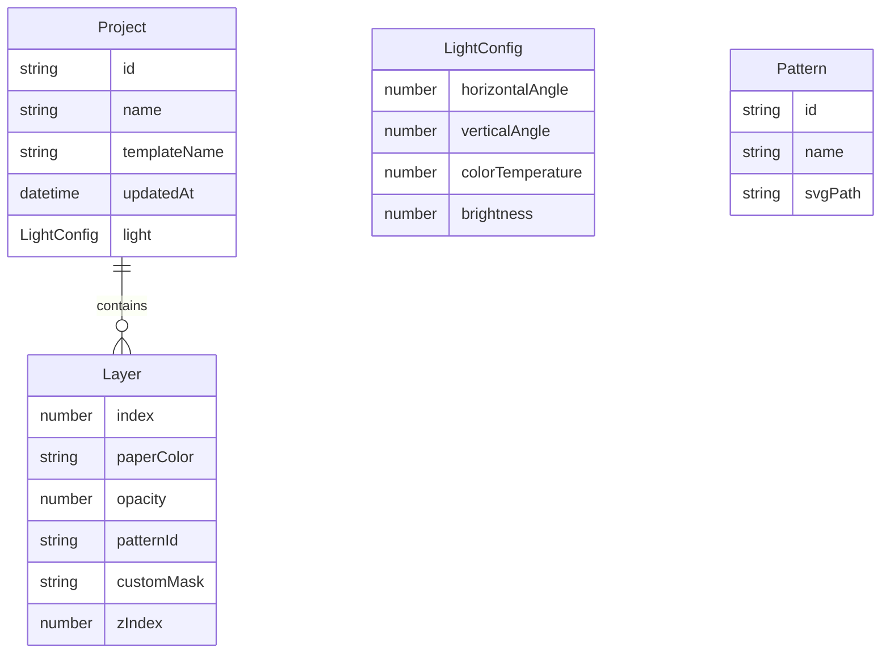

## 1. 架构设计



纯前端应用，无后端。使用localStorage持久化历史记录和作品配置。

## 2. 技术说明
- 前端：React@18 + TypeScript + Vite + Tailwind CSS
- 初始化工具：vite-init (react-ts模板)
- 状态管理：Zustand
- 图标：lucide-react
- 导出依赖：file-saver, canvas-confetti(用于GIF帧生成)
- 存储：localStorage (最多20条历史记录)
- 无后端

## 3. 路由定义
| 路由 | 用途 |
|------|------|
| / | 灯箱创作主页面(单页应用，无路由切换) |

## 4. API定义
无后端API。所有数据在客户端处理。

## 5. 数据模型

### 5.1 数据模型定义



### 5.2 核心类型定义

```typescript
interface LayerConfig {
  id: string;
  index: number;
  paperColor: string;
  opacity: number;
  patternId: string | null;
  customMaskData: string | null;
  zIndex: number;
}

interface LightConfig {
  horizontalAngle: number;
  verticalAngle: number;
  colorTemperature: number;
  brightness: number;
}

interface ProjectConfig {
  id: string;
  name: string;
  templateName: string;
  layers: LayerConfig[];
  light: LightConfig;
  updatedAt: string;
}

interface PatternDef {
  id: string;
  name: string;
  svgPath: string;
}
```

## 6. 文件结构

```
├── index.html
├── package.json
├── vite.config.js
├── tsconfig.json
├── src/
│   ├── App.tsx                    # 主应用，全局状态，布局
│   ├── main.tsx                   # 入口
│   ├── index.css                  # 全局样式
│   ├── store/
│   │   └── useStore.ts            # Zustand状态管理
│   ├── components/
│   │   ├── LightboxPreview.tsx    # 3D灯箱预览
│   │   ├── LayerEditor.tsx        # 图层编辑面板
│   │   └── LightControls.tsx      # 光源控制面板
│   ├── utils/
│   │   ├── exportUtils.ts         # 导出PNG/GIF
│   │   ├── shadowCalculator.ts    # 阴影计算
│   │   └── patterns.ts            # 12种内置纹样SVG路径
│   └── data/
│       └── templates.ts           # 预置模板数据
```

## 7. 关键技术方案

### 7.1 CSS 3D分层实现
- 使用 `perspective: 800px` 在灯箱容器上
- 每层使用 `transform: translateZ()` 沿Z轴分布，间距5px
- 第1层(顶层) `translateZ(15px)`，第4层(底层) `translateZ(0px)`
- 鼠标拖拽通过 `rotateX/Y` 控制整体旋转

### 7.2 阴影计算
- 根据光源水平/垂直角度计算阴影X/Y偏移
- 根据亮度计算阴影透明度
- 根据色温计算阴影颜色
- 返回CSS `drop-shadow()` 滤镜字符串

### 7.3 手绘镂空
- 每层编辑时在Canvas上绘制黑色遮罩
- 笔刷大小3-12px可调
- Shift键约束直线
- 绘制数据存储为DataURL(base64)

### 7.4 导出方案
- PNG：创建离屏Canvas，逐层绘制纸张+镂空+阴影，输出2K分辨率
- GIF：录制5秒内光源参数渐变动画，12fps共60帧，使用简单帧序列编码

### 7.5 性能优化
- 阴影计算使用requestAnimationFrame节流
- 滑块拖动时使用防抖(16ms间隔确保60fps→目标30fps)
- Canvas绘制使用离屏缓存
- Zustand状态细粒度订阅避免不必要的重渲染
