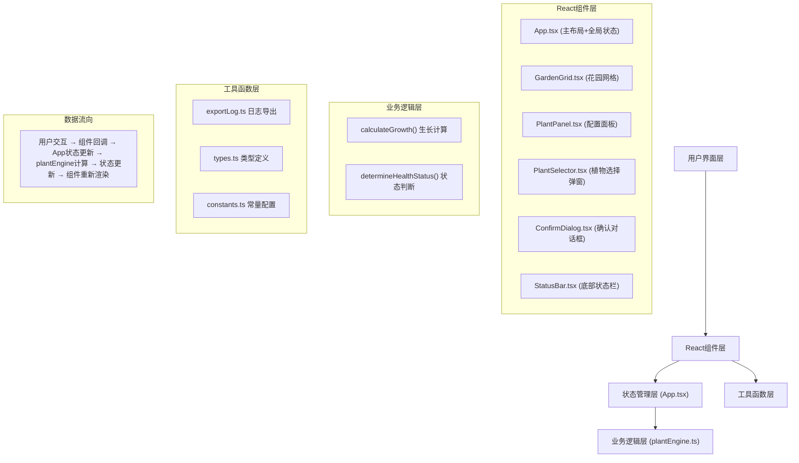
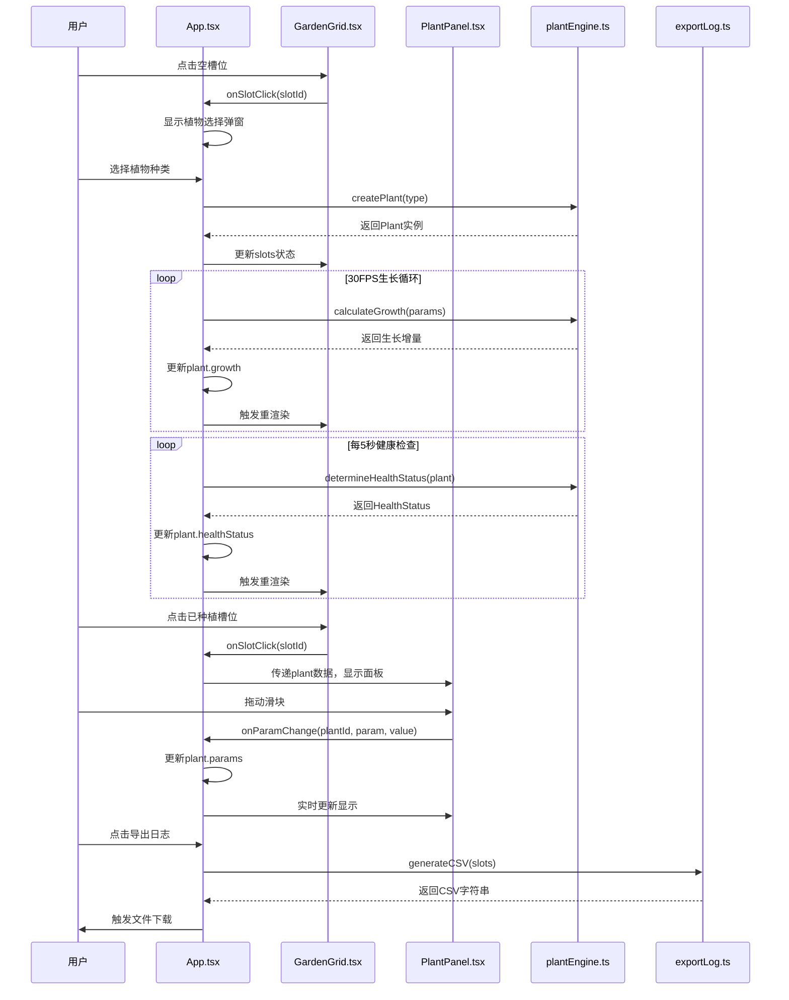

## 1. 架构设计



## 2. 技术描述

- **前端框架**：React@18 + TypeScript@5 + Vite@5
- **构建工具**：Vite@5，使用@vitejs/plugin-react
- **第三方库**：
  - uuid：生成唯一标识符
  - file-saver：文件下载功能
  - react-colorful：颜色选择器（预留）
- **样式方案**：原生CSS + CSS变量，支持响应式设计
- **状态管理**：React useState/useEffect Hooks，集中在App.tsx管理
- **无后端**：纯前端应用，数据存储在内存中

## 3. 目录结构

```
├── index.html
├── package.json
├── vite.config.js
├── tsconfig.json
└── src/
    ├── main.tsx              # React应用入口
    ├── App.tsx               # 主应用组件，全局状态管理
    ├── types/
    │   └── index.ts          # TypeScript类型定义
    ├── constants/
    │   └── plants.ts         # 植物配置常量
    ├── utils/
    │   ├── plantEngine.ts    # 植物生长逻辑引擎
    │   └── exportLog.ts      # 日志导出工具
    ├── components/
    │   ├── GardenGrid.tsx    # 花园网格组件
    │   ├── PlantPanel.tsx    # 植物配置面板
    │   ├── PlantSelector.tsx # 植物选择弹窗
    │   ├── ConfirmDialog.tsx # 确认对话框
    │   └── StatusBar.tsx     # 底部状态栏
    └── styles/
        └── index.css         # 全局样式
```

## 4. 数据模型

### 4.1 核心类型定义

```typescript
// 植物种类
type PlantType = 'basil' | 'mint' | 'tomato' | 'strawberry' | 'lavender';

// 健康状态
type HealthStatus = 'healthy' | 'thirsty' | 'needsLight' | 'needsFertilizer';

// 植物配置参数
interface PlantParams {
  light: number;      // 0-100 光照值
  water: number;      // 0-100 水量值
  fertilizer: number; // 0-100 肥料值
}

// 植物实例
interface Plant {
  id: string;
  type: PlantType;
  name: string;
  growth: number;           // 当前生长进度 0-maxGrowth
  maxGrowth: number;        // 生长周期 100-150
  params: PlantParams;
  healthStatus: HealthStatus;
  plantedAt: number;        // 种植时间戳
  waterCount: number;       // 浇水次数
  healthHistory: Array<{    // 健康状态变化记录
    status: HealthStatus;
    timestamp: number;
  }>;
}

// 花园槽位
interface GardenSlot {
  id: number;
  plant: Plant | null;
}

// 应用状态
interface AppState {
  slots: GardenSlot[];
  selectedSlotId: number | null;
  showPlantSelector: boolean;
  showResetConfirm: boolean;
}
```

### 4.2 植物配置常量

```typescript
// 每种植物的生长周期和偏好参数范围
const PLANT_CONFIGS: Record<PlantType, {
  name: string;
  emoji: string;
  maxGrowth: number;
  preferredLight: [number, number];
  preferredWater: [number, number];
  preferredFertilizer: [number, number];
}> = {
  basil: {
    name: '罗勒',
    emoji: '🌿',
    maxGrowth: 120,
    preferredLight: [60, 90],
    preferredWater: [50, 80],
    preferredFertilizer: [30, 60],
  },
  mint: {
    name: '薄荷',
    emoji: '🌱',
    maxGrowth: 100,
    preferredLight: [50, 80],
    preferredWater: [60, 90],
    preferredFertilizer: [20, 50],
  },
  tomato: {
    name: '番茄',
    emoji: '🍅',
    maxGrowth: 150,
    preferredLight: [70, 100],
    preferredWater: [60, 85],
    preferredFertilizer: [50, 80],
  },
  strawberry: {
    name: '草莓',
    emoji: '🍓',
    maxGrowth: 130,
    preferredLight: [60, 90],
    preferredWater: [55, 80],
    preferredFertilizer: [40, 70],
  },
  lavender: {
    name: '薰衣草',
    emoji: '💜',
    maxGrowth: 140,
    preferredLight: [70, 100],
    preferredWater: [30, 50],
    preferredFertilizer: [20, 40],
  },
};
```

## 5. 核心模块说明

### 5.1 plantEngine.ts - 植物生长引擎

**核心函数**：
- `calculateGrowth(params: PlantParams): number`
  - 计算公式：`生长增量 = (光照*0.3 + 水量*0.4 + 肥料*0.2) * 0.01`
  - 每帧调用，更新生长进度

- `determineHealthStatus(plant: Plant, config: PlantConfig): HealthStatus`
  - 每5秒调用，根据参数与偏好范围的比较判断健康状态
  - 优先级：缺水 > 缺光 > 缺肥 > 健康

### 5.2 App.tsx - 主应用组件

**职责**：
- 管理全局状态（9个槽位、选中状态、弹窗显示）
- 使用requestAnimationFrame实现30FPS生长循环
- 使用setInterval每5秒重新计算健康状态
- 向下传递数据和回调函数给子组件
- 处理日志导出和重置逻辑

**数据流向**：
```
用户点击槽位 → onSlotClick(slotId)
  → 空槽位：显示植物选择弹窗
  → 有植物：设置selectedSlotId，显示配置面板

用户调节滑块 → onParamChange(plantId, param, value)
  → 更新对应植物的params
  → plantEngine实时计算生长速度

用户导出日志 → onExportLog()
  → 收集所有植物数据
  → 生成CSV内容
  → 调用file-saver下载

用户点击重置 → onResetClick()
  → 显示确认对话框
  → 确认后清空slots数组
```

### 5.3 GardenGrid.tsx - 花园网格组件

**Props**：
- `slots: GardenSlot[]` - 槽位数据
- `selectedSlotId: number | null` - 选中槽位ID
- `onSlotClick: (slotId: number) => void` - 点击回调

**渲染**：
- 3x3 CSS Grid布局
- 每个槽位显示：植物emoji、名称、渐变进度条、状态圆点
- 选中槽位添加绿色边框动画

### 5.4 PlantPanel.tsx - 配置面板组件

**Props**：
- `plant: Plant` - 选中的植物
- `onParamChange: (plantId: string, param: keyof PlantParams, value: number) => void` - 参数变化回调
- `onNameChange: (plantId: string, name: string) => void` - 名称变化回调
- `onClose: () => void` - 关闭面板回调

**功能**：
- 三个range滑块（光照、水量、肥料），范围0-100
- 双击名称进入编辑状态
- 实时显示当前参数值和生长速度

## 6. 性能优化

### 6.1 生长循环
- 使用 `requestAnimationFrame` 实现流畅动画
- 实际更新频率控制在30FPS（约33ms间隔）
- 只更新有植物的槽位，空槽位跳过计算

### 6.2 健康状态计算
- 使用 `setInterval` 每5秒计算一次，避免频繁计算
- 只比较参数与偏好范围，复杂度O(1)

### 6.3 日志导出
- 直接在内存中构建CSV字符串，避免DOM操作
- 使用Blob和file-saver高效下载
- 数据量小（最多9株植物），确保500ms内完成

## 7. 调用关系图


