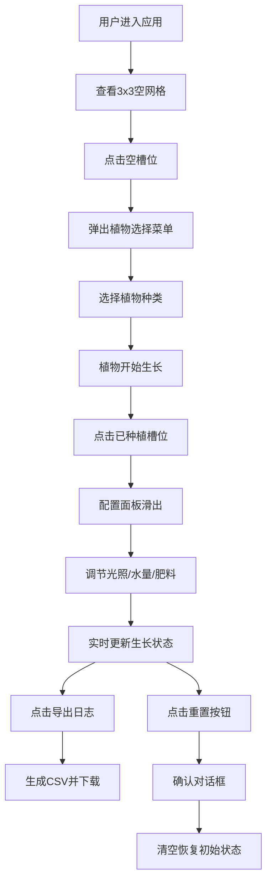

## 1. 产品概述

垂直花园模拟与生长日志应用，为城市园艺爱好者提供浏览器端的微型垂直花园管理体验。用户可配置植物栽培参数（光照、水量、肥料），观察植物生长状态，并生成可导出的植物生长日志。

- **核心价值**：在虚拟环境中体验园艺乐趣，学习植物养护知识，记录植物成长历程
- **目标用户**：城市园艺爱好者、植物爱好者、休闲游戏玩家

## 2. 核心功能

### 2.1 用户角色

| 角色 | 注册方式 | 核心权限 |
|------|----------|----------|
| 普通用户 | 无需注册，直接使用 | 种植植物、配置参数、观察生长、导出日志、重置花园 |

### 2.2 功能模块

1. **花园网格**：3x3植物槽位展示，支持种植选择、状态显示
2. **植物配置面板**：光照、水量、肥料参数调节，植物名称编辑
3. **生长模拟引擎**：实时计算生长进度和健康状态
4. **日志导出**：生成CSV格式的植物生长日志并下载
5. **重置功能**：一键清空花园，恢复初始状态

### 2.3 页面详情

| 页面名称 | 模块名称 | 功能描述 |
|----------|----------|----------|
| 主页面 | 花园网格 | 3x3网格展示9个植物槽位，每个槽位显示植物emoji、名称、生长进度条、健康状态指示器 |
| 主页面 | 植物选择弹窗 | 点击空槽位时弹出，提供5种植物选择（罗勒、薄荷、番茄、草莓、薰衣草） |
| 主页面 | 配置面板 | 右侧滑出，包含三个滑块调节器和名称编辑功能，实时更新植物状态 |
| 主页面 | 顶部操作栏 | 导出日志按钮，一键生成CSV文件 |
| 主页面 | 底部状态栏 | 显示总生长进度和健康植物数量 |
| 主页面 | 重置按钮 | 右下角重置按钮，带确认对话框 |

## 3. 核心流程

### 3.1 种植流程
用户进入应用 → 查看3x3空网格 → 点击空槽位 → 弹出植物选择菜单 → 选择植物种类 → 植物种植成功，开始生长

### 3.2 参数调节流程
点击已种植的槽位 → 右侧弹出配置面板 → 拖动光照/水量/肥料滑块 → 实时更新生长速度和健康状态 → 双击名称可编辑

### 3.3 日志导出流程
点击右上角"导出日志"按钮 → 系统收集所有植物数据 → 生成CSV文件 → 自动下载到本地

### 3.4 重置流程
点击右下角重置按钮 → 弹出确认对话框 → 点击"确定" → 清空所有植物数据 → 恢复空网格状态

## 4. 用户界面设计

### 4.1 设计风格
- **设计主题**：极简园艺风格，清新自然
- **主色调**：浅绿色渐变背景 #e8f5e9 → #fffde7
- **强调色**：绿色 #4caf50，浅绿 #a5d6a7，深绿 #2e7d32
- **状态指示色**：健康(绿)、缺水(蓝)、缺光(橙)、缺肥(红)
- **卡片风格**：半透明白色背景 rgba(255,255,255,0.85)，圆角8px，微弱阴影
- **字体**：现代无衬线字体，清晰易读
- **图标风格**：使用emoji作为植物图标（🌿🌱🍅🍓💜）

### 4.2 页面设计概述

| 页面名称 | 模块名称 | UI元素 |
|----------|----------|--------|
| 主页面 | 花园网格 | 3x3网格布局，每个单元包含emoji图标、植物名称、渐变进度条、状态圆点 |
| 主页面 | 植物选择弹窗 | 居中模态框，5个植物选项卡片，点击选择 |
| 主页面 | 配置面板 | 右侧300px宽磨砂玻璃面板，三个自定义滑块，可编辑标题 |
| 主页面 | 顶部操作栏 | 右上角"导出日志"按钮，绿色背景，白色文字 |
| 主页面 | 底部状态栏 | 全宽底部栏，显示总进度和健康数量统计 |
| 主页面 | 重置按钮 | 右下角浮动按钮，灰色背景，带确认对话框 |
| 主页面 | 选中状态 | 绿色边框动画，过渡0.3s |
| 主页面 | 滑块交互 | 拖动时按钮上弹动画，transform: translateY(-2px) |

### 4.3 响应式设计
- **桌面端**（≥768px）：配置面板固定在右侧，宽度300px
- **移动端**（<768px）：配置面板移至底部，全宽折叠面板，点击展开
- **触摸优化**：增大点击区域，适配触摸操作
- **网格适配**：移动端缩小网格间距，保持3x3布局

### 4.4 动画与交互
- 页面加载：渐入动画，网格单元依次出现
- 配置面板滑入：从右侧平滑滑入，过渡0.3s
- 滑块拖动：按钮上弹效果，过渡0.2s
- 进度条更新：平滑过渡动画
- 选中状态：边框呼吸灯效果
- 弹窗出现：缩放+淡入动画
