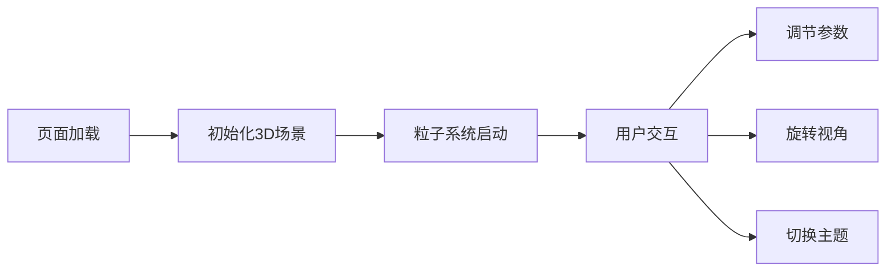

# 虚拟熔岩灯3D交互可视化应用 - 产品需求文档

## 1. 产品概述
在浏览器中打造沉浸式3D熔岩灯粒子艺术装置，用户可作为流体艺术设计师的身份，通过调节参数实时塑造熔岩灯内彩色蜡滴的动态流体效果，在透明玻璃容器中从任意角度观赏。

- 主要功能：3D玻璃容器展示、粒子系统模拟（浮力、融合、分裂、颜色渐变、UI参数控制、主题预设、性能数据显示

- 目标用户：艺术爱好者、流体模拟爱好者、Three.js可视化学习者

## 2. 核心特性

### 2.1 用户角色

| 角色 | 注册方式 | 核心权限 |
|------|---------|---------|
| 普通用户 | 无需注册 | 浏览和使用全部功能 |

### 2.2 功能模块

1. **3D主场景**: 玻璃容器渲染、粒子系统模拟、光源环境
2. **粒子系统**: 浮力运动、碰撞检测、融合分裂逻辑、颜色渐变、发光效果
3. **UI控制面板**: Tweakpane参数控制、主题预设按钮、重置功能、性能数据显示

### 2.3 页面详情

| 页面名称 | 模块名称 | 功能描述 |
|---------|---------|------------|
| 主场景 | 3D渲染 | 全屏3D玻璃容器居中显示熔岩灯粒子动画 |
| 控制面板 | 参数调节 | 热量强度、蜡滴大小、颜色渐变拾色器 |
| 控制面板 | 主题预设 | 经典琥珀、海洋幻梦、烈焰之心三套主题 |
| 控制面板 | 重置功能 | 粒子重置为初始状态 |
| 性能面板 | 数据显示 | 实时粒子数量、FPS显示 |

## 3. 核心流程

用户打开页面 → 自动加载3D场景和粒子动画 → 拖拽旋转视角 → 调节参数实时预览效果 → 切换主题 → 查看性能数据

## 4. 用户界面设计

### 4.1 设计风格
- 主色调：深色背景 #0a0a0a 到 #1a1a1a 径向渐变
- 强调色：#ff69b4（粉色发光边框）
- 字体：白色细体，12px
- 玻璃面板：backdrop-filter: blur(12px) 半透明磨砂效果
- 按钮：弹性回弹动画（gsap spring）
- 容器造型：上窄下宽，瓶颈细长的经典熔岩灯造型

### 4.2 页面设计概要

| 页面名称 | 模块名称 | UI元素 |
|---------|---------|---------|
| 主场景 | 3D容器 | 居中、16:9、45度俯视、相机距离2.5单位 |
| 控制面板 | 右下角悬浮面板、滑块、拾色器、发光边框 |
| 性能面板 | 底部文字、粒子数、FPS |

### 4.3 响应式
- 桌面优先，移动端自适应
- 容器和粒子根据窗口宽高比自动缩放（保持16:9）
- 移动端支持触摸拖拽旋转视角

### 4.4 3D场景指引
- 环境：深色径向渐变背景，4个环境光点分布容器四周
- 光照：环境光+点光源，底部虚拟热源脉动闪烁
- 相机：45度俯视，距离2.5单位，OrbitControls轨道控制器
- 交互：鼠标拖拽旋转，滚轮缩放
- 后处理：粒子发光光晕效果
